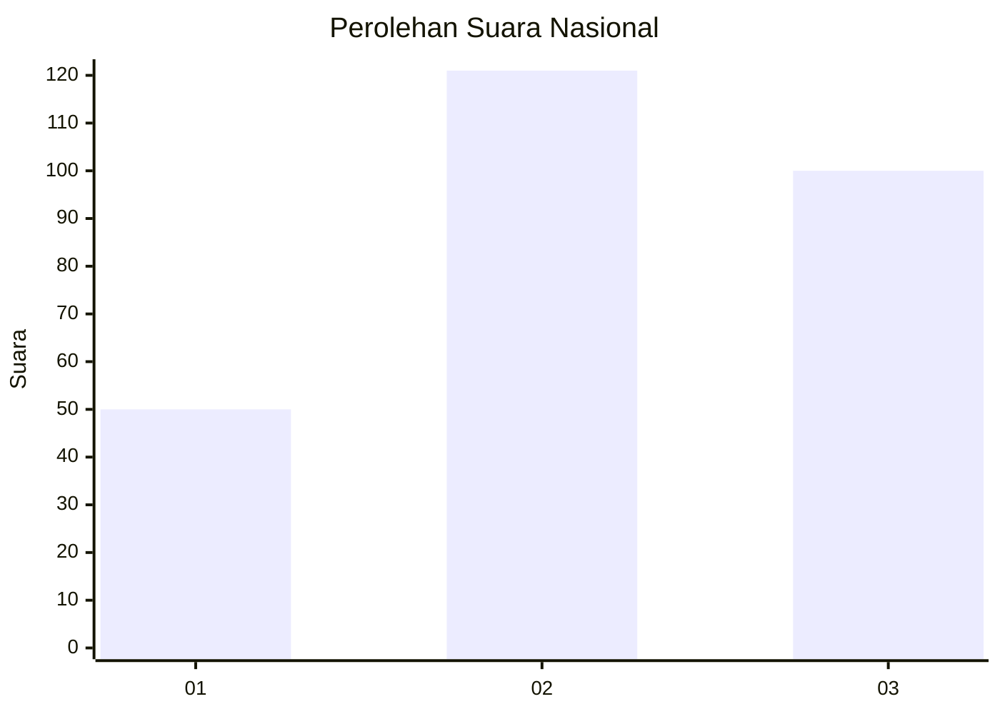
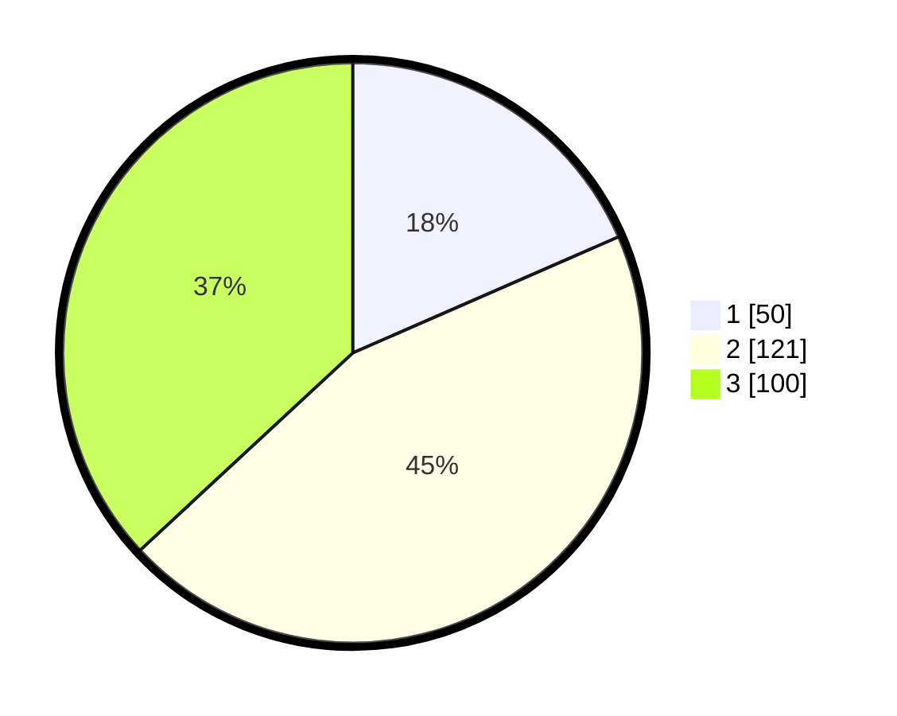

# Hasil

## Grafik

## Tabel

| No. | Nama Paslon    | Suara | Suara (raw) | Persentase |
|:--- |:-------------- | -----:| -----------:| ----------:|
| 1   | ANIES MUHAIMIN | 50    | [50][p-1]   | 18,45      |
| 2   | PRABOWO GIBRAN | 121   | [121][p-2]  | 44,65      |
| 3   | GANJAR MAHFUD  | 100   | [100][p-3]  | 36,90      |

[p-1]: https://github.com/gigit-pemilu/pemilu-2024/blob/main/pilpres/hitung-suara/sub/34-di-yogyakarta/sub/04-sleman/sub/08-berbah/sub/2001-sendangtirto/sub/016-tps/sub/paslon-1.txt
[p-2]: https://github.com/gigit-pemilu/pemilu-2024/blob/main/pilpres/hitung-suara/sub/34-di-yogyakarta/sub/04-sleman/sub/08-berbah/sub/2001-sendangtirto/sub/016-tps/sub/paslon-2.txt
[p-3]: https://github.com/gigit-pemilu/pemilu-2024/blob/main/pilpres/hitung-suara/sub/34-di-yogyakarta/sub/04-sleman/sub/08-berbah/sub/2001-sendangtirto/sub/016-tps/sub/paslon-3.txt

## Foto C Plano

https://sirekap-obj-formc.kpu.go.id/b13e/pemilu/ppwp/34/04/08/20/01/3404082001016-20240215-012154--d1ab014c-616a-4519-8a6d-f980d3b1d3d0.jpg

https://sirekap-obj-formc.kpu.go.id/b13e/pemilu/ppwp/34/04/08/20/01/3404082001016-20240215-012402--71cf2fc9-f64b-4c2c-aacb-edb9ebf19dba.jpg

https://sirekap-obj-formc.kpu.go.id/b13e/pemilu/ppwp/34/04/08/20/01/3404082001016-20240215-012535--7393cf6e-653e-4abe-8cec-a1da2a8e5ee4.jpg

## Metadata

| Key        | Value               |
| ---------- | ------------------- |
| Time Stamp | 2024-02-15 12:00:28 |

