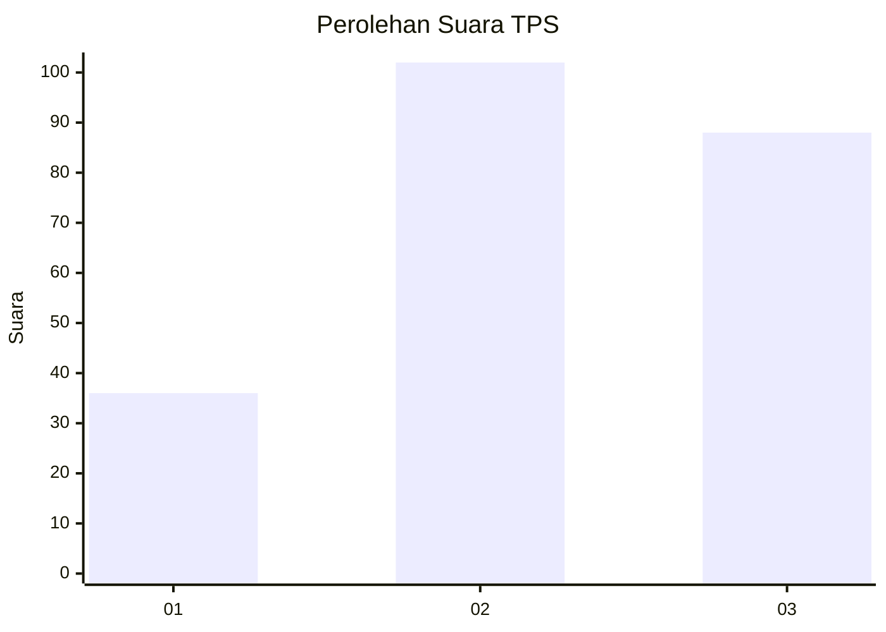
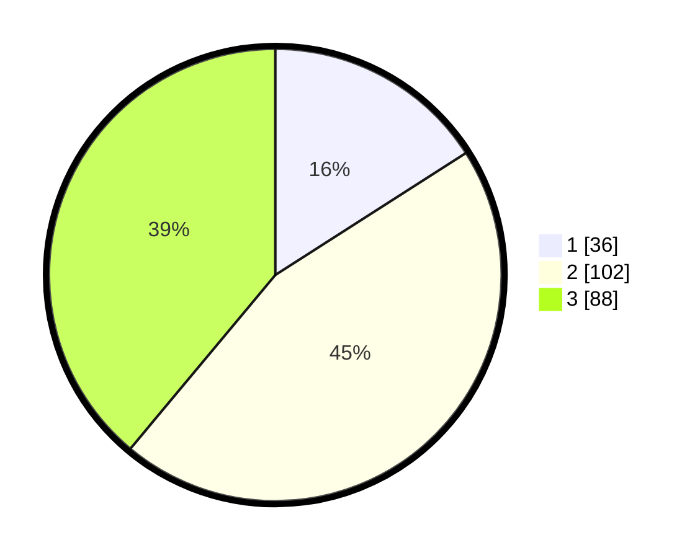

# Hasil

## Grafik

## Tabel

| No. | Nama Paslon    | Suara | Suara (raw) | Persentase |
|:--- |:-------------- | -----:| -----------:| ----------:|
| 1   | ANIES MUHAIMIN | 36    | [36][p-1]   | 15,93      |
| 2   | PRABOWO GIBRAN | 102   | [102][p-2]  | 45,13      |
| 3   | GANJAR MAHFUD  | 88    | [88][p-3]   | 38,94      |

[p-1]: https://github.com/gigit-pemilu/pemilu-2024-34-di-yogyakarta/blob/main/pilpres/hitung-suara/sub/34-di-yogyakarta/sub/04-sleman/sub/08-berbah/sub/2001-sendangtirto/sub/018-tps/sub/paslon-1.txt
[p-2]: https://github.com/gigit-pemilu/pemilu-2024-34-di-yogyakarta/blob/main/pilpres/hitung-suara/sub/34-di-yogyakarta/sub/04-sleman/sub/08-berbah/sub/2001-sendangtirto/sub/018-tps/sub/paslon-2.txt
[p-3]: https://github.com/gigit-pemilu/pemilu-2024-34-di-yogyakarta/blob/main/pilpres/hitung-suara/sub/34-di-yogyakarta/sub/04-sleman/sub/08-berbah/sub/2001-sendangtirto/sub/018-tps/sub/paslon-3.txt

## Foto C Plano

https://sirekap-obj-formc.kpu.go.id/c3cb/pemilu/ppwp/34/04/08/20/01/3404082001018-20240214-213815--283c9713-d8a4-4498-a517-2769787a3a3d.jpg

https://sirekap-obj-formc.kpu.go.id/c3cb/pemilu/ppwp/34/04/08/20/01/3404082001018-20240214-213948--d351a8c2-9102-43d7-9664-d8776d424ec8.jpg

https://sirekap-obj-formc.kpu.go.id/c3cb/pemilu/ppwp/34/04/08/20/01/3404082001018-20240214-214112--dfadde12-ed76-4a13-b243-fc134fb20d35.jpg

## Metadata

| Key        | Value               |
| ---------- | ------------------- |
| Time Stamp | 2024-02-15 16:00:26 |

