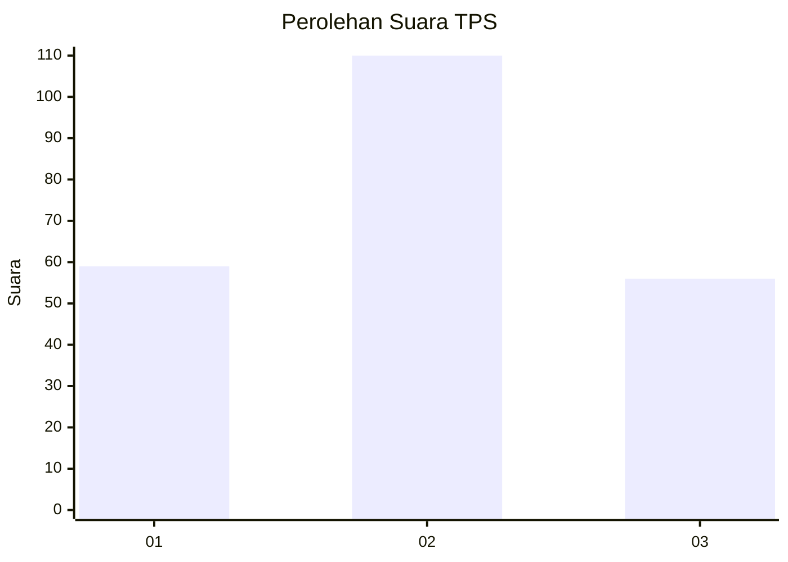
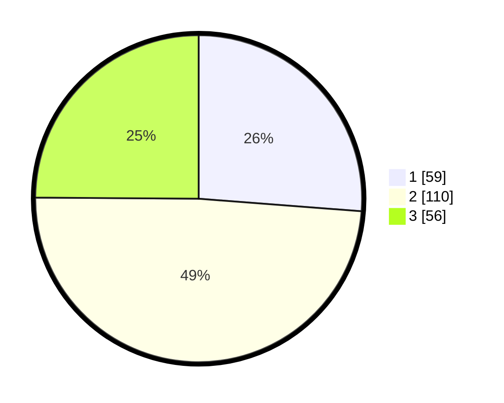

# Hasil

## Grafik

## Tabel

| No. | Nama Paslon    | Suara | Suara (raw) | Persentase |
|:--- |:-------------- | -----:| -----------:| ----------:|
| 1   | ANIES MUHAIMIN | 59    | [59][p-1]   | 26,22      |
| 2   | PRABOWO GIBRAN | 110   | [110][p-2]  | 48,89      |
| 3   | GANJAR MAHFUD  | 56    | [56][p-3]   | 24,89      |

[p-1]: https://github.com/gigit-pemilu/pemilu-2024-34-di-yogyakarta/blob/main/pilpres/hitung-suara/sub/34-di-yogyakarta/sub/04-sleman/sub/08-berbah/sub/2001-sendangtirto/sub/022-tps/sub/paslon-1.txt
[p-2]: https://github.com/gigit-pemilu/pemilu-2024-34-di-yogyakarta/blob/main/pilpres/hitung-suara/sub/34-di-yogyakarta/sub/04-sleman/sub/08-berbah/sub/2001-sendangtirto/sub/022-tps/sub/paslon-2.txt
[p-3]: https://github.com/gigit-pemilu/pemilu-2024-34-di-yogyakarta/blob/main/pilpres/hitung-suara/sub/34-di-yogyakarta/sub/04-sleman/sub/08-berbah/sub/2001-sendangtirto/sub/022-tps/sub/paslon-3.txt

## Foto C Plano

https://sirekap-obj-formc.kpu.go.id/8c8c/pemilu/ppwp/34/04/08/20/01/3404082001022-20240214-204957--98bf3b6d-ea8e-4e24-b6fb-a827cd075993.jpg

https://sirekap-obj-formc.kpu.go.id/8c8c/pemilu/ppwp/34/04/08/20/01/3404082001022-20240214-205021--7be89dc3-b44f-4ea0-8682-dee54e8e71f9.jpg

https://sirekap-obj-formc.kpu.go.id/8c8c/pemilu/ppwp/34/04/08/20/01/3404082001022-20240214-205043--70d3306d-02d3-45f4-8a8b-7f27dd4f41a3.jpg

## Metadata

| Key        | Value               |
| ---------- | ------------------- |
| Time Stamp | 2024-02-15 16:00:26 |

