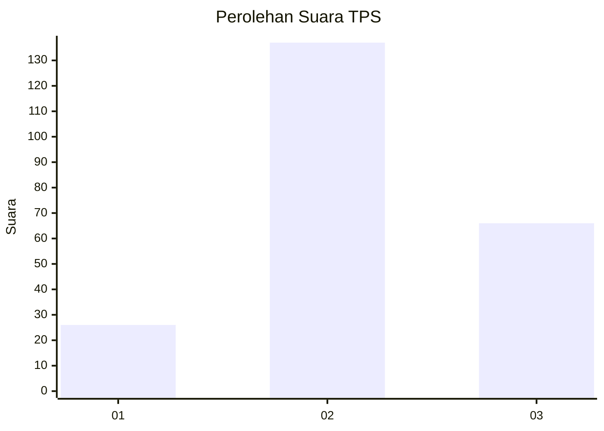
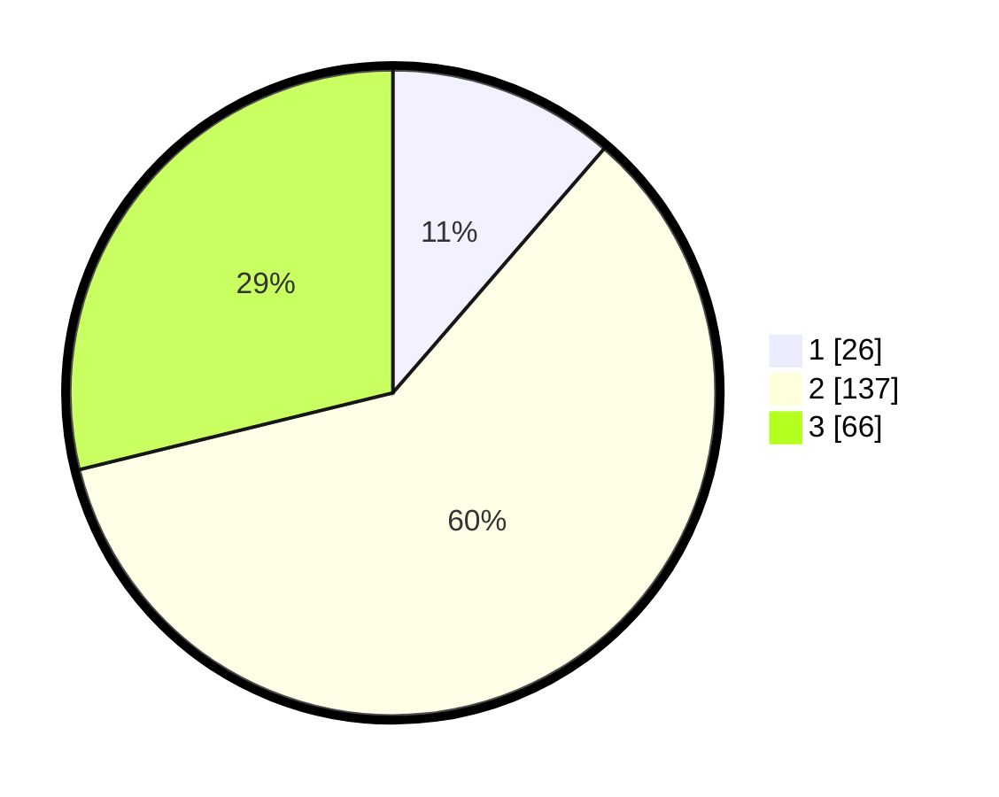

# Hasil

## Grafik

## Tabel

| No. | Nama Paslon    | Suara | Suara (raw) | Persentase |
|:--- |:-------------- | -----:| -----------:| ----------:|
| 1   | ANIES MUHAIMIN | 26    | [26][p-1]   | 11,35      |
| 2   | PRABOWO GIBRAN | 137   | [137][p-2]  | 59,83      |
| 3   | GANJAR MAHFUD  | 66    | [66][p-3]   | 28,82      |

[p-1]: https://github.com/gigit-pemilu/pemilu-2024-34-di-yogyakarta/blob/main/pilpres/hitung-suara/sub/34-di-yogyakarta/sub/04-sleman/sub/08-berbah/sub/2001-sendangtirto/sub/025-tps/sub/paslon-1.txt
[p-2]: https://github.com/gigit-pemilu/pemilu-2024-34-di-yogyakarta/blob/main/pilpres/hitung-suara/sub/34-di-yogyakarta/sub/04-sleman/sub/08-berbah/sub/2001-sendangtirto/sub/025-tps/sub/paslon-2.txt
[p-3]: https://github.com/gigit-pemilu/pemilu-2024-34-di-yogyakarta/blob/main/pilpres/hitung-suara/sub/34-di-yogyakarta/sub/04-sleman/sub/08-berbah/sub/2001-sendangtirto/sub/025-tps/sub/paslon-3.txt

## Foto C Plano

https://sirekap-obj-formc.kpu.go.id/73a9/pemilu/ppwp/34/04/08/20/01/3404082001025-20240214-220850--c0154427-6441-4610-85d8-91a709e370b3.jpg

https://sirekap-obj-formc.kpu.go.id/73a9/pemilu/ppwp/34/04/08/20/01/3404082001025-20240214-220904--d7205091-d6dc-4747-8232-098f65accb85.jpg

https://sirekap-obj-formc.kpu.go.id/73a9/pemilu/ppwp/34/04/08/20/01/3404082001025-20240214-221026--70d9e399-e03b-4662-b255-1dad4723324f.jpg

## Metadata

| Key        | Value               |
| ---------- | ------------------- |
| Time Stamp | 2024-02-15 16:00:26 |

