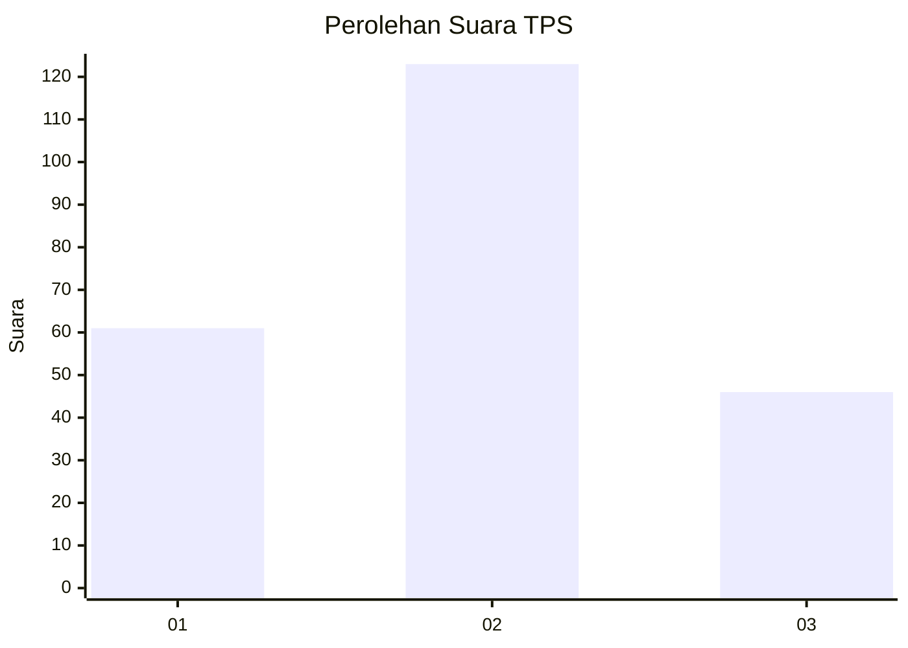
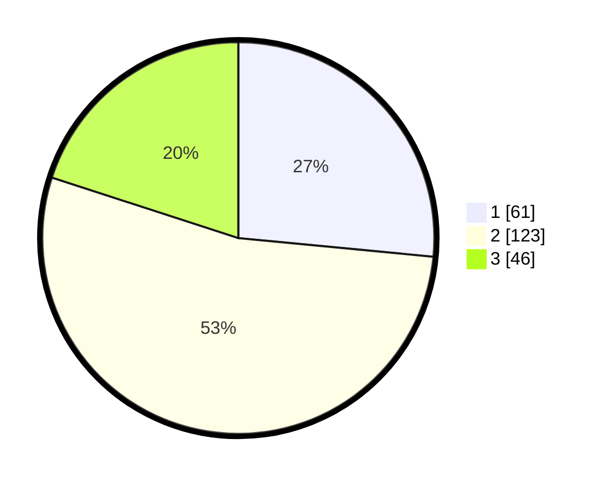

# Hasil

## Grafik

## Tabel

| No. | Nama Paslon    | Suara | Suara (raw) | Persentase |
|:--- |:-------------- | -----:| -----------:| ----------:|
| 1   | ANIES MUHAIMIN | 61    | [61][p-1]   | 26,52      |
| 2   | PRABOWO GIBRAN | 123   | [123][p-2]  | 53,48      |
| 3   | GANJAR MAHFUD  | 46    | [46][p-3]   | 20,00      |

[p-1]: https://github.com/gigit-pemilu/pemilu-2024-34-di-yogyakarta/blob/main/pilpres/hitung-suara/sub/34-di-yogyakarta/sub/04-sleman/sub/08-berbah/sub/2001-sendangtirto/sub/026-tps/sub/paslon-1.txt
[p-2]: https://github.com/gigit-pemilu/pemilu-2024-34-di-yogyakarta/blob/main/pilpres/hitung-suara/sub/34-di-yogyakarta/sub/04-sleman/sub/08-berbah/sub/2001-sendangtirto/sub/026-tps/sub/paslon-2.txt
[p-3]: https://github.com/gigit-pemilu/pemilu-2024-34-di-yogyakarta/blob/main/pilpres/hitung-suara/sub/34-di-yogyakarta/sub/04-sleman/sub/08-berbah/sub/2001-sendangtirto/sub/026-tps/sub/paslon-3.txt

## Foto C Plano

https://sirekap-obj-formc.kpu.go.id/e52c/pemilu/ppwp/34/04/08/20/01/3404082001026-20240214-205756--d5be2fe7-aaca-4f90-993e-b5942039d29b.jpg

https://sirekap-obj-formc.kpu.go.id/e52c/pemilu/ppwp/34/04/08/20/01/3404082001026-20240214-202608--35b48af4-9309-43b9-8062-a279228a13b2.jpg

https://sirekap-obj-formc.kpu.go.id/e52c/pemilu/ppwp/34/04/08/20/01/3404082001026-20240214-210209--f20336b8-57ae-4a36-8363-d8ea882feabe.jpg

## Metadata

| Key        | Value               |
| ---------- | ------------------- |
| Time Stamp | 2024-02-15 21:01:18 |

