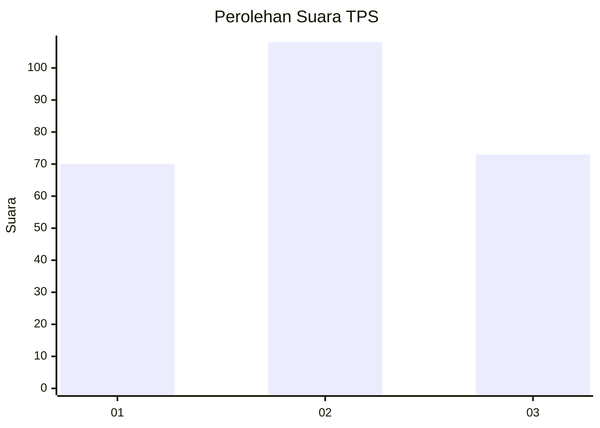
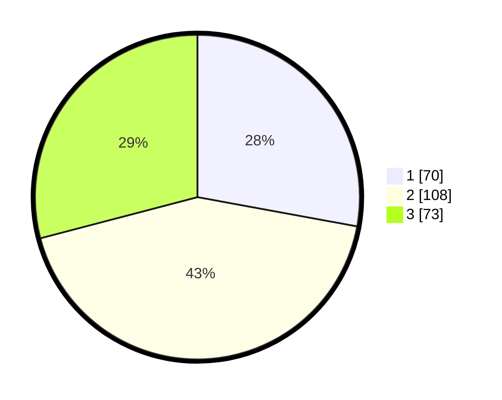

# Hasil

## Grafik

## Tabel

| No. | Nama Paslon    | Suara | Suara (raw) | Persentase |
|:--- |:-------------- | -----:| -----------:| ----------:|
| 1   | ANIES MUHAIMIN | 70    | [70][p-1]   | 27,89      |
| 2   | PRABOWO GIBRAN | 108   | [108][p-2]  | 43,03      |
| 3   | GANJAR MAHFUD  | 73    | [73][p-3]   | 29,08      |

[p-1]: https://github.com/gigit-pemilu/pemilu-2024-34-di-yogyakarta/blob/main/pilpres/hitung-suara/sub/34-di-yogyakarta/sub/04-sleman/sub/08-berbah/sub/2001-sendangtirto/sub/027-tps/sub/paslon-1.txt
[p-2]: https://github.com/gigit-pemilu/pemilu-2024-34-di-yogyakarta/blob/main/pilpres/hitung-suara/sub/34-di-yogyakarta/sub/04-sleman/sub/08-berbah/sub/2001-sendangtirto/sub/027-tps/sub/paslon-2.txt
[p-3]: https://github.com/gigit-pemilu/pemilu-2024-34-di-yogyakarta/blob/main/pilpres/hitung-suara/sub/34-di-yogyakarta/sub/04-sleman/sub/08-berbah/sub/2001-sendangtirto/sub/027-tps/sub/paslon-3.txt

## Foto C Plano

https://sirekap-obj-formc.kpu.go.id/177b/pemilu/ppwp/34/04/08/20/01/3404082001027-20240215-023457--17d2082c-3865-46f0-b351-5a30dac8ed6a.jpg

https://sirekap-obj-formc.kpu.go.id/177b/pemilu/ppwp/34/04/08/20/01/3404082001027-20240214-222026--e5677344-5899-43f4-b34c-91ac10d43d7b.jpg

https://sirekap-obj-formc.kpu.go.id/177b/pemilu/ppwp/34/04/08/20/01/3404082001027-20240215-023622--7528de28-f15e-4690-8497-df02b9dd712d.jpg

## Metadata

| Key        | Value               |
| ---------- | ------------------- |
| Time Stamp | 2024-02-15 21:30:27 |

