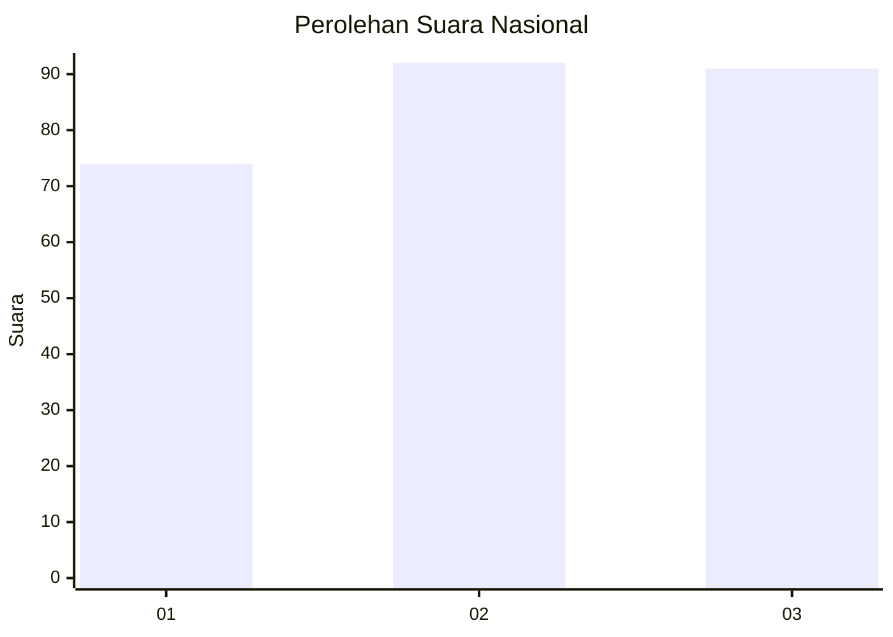
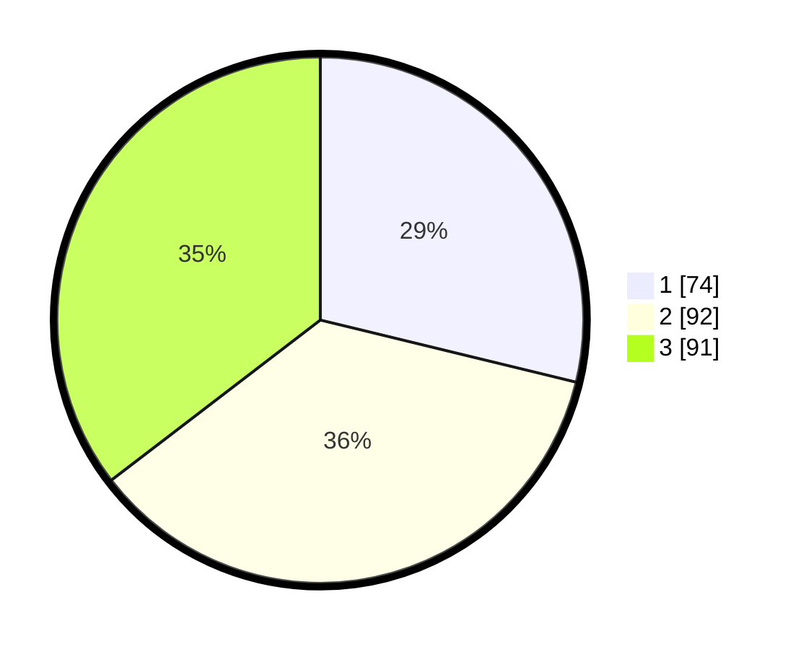

# Hasil

## Grafik

## Tabel

| No. | Nama Paslon    | Suara | Suara (raw) | Persentase |
|:--- |:-------------- | -----:| -----------:| ----------:|
| 1   | ANIES MUHAIMIN | 74    | [74][p-1]   | 28,79      |
| 2   | PRABOWO GIBRAN | 92    | [92][p-2]   | 35,80      |
| 3   | GANJAR MAHFUD  | 91    | [91][p-3]   | 35,41      |

[p-1]: https://github.com/gigit-pemilu/pemilu-2024/blob/main/pilpres/hitung-suara/sub/34-di-yogyakarta/sub/04-sleman/sub/08-berbah/sub/2001-sendangtirto/sub/032-tps/sub/paslon-1.txt
[p-2]: https://github.com/gigit-pemilu/pemilu-2024/blob/main/pilpres/hitung-suara/sub/34-di-yogyakarta/sub/04-sleman/sub/08-berbah/sub/2001-sendangtirto/sub/032-tps/sub/paslon-2.txt
[p-3]: https://github.com/gigit-pemilu/pemilu-2024/blob/main/pilpres/hitung-suara/sub/34-di-yogyakarta/sub/04-sleman/sub/08-berbah/sub/2001-sendangtirto/sub/032-tps/sub/paslon-3.txt

## Foto C Plano

https://sirekap-obj-formc.kpu.go.id/44a8/pemilu/ppwp/34/04/08/20/01/3404082001032-20240214-155604--72a60456-d99b-48bc-8c41-fd24e1daf1ba.jpg

https://sirekap-obj-formc.kpu.go.id/44a8/pemilu/ppwp/34/04/08/20/01/3404082001032-20240214-162243--416ad178-9e09-489c-991b-0443bc05e32b.jpg

https://sirekap-obj-formc.kpu.go.id/44a8/pemilu/ppwp/34/04/08/20/01/3404082001032-20240214-160114--65b78692-91da-440e-a272-1da06df44e19.jpg

## Metadata

| Key        | Value               |
| ---------- | ------------------- |
| Time Stamp | 2024-02-25 10:00:00 |

