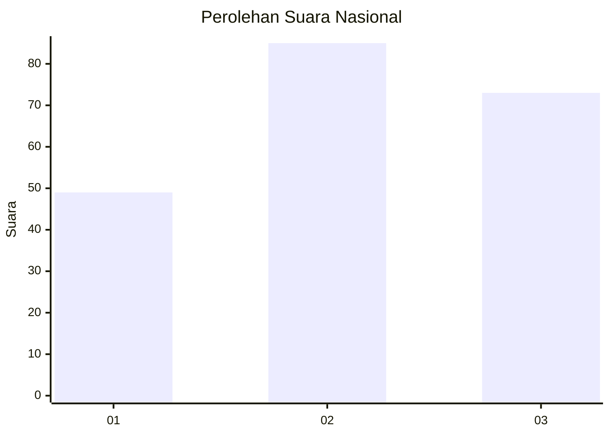
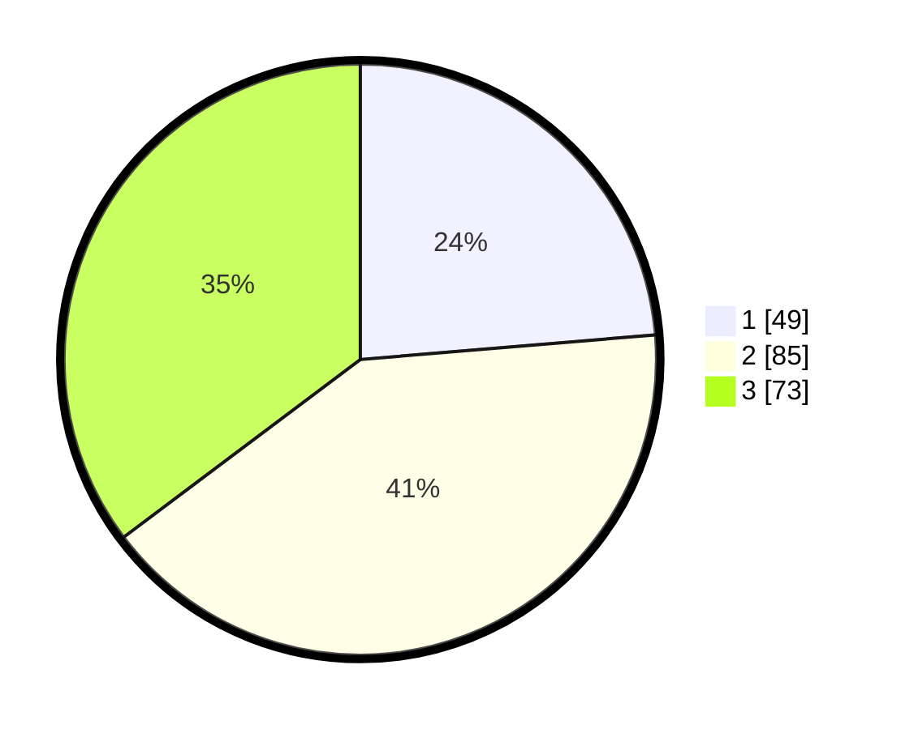

# Hasil

## Grafik

## Tabel

| No. | Nama Paslon    | Suara | Suara (raw) | Persentase |
|:--- |:-------------- | -----:| -----------:| ----------:|
| 1   | ANIES MUHAIMIN | 49    | [49][p-1]   | 23,67      |
| 2   | PRABOWO GIBRAN | 85    | [85][p-2]   | 41,06      |
| 3   | GANJAR MAHFUD  | 73    | [73][p-3]   | 35,27      |

[p-1]: https://github.com/gigit-pemilu/pemilu-2024/blob/main/pilpres/hitung-suara/sub/34-di-yogyakarta/sub/04-sleman/sub/08-berbah/sub/2001-sendangtirto/sub/037-tps/sub/paslon-1.txt
[p-2]: https://github.com/gigit-pemilu/pemilu-2024/blob/main/pilpres/hitung-suara/sub/34-di-yogyakarta/sub/04-sleman/sub/08-berbah/sub/2001-sendangtirto/sub/037-tps/sub/paslon-2.txt
[p-3]: https://github.com/gigit-pemilu/pemilu-2024/blob/main/pilpres/hitung-suara/sub/34-di-yogyakarta/sub/04-sleman/sub/08-berbah/sub/2001-sendangtirto/sub/037-tps/sub/paslon-3.txt

## Foto C Plano

https://sirekap-obj-formc.kpu.go.id/fe9b/pemilu/ppwp/34/04/08/20/01/3404082001037-20240214-141021--3fa7c293-2c64-450a-b791-0f9055e3fd67.jpg

https://sirekap-obj-formc.kpu.go.id/fe9b/pemilu/ppwp/34/04/08/20/01/3404082001037-20240214-191049--876004a6-4704-4700-a009-e4235017b89d.jpg

https://sirekap-obj-formc.kpu.go.id/fe9b/pemilu/ppwp/34/04/08/20/01/3404082001037-20240214-141002--2fea35b1-58dc-41da-8b58-402a57c70197.jpg

## Metadata

| Key        | Value               |
| ---------- | ------------------- |
| Time Stamp | 2024-02-15 16:30:25 |

