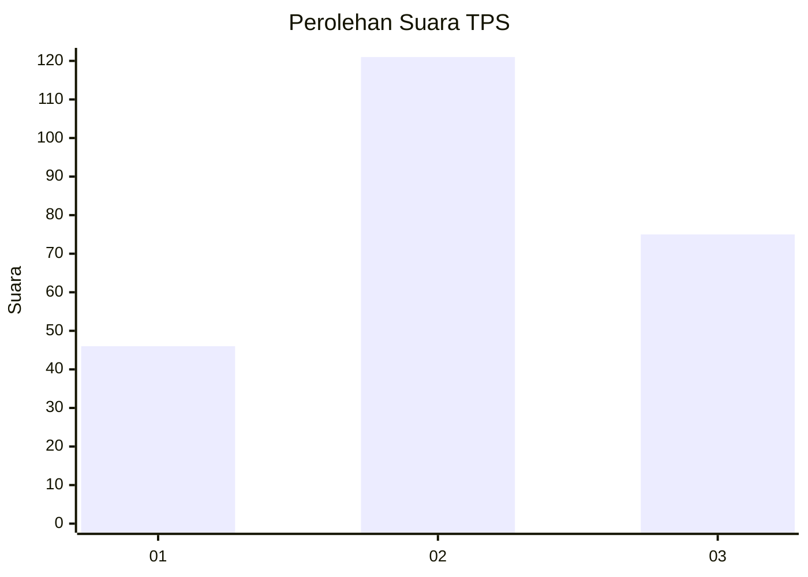
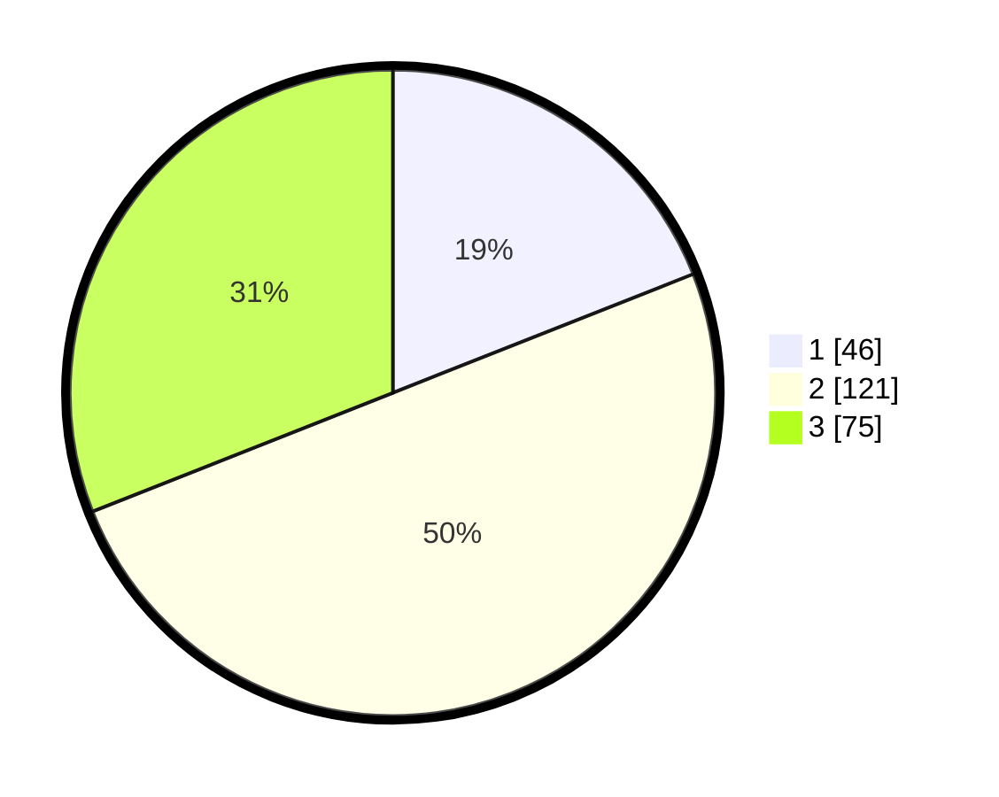

# Hasil

## Grafik

## Tabel

| No. | Nama Paslon    | Suara | Suara (raw) | Persentase |
|:--- |:-------------- | -----:| -----------:| ----------:|
| 1   | ANIES MUHAIMIN | 46    | [46][p-1]   | 19,01      |
| 2   | PRABOWO GIBRAN | 121   | [121][p-2]  | 50,00      |
| 3   | GANJAR MAHFUD  | 75    | [75][p-3]   | 30,99      |

[p-1]: https://github.com/gigit-pemilu/pemilu-2024-34-di-yogyakarta/blob/main/pilpres/hitung-suara/sub/34-di-yogyakarta/sub/04-sleman/sub/08-berbah/sub/2001-sendangtirto/sub/038-tps/sub/paslon-1.txt
[p-2]: https://github.com/gigit-pemilu/pemilu-2024-34-di-yogyakarta/blob/main/pilpres/hitung-suara/sub/34-di-yogyakarta/sub/04-sleman/sub/08-berbah/sub/2001-sendangtirto/sub/038-tps/sub/paslon-2.txt
[p-3]: https://github.com/gigit-pemilu/pemilu-2024-34-di-yogyakarta/blob/main/pilpres/hitung-suara/sub/34-di-yogyakarta/sub/04-sleman/sub/08-berbah/sub/2001-sendangtirto/sub/038-tps/sub/paslon-3.txt

## Foto C Plano

https://sirekap-obj-formc.kpu.go.id/275d/pemilu/ppwp/34/04/08/20/01/3404082001038-20240215-010637--85d00c23-0bdb-4bfe-b74a-cc26dfaf1a30.jpg

https://sirekap-obj-formc.kpu.go.id/275d/pemilu/ppwp/34/04/08/20/01/3404082001038-20240215-010749--2533136f-631e-42c2-8089-fe279df31e0a.jpg

https://sirekap-obj-formc.kpu.go.id/275d/pemilu/ppwp/34/04/08/20/01/3404082001038-20240215-010851--92166169-6498-4f40-93e5-376209dd461b.jpg

## Metadata

| Key        | Value               |
| ---------- | ------------------- |
| Time Stamp | 2024-02-25 12:00:00 |

