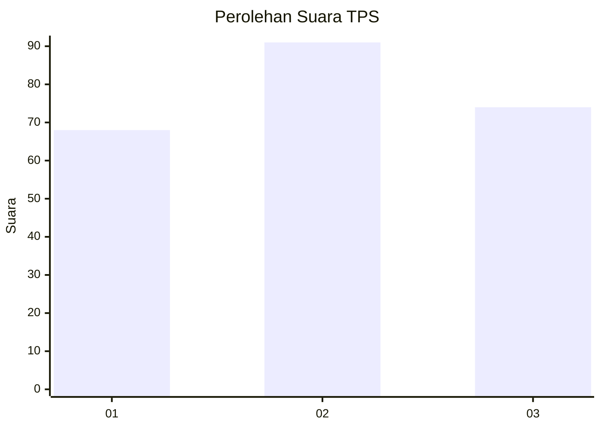
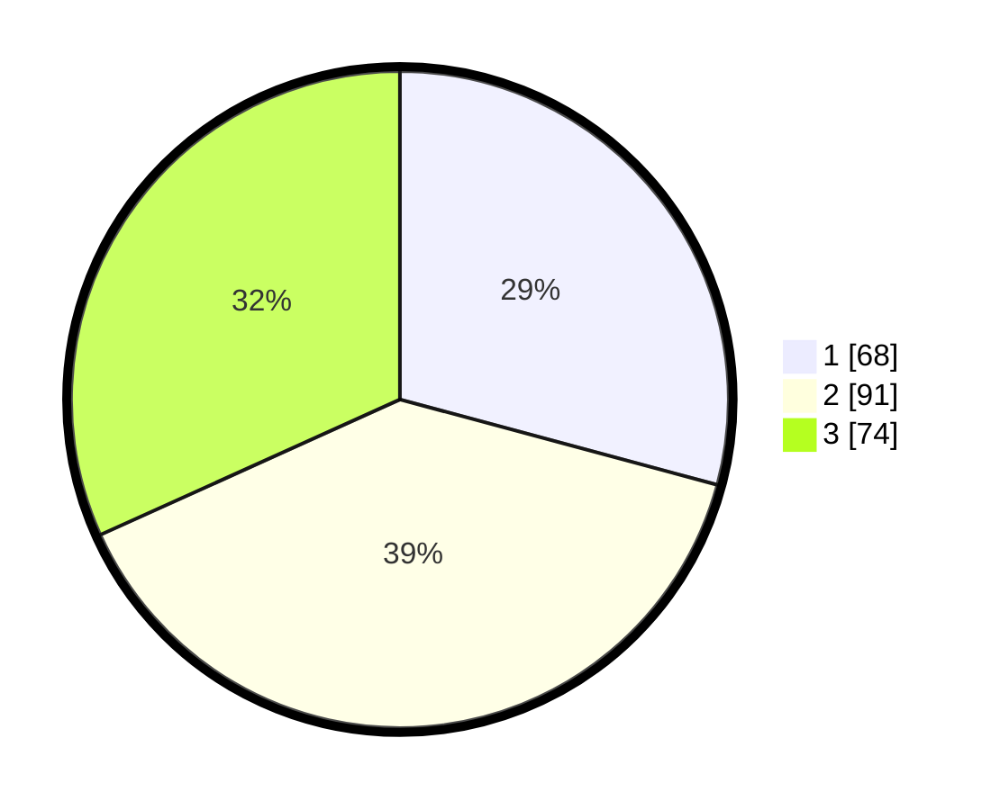

# Hasil

## Grafik

## Tabel

| No. | Nama Paslon    | Suara | Suara (raw) | Persentase |
|:--- |:-------------- | -----:| -----------:| ----------:|
| 1   | ANIES MUHAIMIN | 68    | [68][p-1]   | 29,18      |
| 2   | PRABOWO GIBRAN | 91    | [91][p-2]   | 39,06      |
| 3   | GANJAR MAHFUD  | 74    | [74][p-3]   | 31,76      |

[p-1]: https://github.com/gigit-pemilu/pemilu-2024-34-di-yogyakarta/blob/main/pilpres/hitung-suara/sub/34-di-yogyakarta/sub/04-sleman/sub/08-berbah/sub/2001-sendangtirto/sub/040-tps/sub/paslon-1.txt
[p-2]: https://github.com/gigit-pemilu/pemilu-2024-34-di-yogyakarta/blob/main/pilpres/hitung-suara/sub/34-di-yogyakarta/sub/04-sleman/sub/08-berbah/sub/2001-sendangtirto/sub/040-tps/sub/paslon-2.txt
[p-3]: https://github.com/gigit-pemilu/pemilu-2024-34-di-yogyakarta/blob/main/pilpres/hitung-suara/sub/34-di-yogyakarta/sub/04-sleman/sub/08-berbah/sub/2001-sendangtirto/sub/040-tps/sub/paslon-3.txt

## Foto C Plano

https://sirekap-obj-formc.kpu.go.id/62ae/pemilu/ppwp/34/04/08/20/01/3404082001040-20240214-195849--bac0505f-be55-4f3b-aa5c-85e5d6222ce4.jpg

https://sirekap-obj-formc.kpu.go.id/62ae/pemilu/ppwp/34/04/08/20/01/3404082001040-20240214-200039--bc1e7332-df28-4725-9f54-983015c2cabd.jpg

https://sirekap-obj-formc.kpu.go.id/62ae/pemilu/ppwp/34/04/08/20/01/3404082001040-20240214-200300--29f569b4-f35a-4d71-bdeb-badfb0b7ac27.jpg

## Metadata

| Key        | Value               |
| ---------- | ------------------- |
| Time Stamp | 2024-02-15 16:30:25 |

