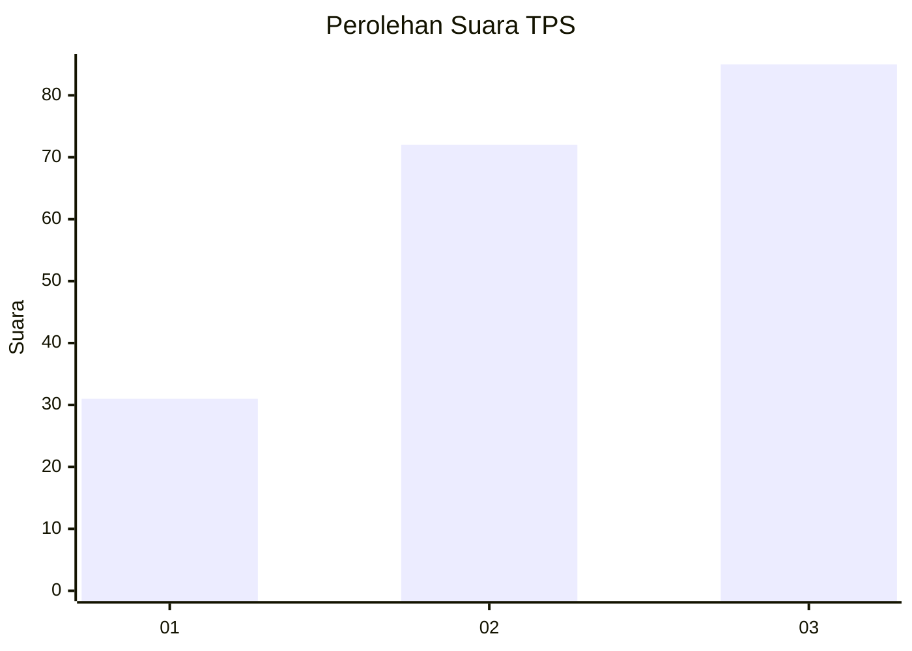
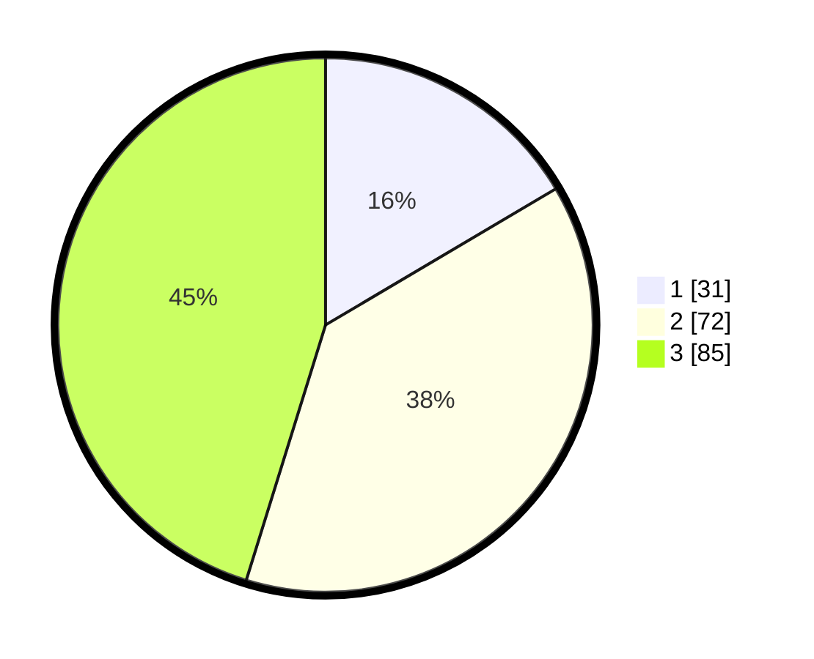

# Hasil

## Grafik

## Tabel

| No. | Nama Paslon    | Suara | Suara (raw) | Persentase |
|:--- |:-------------- | -----:| -----------:| ----------:|
| 1   | ANIES MUHAIMIN | 31    | [31][p-1]   | 16,49      |
| 2   | PRABOWO GIBRAN | 72    | [72][p-2]   | 38,30      |
| 3   | GANJAR MAHFUD  | 85    | [85][p-3]   | 45,21      |

[p-1]: https://github.com/gigit-pemilu/pemilu-2024-34-di-yogyakarta/blob/main/pilpres/hitung-suara/sub/34-di-yogyakarta/sub/04-sleman/sub/08-berbah/sub/2001-sendangtirto/sub/044-tps/sub/paslon-1.txt
[p-2]: https://github.com/gigit-pemilu/pemilu-2024-34-di-yogyakarta/blob/main/pilpres/hitung-suara/sub/34-di-yogyakarta/sub/04-sleman/sub/08-berbah/sub/2001-sendangtirto/sub/044-tps/sub/paslon-2.txt
[p-3]: https://github.com/gigit-pemilu/pemilu-2024-34-di-yogyakarta/blob/main/pilpres/hitung-suara/sub/34-di-yogyakarta/sub/04-sleman/sub/08-berbah/sub/2001-sendangtirto/sub/044-tps/sub/paslon-3.txt

## Foto C Plano

https://sirekap-obj-formc.kpu.go.id/07bc/pemilu/ppwp/34/04/08/20/01/3404082001044-20240214-141155--1df5b60f-6ae8-4556-847c-b3338a213536.jpg

https://sirekap-obj-formc.kpu.go.id/07bc/pemilu/ppwp/34/04/08/20/01/3404082001044-20240214-141048--8ef0614e-a2fc-4dec-b97e-c130f7db651b.jpg

https://sirekap-obj-formc.kpu.go.id/07bc/pemilu/ppwp/34/04/08/20/01/3404082001044-20240214-212823--a4316fb6-f7ef-4340-9fd3-6b6414c665d5.jpg

## Metadata

| Key        | Value               |
| ---------- | ------------------- |
| Time Stamp | 2024-02-15 00:41:44 |

