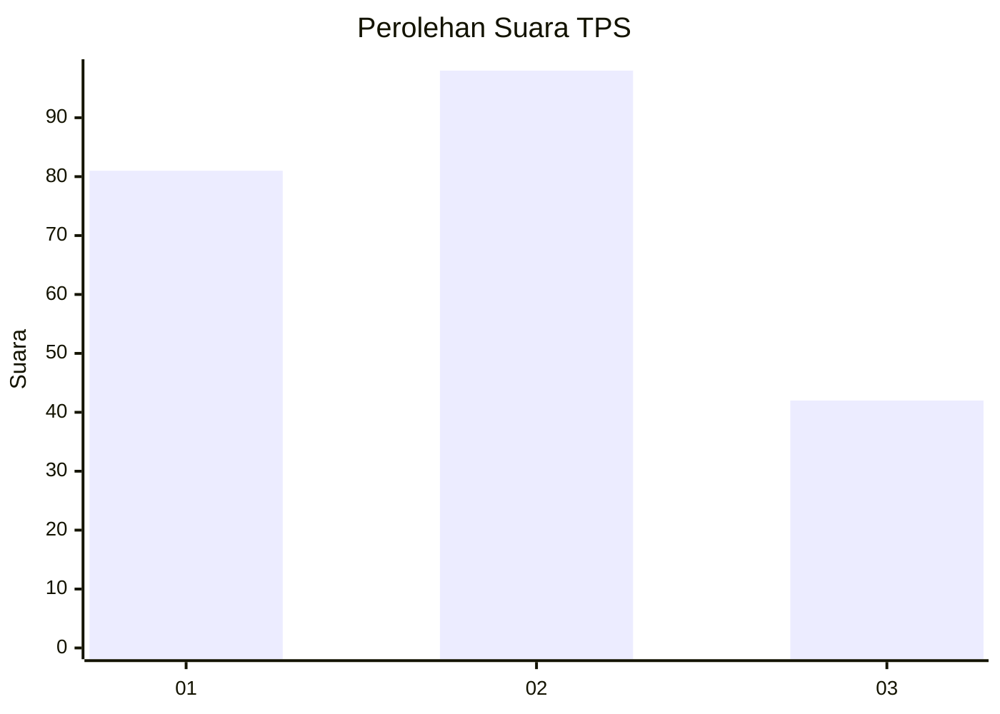
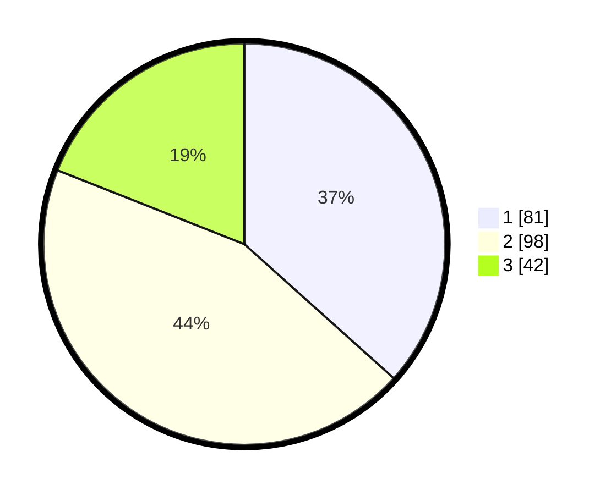

# Hasil

## Grafik

## Tabel

| No. | Nama Paslon    | Suara | Suara (raw) | Persentase |
|:--- |:-------------- | -----:| -----------:| ----------:|
| 1   | ANIES MUHAIMIN | 81    | [81][p-1]   | 36,65      |
| 2   | PRABOWO GIBRAN | 98    | [98][p-2]   | 44,34      |
| 3   | GANJAR MAHFUD  | 42    | [42][p-3]   | 19,00      |

[p-1]: https://github.com/gigit-pemilu/pemilu-2024-34-di-yogyakarta/blob/main/pilpres/hitung-suara/sub/34-di-yogyakarta/sub/04-sleman/sub/08-berbah/sub/2001-sendangtirto/sub/045-tps/sub/paslon-1.txt
[p-2]: https://github.com/gigit-pemilu/pemilu-2024-34-di-yogyakarta/blob/main/pilpres/hitung-suara/sub/34-di-yogyakarta/sub/04-sleman/sub/08-berbah/sub/2001-sendangtirto/sub/045-tps/sub/paslon-2.txt
[p-3]: https://github.com/gigit-pemilu/pemilu-2024-34-di-yogyakarta/blob/main/pilpres/hitung-suara/sub/34-di-yogyakarta/sub/04-sleman/sub/08-berbah/sub/2001-sendangtirto/sub/045-tps/sub/paslon-3.txt

## Foto C Plano

https://sirekap-obj-formc.kpu.go.id/bec6/pemilu/ppwp/34/04/08/20/01/3404082001045-20240215-005134--7f27cc4b-1449-45f9-9660-e3cdcce17ad8.jpg

https://sirekap-obj-formc.kpu.go.id/bec6/pemilu/ppwp/34/04/08/20/01/3404082001045-20240215-005316--9ba297c6-7634-4649-b000-c42db9a7e1ff.jpg

https://sirekap-obj-formc.kpu.go.id/bec6/pemilu/ppwp/34/04/08/20/01/3404082001045-20240215-005715--1e1255ef-99eb-4bfa-b0c0-5260f94f8542.jpg

## Metadata

| Key        | Value               |
| ---------- | ------------------- |
| Time Stamp | 2024-02-24 22:31:28 |

