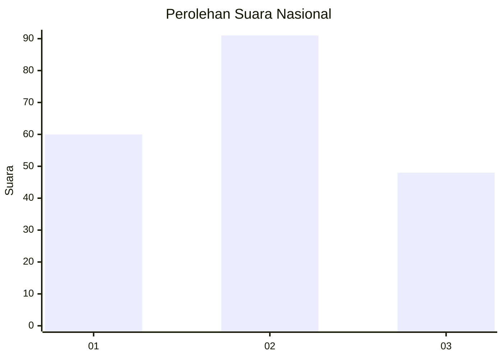
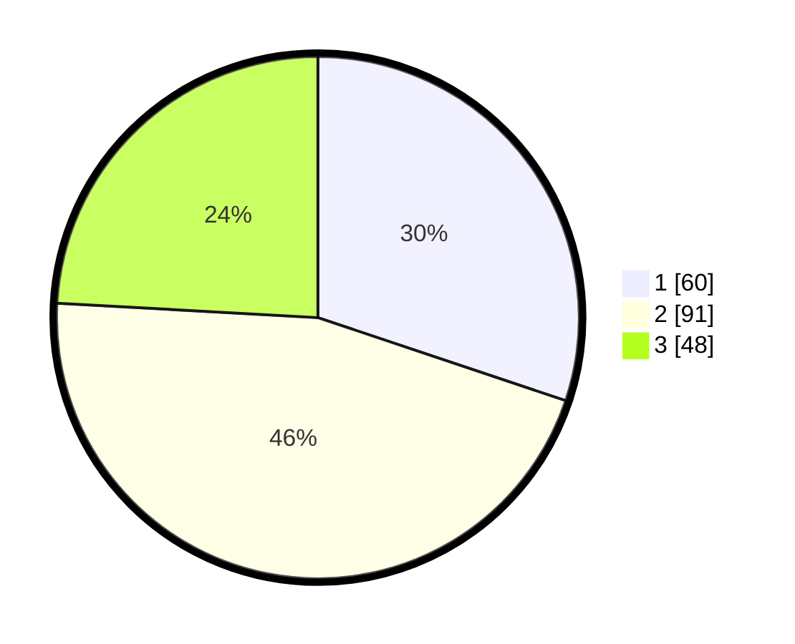

# Hasil

## Grafik

## Tabel

| No. | Nama Paslon    | Suara | Suara (raw) | Persentase |
|:--- |:-------------- | -----:| -----------:| ----------:|
| 1   | ANIES MUHAIMIN | 60    | [60][p-1]   | 30,15      |
| 2   | PRABOWO GIBRAN | 91    | [91][p-2]   | 45,73      |
| 3   | GANJAR MAHFUD  | 48    | [48][p-3]   | 24,12      |

[p-1]: https://github.com/gigit-pemilu/pemilu-2024/blob/main/pilpres/hitung-suara/sub/34-di-yogyakarta/sub/04-sleman/sub/08-berbah/sub/2001-sendangtirto/sub/050-tps/sub/paslon-1.txt
[p-2]: https://github.com/gigit-pemilu/pemilu-2024/blob/main/pilpres/hitung-suara/sub/34-di-yogyakarta/sub/04-sleman/sub/08-berbah/sub/2001-sendangtirto/sub/050-tps/sub/paslon-2.txt
[p-3]: https://github.com/gigit-pemilu/pemilu-2024/blob/main/pilpres/hitung-suara/sub/34-di-yogyakarta/sub/04-sleman/sub/08-berbah/sub/2001-sendangtirto/sub/050-tps/sub/paslon-3.txt

## Foto C Plano

https://sirekap-obj-formc.kpu.go.id/5e60/pemilu/ppwp/34/04/08/20/01/3404082001050-20240214-200246--a586f2b9-ac9c-4deb-872a-c51c717116ce.jpg

https://sirekap-obj-formc.kpu.go.id/5e60/pemilu/ppwp/34/04/08/20/01/3404082001050-20240214-200301--10133bff-f5bc-4d49-ae87-fe3fd50153df.jpg

https://sirekap-obj-formc.kpu.go.id/5e60/pemilu/ppwp/34/04/08/20/01/3404082001050-20240214-200322--2ba40b40-883b-432c-9f17-a8be37eb192c.jpg

## Metadata

| Key        | Value               |
| ---------- | ------------------- |
| Time Stamp | 2024-02-15 16:30:25 |

