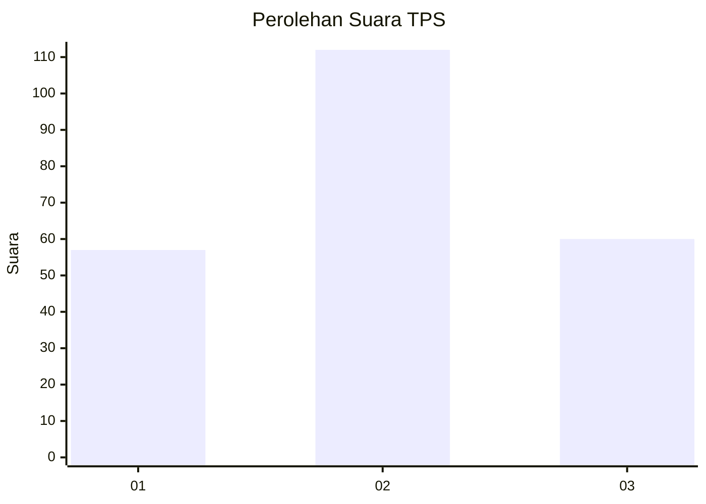
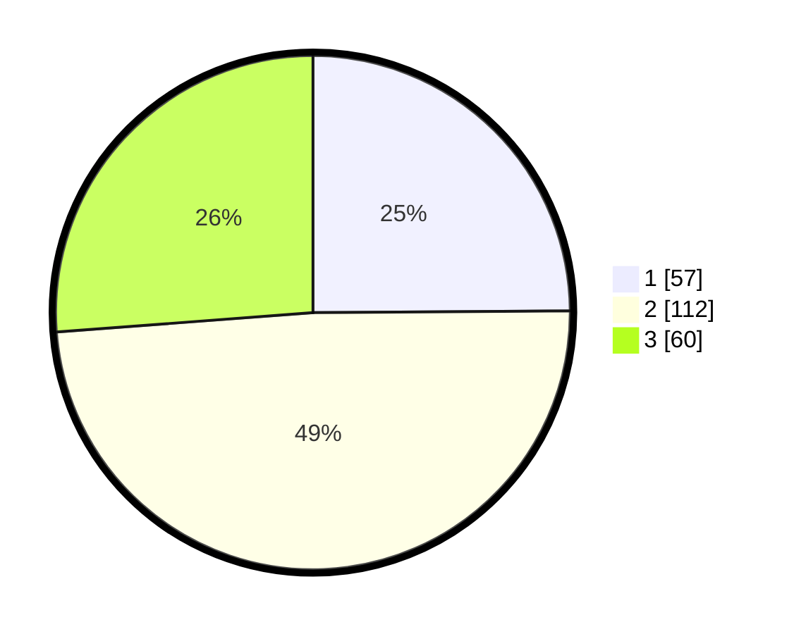

# Hasil

## Grafik

## Tabel

| No. | Nama Paslon    | Suara | Suara (raw) | Persentase |
|:--- |:-------------- | -----:| -----------:| ----------:|
| 1   | ANIES MUHAIMIN | 57    | [57][p-1]   | 24,89      |
| 2   | PRABOWO GIBRAN | 112   | [112][p-2]  | 48,91      |
| 3   | GANJAR MAHFUD  | 60    | [60][p-3]   | 26,20      |

[p-1]: https://github.com/gigit-pemilu/pemilu-2024-34-di-yogyakarta/blob/main/pilpres/hitung-suara/sub/34-di-yogyakarta/sub/04-sleman/sub/08-berbah/sub/2001-sendangtirto/sub/056-tps/sub/paslon-1.txt
[p-2]: https://github.com/gigit-pemilu/pemilu-2024-34-di-yogyakarta/blob/main/pilpres/hitung-suara/sub/34-di-yogyakarta/sub/04-sleman/sub/08-berbah/sub/2001-sendangtirto/sub/056-tps/sub/paslon-2.txt
[p-3]: https://github.com/gigit-pemilu/pemilu-2024-34-di-yogyakarta/blob/main/pilpres/hitung-suara/sub/34-di-yogyakarta/sub/04-sleman/sub/08-berbah/sub/2001-sendangtirto/sub/056-tps/sub/paslon-3.txt

## Foto C Plano

https://sirekap-obj-formc.kpu.go.id/c04f/pemilu/ppwp/34/04/08/20/01/3404082001056-20240215-013908--0283de81-be05-4848-8767-a643b397ddc5.jpg

https://sirekap-obj-formc.kpu.go.id/c04f/pemilu/ppwp/34/04/08/20/01/3404082001056-20240214-185541--23e7ed71-055c-4e38-82f6-d5da75efc4f5.jpg

https://sirekap-obj-formc.kpu.go.id/c04f/pemilu/ppwp/34/04/08/20/01/3404082001056-20240215-013955--afe59cfa-45b5-4402-a703-e9711926cdbd.jpg

## Metadata

| Key        | Value               |
| ---------- | ------------------- |
| Time Stamp | 2024-02-15 15:00:29 |

## DATA PEMILIH TETAP

Jumlah pemilih dalam DPT: **237**.
 * L: **105**.
 * P: **132**.

## DATA PENGGUNA HAK PILIH

Jumlah pengguna hak pilih dalam DPT: **206**.
 * L: **92**.
 * P: **114**.

Jumlah pengguna hak pilih dalam DPTb: **19**.
 * L: **3**.
 * P: **16**.

Jumlah pengguna hak pilih dalam DPK: **6**.
 * L: **5**.
 * P: **1**.

Jumlah pengguna hak pilih: **231**.
 * L: **100**.
 * P: **131**.

## JUMLAH SUARA SAH DAN TIDAK SAH

JUMLAH SELURUH SUARA SAH: **229**.

JUMLAH SUARA TIDAK SAH: **2**.

JUMLAH SELURUH SUARA SAH DAN SUARA TIDAK SAH: **231**.

