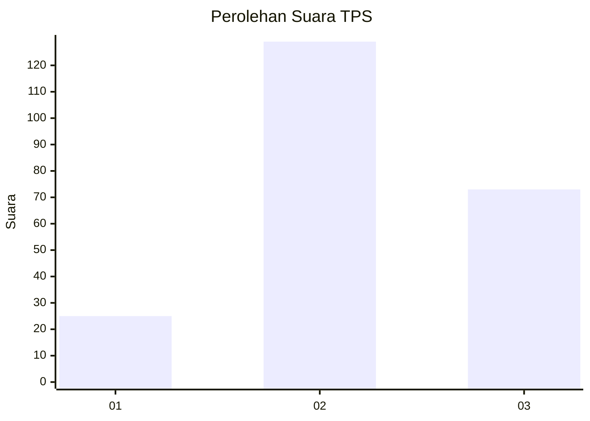
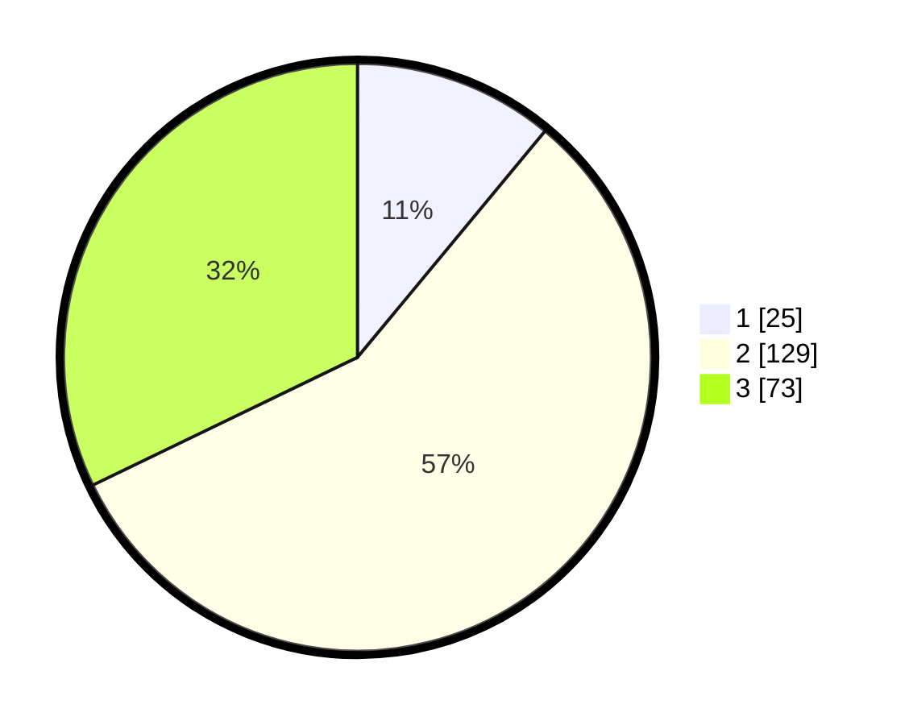

# Hasil

## Grafik

## Tabel

| No. | Nama Paslon    | Suara | Suara (raw) | Persentase |
|:--- |:-------------- | -----:| -----------:| ----------:|
| 1   | ANIES MUHAIMIN | 25    | [25][p-1]   | 11,01      |
| 2   | PRABOWO GIBRAN | 129   | [129][p-2]  | 56,83      |
| 3   | GANJAR MAHFUD  | 73    | [73][p-3]   | 32,16      |

[p-1]: https://github.com/gigit-pemilu/pemilu-2024-34-di-yogyakarta/blob/main/pilpres/hitung-suara/sub/34-di-yogyakarta/sub/04-sleman/sub/08-berbah/sub/2002-tegaltirto/sub/002-tps/sub/paslon-1.txt
[p-2]: https://github.com/gigit-pemilu/pemilu-2024-34-di-yogyakarta/blob/main/pilpres/hitung-suara/sub/34-di-yogyakarta/sub/04-sleman/sub/08-berbah/sub/2002-tegaltirto/sub/002-tps/sub/paslon-2.txt
[p-3]: https://github.com/gigit-pemilu/pemilu-2024-34-di-yogyakarta/blob/main/pilpres/hitung-suara/sub/34-di-yogyakarta/sub/04-sleman/sub/08-berbah/sub/2002-tegaltirto/sub/002-tps/sub/paslon-3.txt

## Foto C Plano

https://sirekap-obj-formc.kpu.go.id/59d7/pemilu/ppwp/34/04/08/20/02/3404082002002-20240214-231622--88479a4a-e596-4550-8cdf-1c26a5f5d7a6.jpg

https://sirekap-obj-formc.kpu.go.id/59d7/pemilu/ppwp/34/04/08/20/02/3404082002002-20240214-231754--59a00ddb-e251-4047-b2b5-10713e49536f.jpg

## Metadata

| Key        | Value               |
| ---------- | ------------------- |
| Time Stamp | 2024-02-24 22:31:28 |

