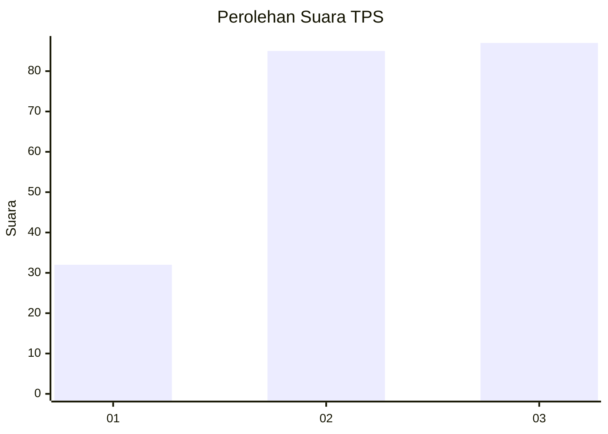
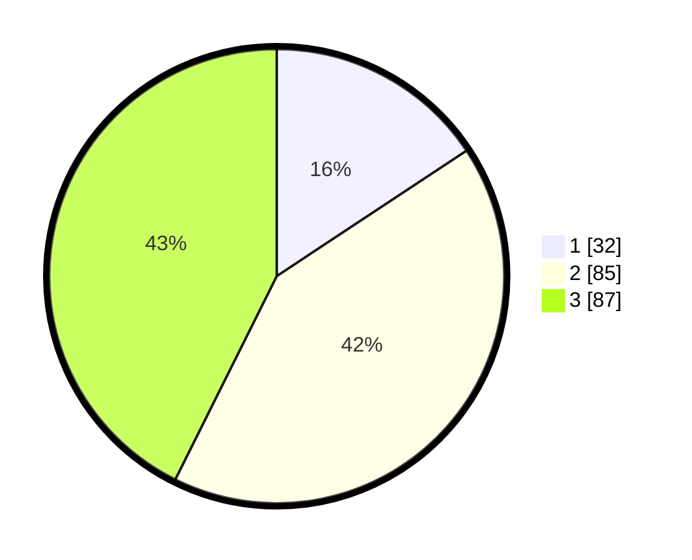

# Hasil

## Grafik

## Tabel

| No. | Nama Paslon    | Suara | Suara (raw) | Persentase |
|:--- |:-------------- | -----:| -----------:| ----------:|
| 1   | ANIES MUHAIMIN | 32    | [32][p-1]   | 15,69      |
| 2   | PRABOWO GIBRAN | 85    | [85][p-2]   | 41,67      |
| 3   | GANJAR MAHFUD  | 87    | [87][p-3]   | 42,65      |

[p-1]: https://github.com/gigit-pemilu/pemilu-2024-34-di-yogyakarta/blob/main/pilpres/hitung-suara/sub/34-di-yogyakarta/sub/04-sleman/sub/08-berbah/sub/2002-tegaltirto/sub/003-tps/sub/paslon-1.txt
[p-2]: https://github.com/gigit-pemilu/pemilu-2024-34-di-yogyakarta/blob/main/pilpres/hitung-suara/sub/34-di-yogyakarta/sub/04-sleman/sub/08-berbah/sub/2002-tegaltirto/sub/003-tps/sub/paslon-2.txt
[p-3]: https://github.com/gigit-pemilu/pemilu-2024-34-di-yogyakarta/blob/main/pilpres/hitung-suara/sub/34-di-yogyakarta/sub/04-sleman/sub/08-berbah/sub/2002-tegaltirto/sub/003-tps/sub/paslon-3.txt

## Foto C Plano

https://sirekap-obj-formc.kpu.go.id/b8d1/pemilu/ppwp/34/04/08/20/02/3404082002003-20240214-210903--c8d730d4-1231-467f-8f76-3a058208c036.jpg

https://sirekap-obj-formc.kpu.go.id/b8d1/pemilu/ppwp/34/04/08/20/02/3404082002003-20240214-211007--58561afb-399f-4c62-b573-ae90e8fe9319.jpg

https://sirekap-obj-formc.kpu.go.id/b8d1/pemilu/ppwp/34/04/08/20/02/3404082002003-20240214-211720--b160ece7-5c13-44ca-8f92-04a69685bceb.jpg

## Metadata

| Key        | Value               |
| ---------- | ------------------- |
| Time Stamp | 2024-02-15 12:00:28 |

