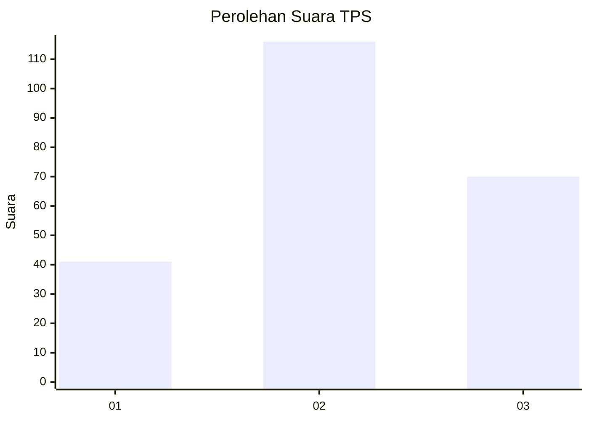
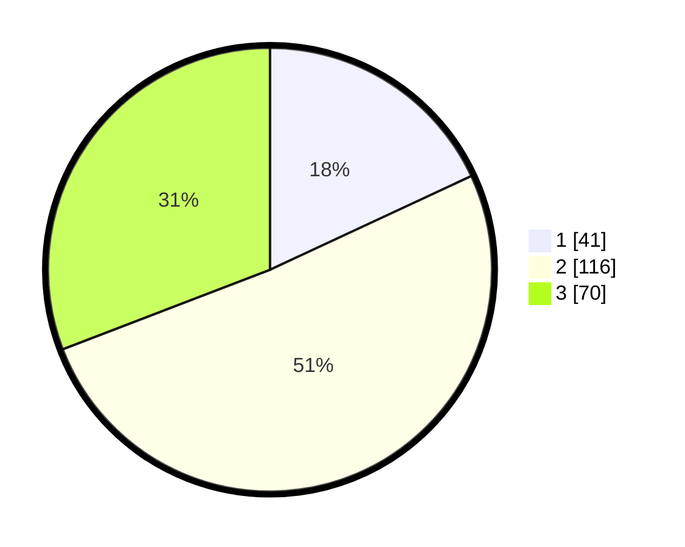

# Hasil

## Grafik

## Tabel

| No. | Nama Paslon    | Suara | Suara (raw) | Persentase |
|:--- |:-------------- | -----:| -----------:| ----------:|
| 1   | ANIES MUHAIMIN | 41    | [41][p-1]   | 18,06      |
| 2   | PRABOWO GIBRAN | 116   | [116][p-2]  | 51,10      |
| 3   | GANJAR MAHFUD  | 70    | [70][p-3]   | 30,84      |

[p-1]: https://github.com/gigit-pemilu/pemilu-2024-34-di-yogyakarta/blob/main/pilpres/hitung-suara/sub/34-di-yogyakarta/sub/04-sleman/sub/08-berbah/sub/2002-tegaltirto/sub/004-tps/sub/paslon-1.txt
[p-2]: https://github.com/gigit-pemilu/pemilu-2024-34-di-yogyakarta/blob/main/pilpres/hitung-suara/sub/34-di-yogyakarta/sub/04-sleman/sub/08-berbah/sub/2002-tegaltirto/sub/004-tps/sub/paslon-2.txt
[p-3]: https://github.com/gigit-pemilu/pemilu-2024-34-di-yogyakarta/blob/main/pilpres/hitung-suara/sub/34-di-yogyakarta/sub/04-sleman/sub/08-berbah/sub/2002-tegaltirto/sub/004-tps/sub/paslon-3.txt

## Foto C Plano

https://sirekap-obj-formc.kpu.go.id/519c/pemilu/ppwp/34/04/08/20/02/3404082002004-20240214-193935--56a5eb93-0bbb-47a7-9a58-9b3b38833344.jpg

https://sirekap-obj-formc.kpu.go.id/519c/pemilu/ppwp/34/04/08/20/02/3404082002004-20240214-193940--82dd6136-1e06-4ebf-a97a-ad6b144550d6.jpg

https://sirekap-obj-formc.kpu.go.id/519c/pemilu/ppwp/34/04/08/20/02/3404082002004-20240214-193945--5e1ae721-684d-4b51-9135-874e22110089.jpg

## Metadata

| Key        | Value               |
| ---------- | ------------------- |
| Time Stamp | 2024-02-24 22:31:28 |

