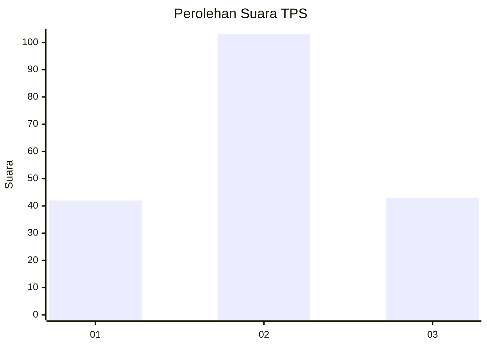
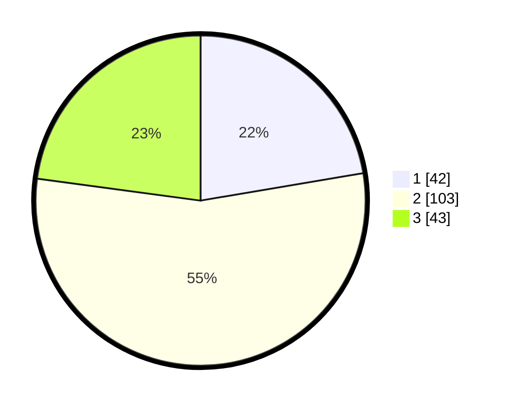

# Hasil

## Grafik

## Tabel

| No. | Nama Paslon    | Suara | Suara (raw) | Persentase |
|:--- |:-------------- | -----:| -----------:| ----------:|
| 1   | ANIES MUHAIMIN | 42    | [42][p-1]   | 22,34      |
| 2   | PRABOWO GIBRAN | 103   | [103][p-2]  | 54,79      |
| 3   | GANJAR MAHFUD  | 43    | [43][p-3]   | 22,87      |

[p-1]: https://github.com/gigit-pemilu/pemilu-2024-34-di-yogyakarta/blob/main/pilpres/hitung-suara/sub/34-di-yogyakarta/sub/04-sleman/sub/08-berbah/sub/2002-tegaltirto/sub/008-tps/sub/paslon-1.txt
[p-2]: https://github.com/gigit-pemilu/pemilu-2024-34-di-yogyakarta/blob/main/pilpres/hitung-suara/sub/34-di-yogyakarta/sub/04-sleman/sub/08-berbah/sub/2002-tegaltirto/sub/008-tps/sub/paslon-2.txt
[p-3]: https://github.com/gigit-pemilu/pemilu-2024-34-di-yogyakarta/blob/main/pilpres/hitung-suara/sub/34-di-yogyakarta/sub/04-sleman/sub/08-berbah/sub/2002-tegaltirto/sub/008-tps/sub/paslon-3.txt

## Foto C Plano

https://sirekap-obj-formc.kpu.go.id/2274/pemilu/ppwp/34/04/08/20/02/3404082002008-20240214-225912--7e6650d0-39cc-4877-b329-9632427e5638.jpg

https://sirekap-obj-formc.kpu.go.id/2274/pemilu/ppwp/34/04/08/20/02/3404082002008-20240214-230109--1af90701-23a5-4ba3-9de5-e7f8946ad9b5.jpg

https://sirekap-obj-formc.kpu.go.id/2274/pemilu/ppwp/34/04/08/20/02/3404082002008-20240214-230208--259bd129-dcd1-42ae-8872-f29aa29d46c4.jpg

## Metadata

| Key        | Value               |
| ---------- | ------------------- |
| Time Stamp | 2024-02-15 15:30:25 |

