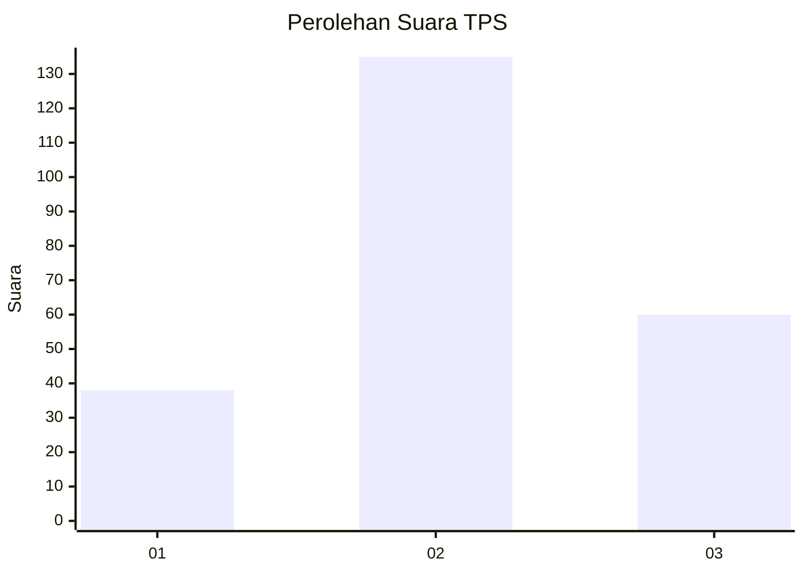
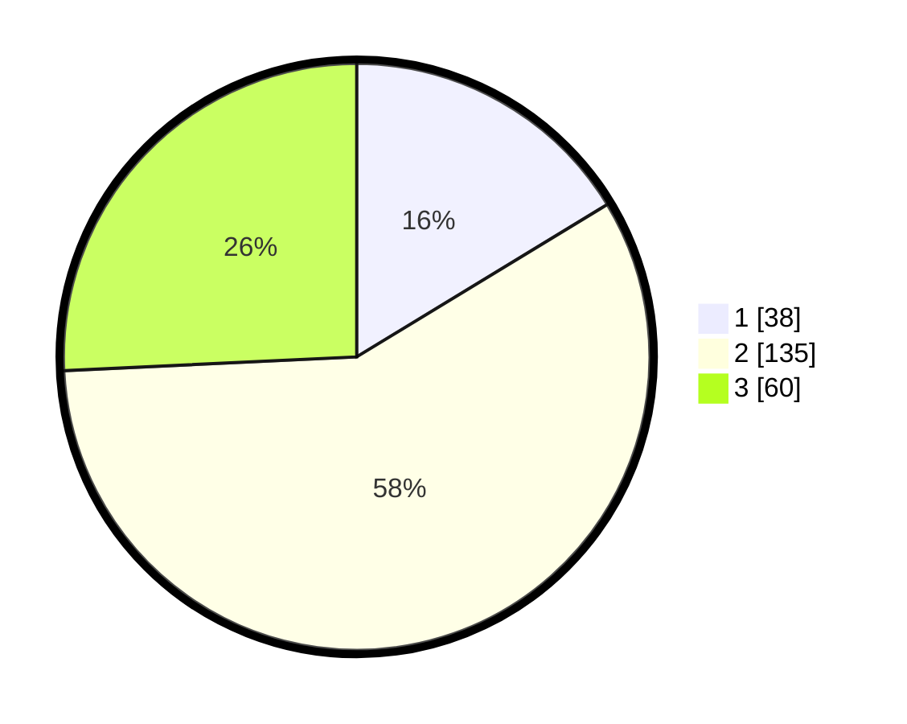

# Hasil

## Grafik

## Tabel

| No. | Nama Paslon    | Suara | Suara (raw) | Persentase |
|:--- |:-------------- | -----:| -----------:| ----------:|
| 1   | ANIES MUHAIMIN | 38    | [38][p-1]   | 16,31      |
| 2   | PRABOWO GIBRAN | 135   | [135][p-2]  | 57,94      |
| 3   | GANJAR MAHFUD  | 60    | [60][p-3]   | 25,75      |

[p-1]: https://github.com/gigit-pemilu/pemilu-2024-34-di-yogyakarta/blob/main/pilpres/hitung-suara/sub/34-di-yogyakarta/sub/04-sleman/sub/08-berbah/sub/2002-tegaltirto/sub/009-tps/sub/paslon-1.txt
[p-2]: https://github.com/gigit-pemilu/pemilu-2024-34-di-yogyakarta/blob/main/pilpres/hitung-suara/sub/34-di-yogyakarta/sub/04-sleman/sub/08-berbah/sub/2002-tegaltirto/sub/009-tps/sub/paslon-2.txt
[p-3]: https://github.com/gigit-pemilu/pemilu-2024-34-di-yogyakarta/blob/main/pilpres/hitung-suara/sub/34-di-yogyakarta/sub/04-sleman/sub/08-berbah/sub/2002-tegaltirto/sub/009-tps/sub/paslon-3.txt

## Foto C Plano

https://sirekap-obj-formc.kpu.go.id/2fb5/pemilu/ppwp/34/04/08/20/02/3404082002009-20240214-233900--2e02a9c8-9343-4a6b-877c-fc8d6234d8a3.jpg

https://sirekap-obj-formc.kpu.go.id/2fb5/pemilu/ppwp/34/04/08/20/02/3404082002009-20240214-234009--885deee9-282a-4963-804c-dff9e81fee82.jpg

https://sirekap-obj-formc.kpu.go.id/2fb5/pemilu/ppwp/34/04/08/20/02/3404082002009-20240215-004638--21b0e61b-3292-4820-9eb6-ed92e61830a4.jpg

## Metadata

| Key        | Value               |
| ---------- | ------------------- |
| Time Stamp | 2024-02-15 21:01:18 |

