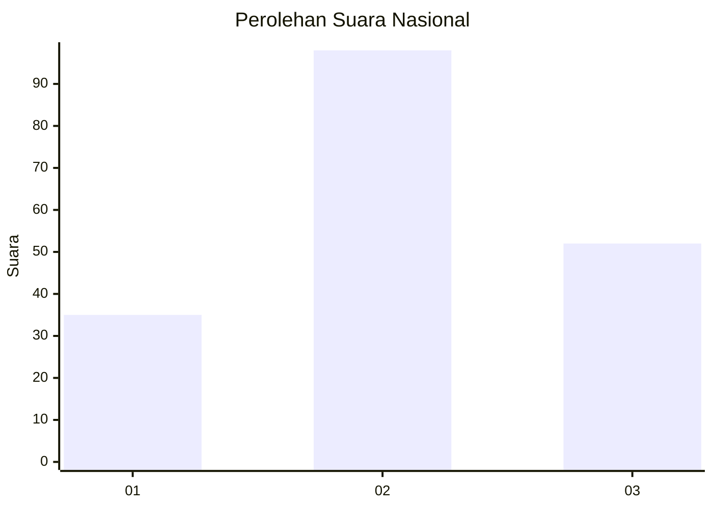
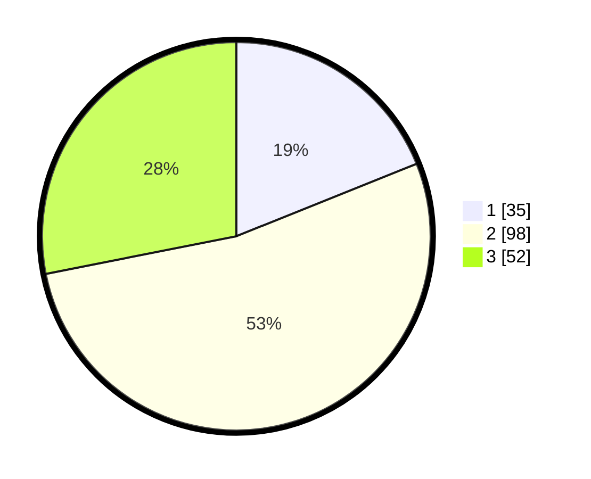

# Hasil

## Grafik

## Tabel

| No. | Nama Paslon    | Suara | Suara (raw) | Persentase |
|:--- |:-------------- | -----:| -----------:| ----------:|
| 1   | ANIES MUHAIMIN | 35    | [35][p-1]   | 18,92      |
| 2   | PRABOWO GIBRAN | 98    | [98][p-2]   | 52,97      |
| 3   | GANJAR MAHFUD  | 52    | [52][p-3]   | 28,11      |

[p-1]: https://github.com/gigit-pemilu/pemilu-2024/blob/main/pilpres/hitung-suara/sub/34-di-yogyakarta/sub/04-sleman/sub/08-berbah/sub/2002-tegaltirto/sub/011-tps/sub/paslon-1.txt
[p-2]: https://github.com/gigit-pemilu/pemilu-2024/blob/main/pilpres/hitung-suara/sub/34-di-yogyakarta/sub/04-sleman/sub/08-berbah/sub/2002-tegaltirto/sub/011-tps/sub/paslon-2.txt
[p-3]: https://github.com/gigit-pemilu/pemilu-2024/blob/main/pilpres/hitung-suara/sub/34-di-yogyakarta/sub/04-sleman/sub/08-berbah/sub/2002-tegaltirto/sub/011-tps/sub/paslon-3.txt

## Foto C Plano

https://sirekap-obj-formc.kpu.go.id/5e88/pemilu/ppwp/34/04/08/20/02/3404082002011-20240214-203329--b2cee6ff-4863-4d26-b93c-6459b1c17dfe.jpg

https://sirekap-obj-formc.kpu.go.id/5e88/pemilu/ppwp/34/04/08/20/02/3404082002011-20240214-205200--059e027d-0d70-4508-8e76-b3ecb7a24d6b.jpg

https://sirekap-obj-formc.kpu.go.id/5e88/pemilu/ppwp/34/04/08/20/02/3404082002011-20240214-205416--2de4881c-7bc7-4c29-9a38-e2edaaf456f0.jpg

## Metadata

| Key        | Value               |
| ---------- | ------------------- |
| Time Stamp | 2024-02-24 22:31:28 |

