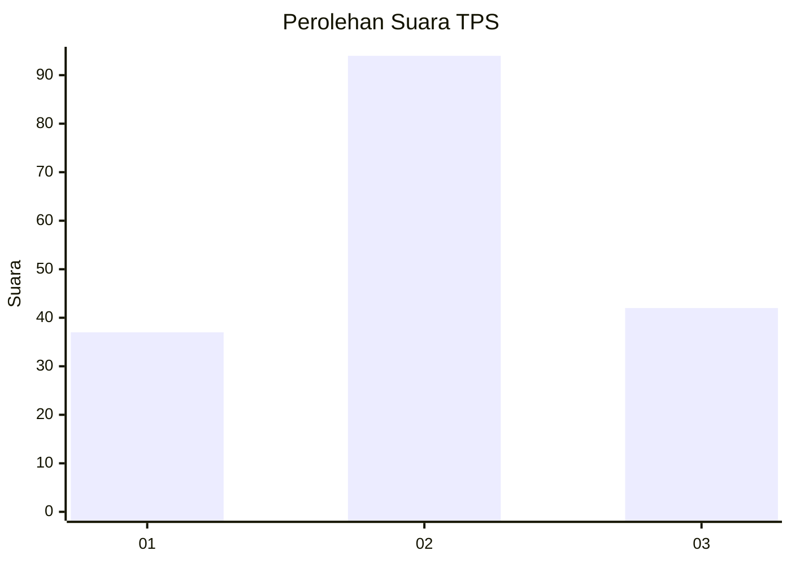
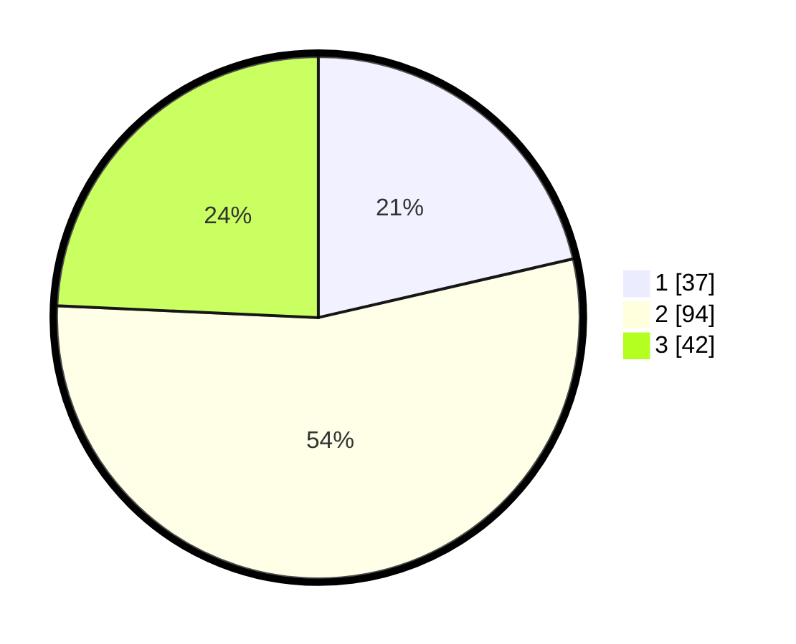

# Hasil

## Grafik

## Tabel

| No. | Nama Paslon    | Suara | Suara (raw) | Persentase |
|:--- |:-------------- | -----:| -----------:| ----------:|
| 1   | ANIES MUHAIMIN | 37    | [37][p-1]   | 21,39      |
| 2   | PRABOWO GIBRAN | 94    | [94][p-2]   | 54,34      |
| 3   | GANJAR MAHFUD  | 42    | [42][p-3]   | 24,28      |

[p-1]: https://github.com/gigit-pemilu/pemilu-2024-34-di-yogyakarta/blob/main/pilpres/hitung-suara/sub/34-di-yogyakarta/sub/04-sleman/sub/08-berbah/sub/2002-tegaltirto/sub/012-tps/sub/paslon-1.txt
[p-2]: https://github.com/gigit-pemilu/pemilu-2024-34-di-yogyakarta/blob/main/pilpres/hitung-suara/sub/34-di-yogyakarta/sub/04-sleman/sub/08-berbah/sub/2002-tegaltirto/sub/012-tps/sub/paslon-2.txt
[p-3]: https://github.com/gigit-pemilu/pemilu-2024-34-di-yogyakarta/blob/main/pilpres/hitung-suara/sub/34-di-yogyakarta/sub/04-sleman/sub/08-berbah/sub/2002-tegaltirto/sub/012-tps/sub/paslon-3.txt

## Foto C Plano

https://sirekap-obj-formc.kpu.go.id/55af/pemilu/ppwp/34/04/08/20/02/3404082002012-20240214-155540--5dea0f15-861d-4629-a808-297392d3c60f.jpg

https://sirekap-obj-formc.kpu.go.id/55af/pemilu/ppwp/34/04/08/20/02/3404082002012-20240214-225634--acd1b60c-2856-42c8-8e80-0d2338152770.jpg

https://sirekap-obj-formc.kpu.go.id/55af/pemilu/ppwp/34/04/08/20/02/3404082002012-20240214-225624--0e589f84-2f0c-470c-b80d-57b699c7d5c3.jpg

## Metadata

| Key        | Value               |
| ---------- | ------------------- |
| Time Stamp | 2024-02-25 09:00:00 |

