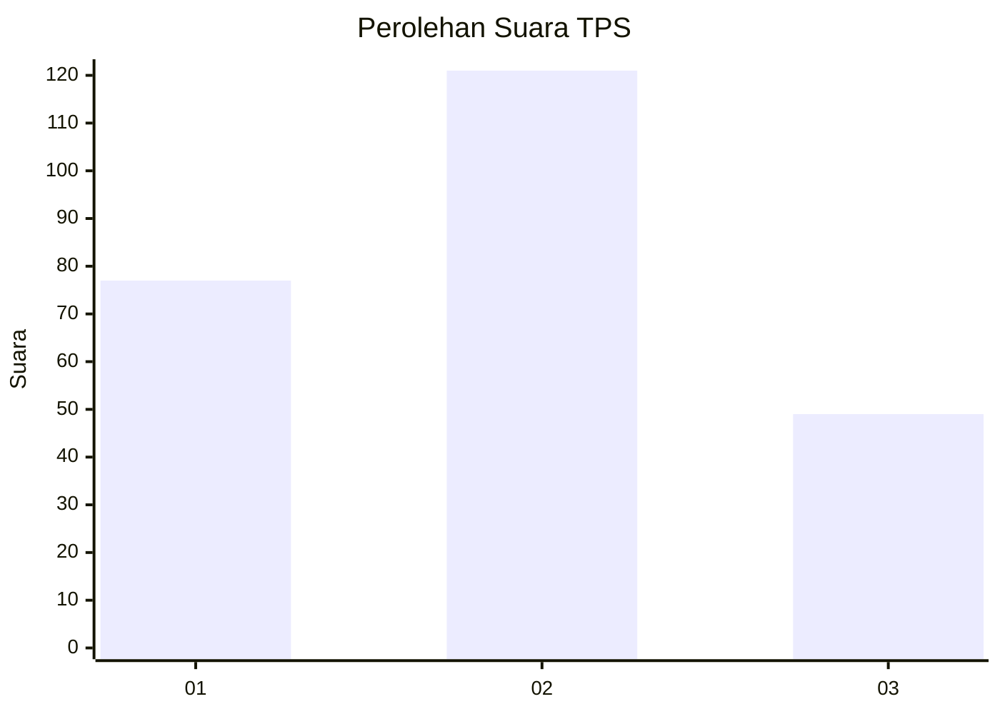
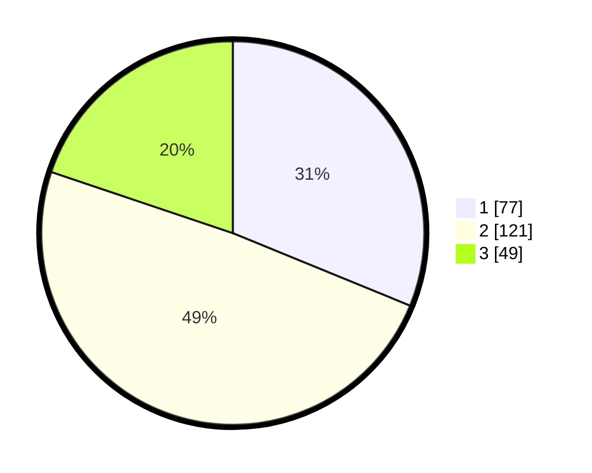

# Hasil

## Grafik

## Tabel

| No. | Nama Paslon    | Suara | Suara (raw) | Persentase |
|:--- |:-------------- | -----:| -----------:| ----------:|
| 1   | ANIES MUHAIMIN | 77    | [77][p-1]   | 31,17      |
| 2   | PRABOWO GIBRAN | 121   | [121][p-2]  | 48,99      |
| 3   | GANJAR MAHFUD  | 49    | [49][p-3]   | 19,84      |

[p-1]: https://github.com/gigit-pemilu/pemilu-2024-34-di-yogyakarta/blob/main/pilpres/hitung-suara/sub/34-di-yogyakarta/sub/04-sleman/sub/08-berbah/sub/2002-tegaltirto/sub/015-tps/sub/paslon-1.txt
[p-2]: https://github.com/gigit-pemilu/pemilu-2024-34-di-yogyakarta/blob/main/pilpres/hitung-suara/sub/34-di-yogyakarta/sub/04-sleman/sub/08-berbah/sub/2002-tegaltirto/sub/015-tps/sub/paslon-2.txt
[p-3]: https://github.com/gigit-pemilu/pemilu-2024-34-di-yogyakarta/blob/main/pilpres/hitung-suara/sub/34-di-yogyakarta/sub/04-sleman/sub/08-berbah/sub/2002-tegaltirto/sub/015-tps/sub/paslon-3.txt

## Foto C Plano

https://sirekap-obj-formc.kpu.go.id/066a/pemilu/ppwp/34/04/08/20/02/3404082002015-20240215-001651--e0e98647-4a7b-40a5-8a6e-32269085b91a.jpg

https://sirekap-obj-formc.kpu.go.id/066a/pemilu/ppwp/34/04/08/20/02/3404082002015-20240215-001755--551d50cd-768d-48f8-be99-0915df6a1a33.jpg

https://sirekap-obj-formc.kpu.go.id/066a/pemilu/ppwp/34/04/08/20/02/3404082002015-20240215-001900--00ddc740-04ec-4336-92ad-8b889e47dc0a.jpg

## Metadata

| Key        | Value               |
| ---------- | ------------------- |
| Time Stamp | 2024-02-15 16:30:25 |

