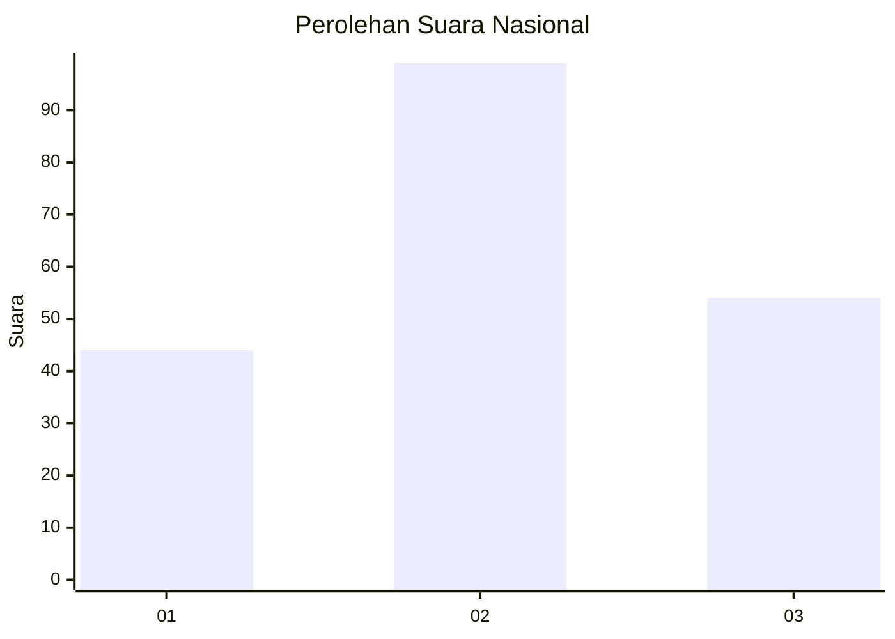
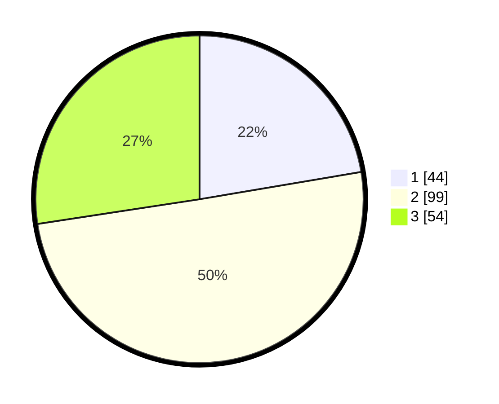

# Hasil

## Grafik

## Tabel

| No. | Nama Paslon    | Suara | Suara (raw) | Persentase |
|:--- |:-------------- | -----:| -----------:| ----------:|
| 1   | ANIES MUHAIMIN | 44    | [44][p-1]   | 22,34      |
| 2   | PRABOWO GIBRAN | 99    | [99][p-2]   | 50,25      |
| 3   | GANJAR MAHFUD  | 54    | [54][p-3]   | 27,41      |

[p-1]: https://github.com/gigit-pemilu/pemilu-2024/blob/main/pilpres/hitung-suara/sub/34-di-yogyakarta/sub/04-sleman/sub/08-berbah/sub/2002-tegaltirto/sub/022-tps/sub/paslon-1.txt
[p-2]: https://github.com/gigit-pemilu/pemilu-2024/blob/main/pilpres/hitung-suara/sub/34-di-yogyakarta/sub/04-sleman/sub/08-berbah/sub/2002-tegaltirto/sub/022-tps/sub/paslon-2.txt
[p-3]: https://github.com/gigit-pemilu/pemilu-2024/blob/main/pilpres/hitung-suara/sub/34-di-yogyakarta/sub/04-sleman/sub/08-berbah/sub/2002-tegaltirto/sub/022-tps/sub/paslon-3.txt

## Foto C Plano

https://sirekap-obj-formc.kpu.go.id/b4be/pemilu/ppwp/34/04/08/20/02/3404082002022-20240214-230748--b18cb208-6a3b-4002-ac33-8d1f11f5cda5.jpg

https://sirekap-obj-formc.kpu.go.id/b4be/pemilu/ppwp/34/04/08/20/02/3404082002022-20240214-230600--e429450a-e851-4b00-83c0-a5868a48e9c1.jpg

https://sirekap-obj-formc.kpu.go.id/b4be/pemilu/ppwp/34/04/08/20/02/3404082002022-20240214-230735--89347bb4-8965-4de1-a0c0-70afbb36bdf4.jpg

## Metadata

| Key        | Value               |
| ---------- | ------------------- |
| Time Stamp | 2024-02-15 09:00:24 |

