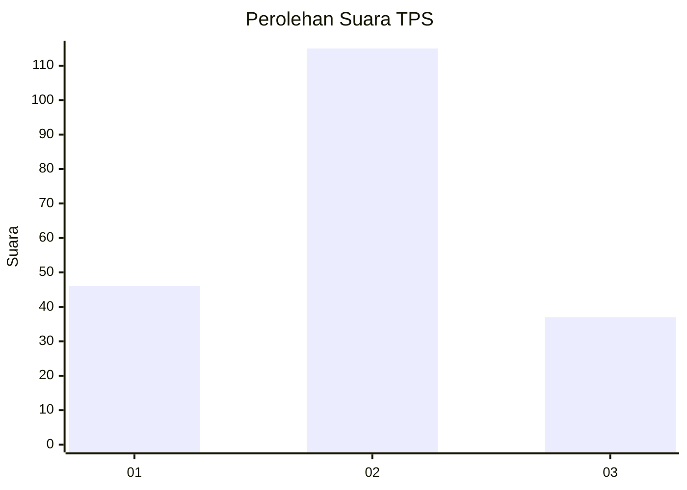
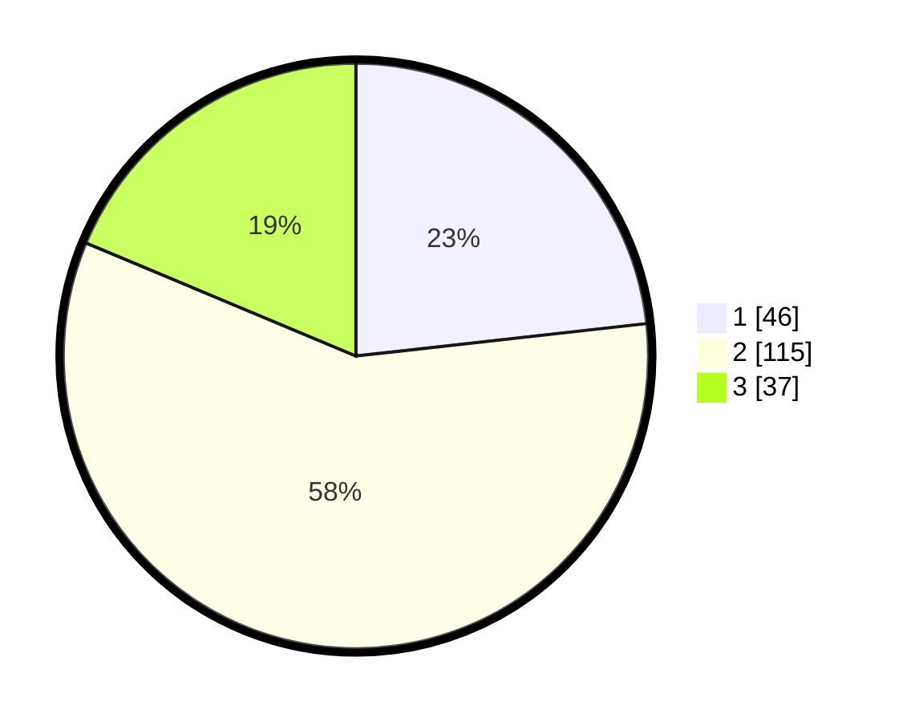

# Hasil

## Grafik

## Tabel

| No. | Nama Paslon    | Suara | Suara (raw) | Persentase |
|:--- |:-------------- | -----:| -----------:| ----------:|
| 1   | ANIES MUHAIMIN | 46    | [46][p-1]   | 23,23      |
| 2   | PRABOWO GIBRAN | 115   | [115][p-2]  | 58,08      |
| 3   | GANJAR MAHFUD  | 37    | [37][p-3]   | 18,69      |

[p-1]: https://github.com/gigit-pemilu/pemilu-2024-34-di-yogyakarta/blob/main/pilpres/hitung-suara/sub/34-di-yogyakarta/sub/04-sleman/sub/08-berbah/sub/2002-tegaltirto/sub/023-tps/sub/paslon-1.txt
[p-2]: https://github.com/gigit-pemilu/pemilu-2024-34-di-yogyakarta/blob/main/pilpres/hitung-suara/sub/34-di-yogyakarta/sub/04-sleman/sub/08-berbah/sub/2002-tegaltirto/sub/023-tps/sub/paslon-2.txt
[p-3]: https://github.com/gigit-pemilu/pemilu-2024-34-di-yogyakarta/blob/main/pilpres/hitung-suara/sub/34-di-yogyakarta/sub/04-sleman/sub/08-berbah/sub/2002-tegaltirto/sub/023-tps/sub/paslon-3.txt

## Foto C Plano

https://sirekap-obj-formc.kpu.go.id/e8ce/pemilu/ppwp/34/04/08/20/02/3404082002023-20240215-010604--6f719c61-042d-443d-a98f-42f0791eb7d1.jpg

https://sirekap-obj-formc.kpu.go.id/e8ce/pemilu/ppwp/34/04/08/20/02/3404082002023-20240215-010743--6623844f-1026-47bf-8280-97a8b34ad4c0.jpg

https://sirekap-obj-formc.kpu.go.id/e8ce/pemilu/ppwp/34/04/08/20/02/3404082002023-20240215-024912--a09d4663-057a-4d4c-9621-65fdb50ba3ac.jpg

## Metadata

| Key        | Value               |
| ---------- | ------------------- |
| Time Stamp | 2024-02-15 21:30:27 |

