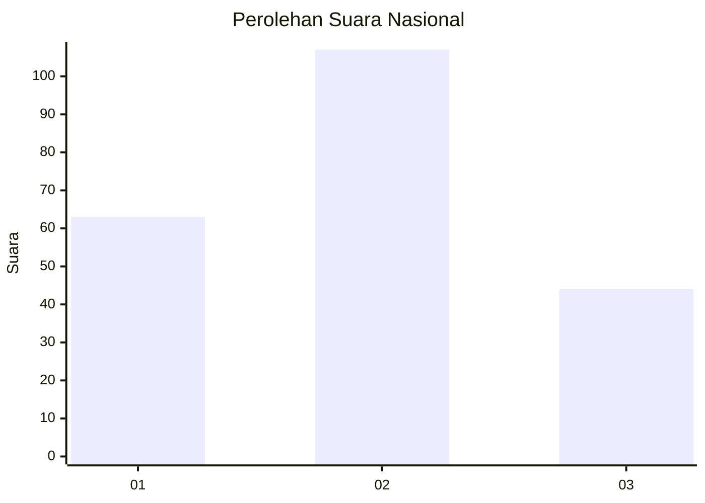
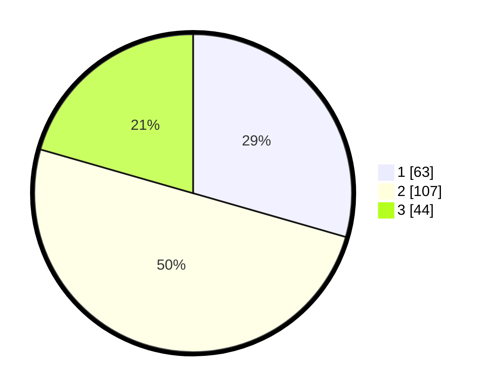

# Hasil

## Grafik

## Tabel

| No. | Nama Paslon    | Suara | Suara (raw) | Persentase |
|:--- |:-------------- | -----:| -----------:| ----------:|
| 1   | ANIES MUHAIMIN | 63    | [63][p-1]   | 29,44      |
| 2   | PRABOWO GIBRAN | 107   | [107][p-2]  | 50,00      |
| 3   | GANJAR MAHFUD  | 44    | [44][p-3]   | 20,56      |

[p-1]: https://github.com/gigit-pemilu/pemilu-2024/blob/main/pilpres/hitung-suara/sub/34-di-yogyakarta/sub/04-sleman/sub/08-berbah/sub/2002-tegaltirto/sub/025-tps/sub/paslon-1.txt
[p-2]: https://github.com/gigit-pemilu/pemilu-2024/blob/main/pilpres/hitung-suara/sub/34-di-yogyakarta/sub/04-sleman/sub/08-berbah/sub/2002-tegaltirto/sub/025-tps/sub/paslon-2.txt
[p-3]: https://github.com/gigit-pemilu/pemilu-2024/blob/main/pilpres/hitung-suara/sub/34-di-yogyakarta/sub/04-sleman/sub/08-berbah/sub/2002-tegaltirto/sub/025-tps/sub/paslon-3.txt

## Foto C Plano

https://sirekap-obj-formc.kpu.go.id/eedc/pemilu/ppwp/34/04/08/20/02/3404082002025-20240214-141424--3f0129ac-e508-4a7a-9459-7e326a8ce760.jpg

https://sirekap-obj-formc.kpu.go.id/eedc/pemilu/ppwp/34/04/08/20/02/3404082002025-20240214-141539--84eca207-23eb-40ce-b349-32021051be46.jpg

https://sirekap-obj-formc.kpu.go.id/eedc/pemilu/ppwp/34/04/08/20/02/3404082002025-20240214-141702--3e6e6608-bcd6-4c06-9595-8ba1febd51e4.jpg

## Metadata

| Key        | Value               |
| ---------- | ------------------- |
| Time Stamp | 2024-02-15 16:30:25 |

