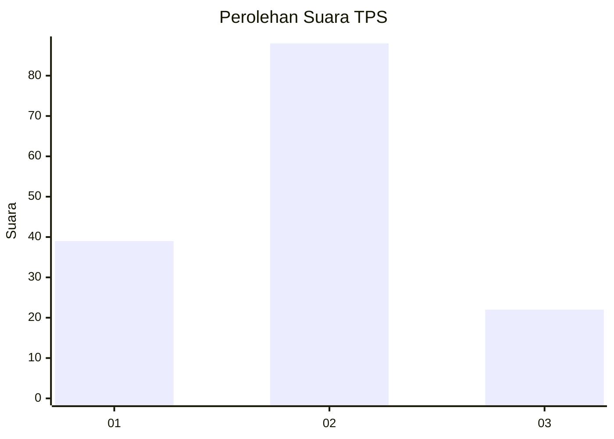
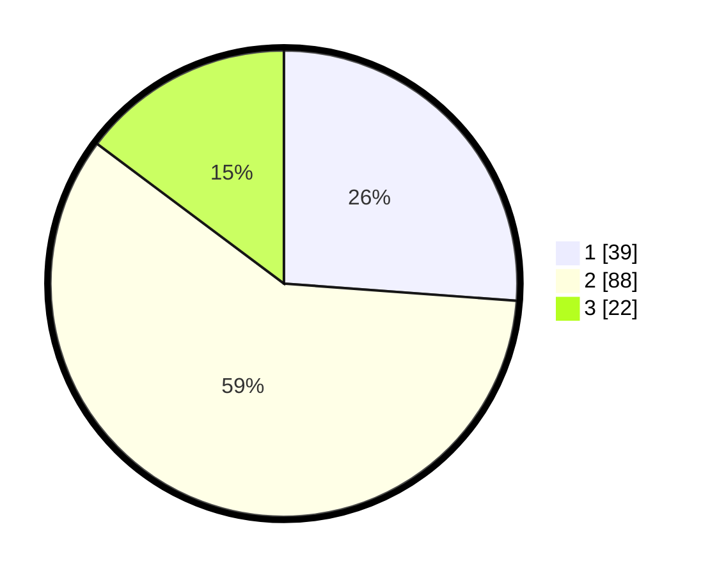

# Hasil

## Grafik

## Tabel

| No. | Nama Paslon    | Suara | Suara (raw) | Persentase |
|:--- |:-------------- | -----:| -----------:| ----------:|
| 1   | ANIES MUHAIMIN | 39    | [39][p-1]   | 26,17      |
| 2   | PRABOWO GIBRAN | 88    | [88][p-2]   | 59,06      |
| 3   | GANJAR MAHFUD  | 22    | [22][p-3]   | 14,77      |

[p-1]: https://github.com/gigit-pemilu/pemilu-2024-34-di-yogyakarta/blob/main/pilpres/hitung-suara/sub/34-di-yogyakarta/sub/04-sleman/sub/08-berbah/sub/2002-tegaltirto/sub/026-tps/sub/paslon-1.txt
[p-2]: https://github.com/gigit-pemilu/pemilu-2024-34-di-yogyakarta/blob/main/pilpres/hitung-suara/sub/34-di-yogyakarta/sub/04-sleman/sub/08-berbah/sub/2002-tegaltirto/sub/026-tps/sub/paslon-2.txt
[p-3]: https://github.com/gigit-pemilu/pemilu-2024-34-di-yogyakarta/blob/main/pilpres/hitung-suara/sub/34-di-yogyakarta/sub/04-sleman/sub/08-berbah/sub/2002-tegaltirto/sub/026-tps/sub/paslon-3.txt

## Foto C Plano

https://sirekap-obj-formc.kpu.go.id/3249/pemilu/ppwp/34/04/08/20/02/3404082002026-20240214-214640--459ecf3e-9000-4641-9a4a-7ddcf1400816.jpg

https://sirekap-obj-formc.kpu.go.id/3249/pemilu/ppwp/34/04/08/20/02/3404082002026-20240214-215022--b8b87fd9-4857-4424-a618-2a89d095a87e.jpg

https://sirekap-obj-formc.kpu.go.id/3249/pemilu/ppwp/34/04/08/20/02/3404082002026-20240214-215132--2c252cab-3e40-4de4-a9d7-4f69cc755926.jpg

## Metadata

| Key        | Value               |
| ---------- | ------------------- |
| Time Stamp | 2024-02-25 18:00:00 |

