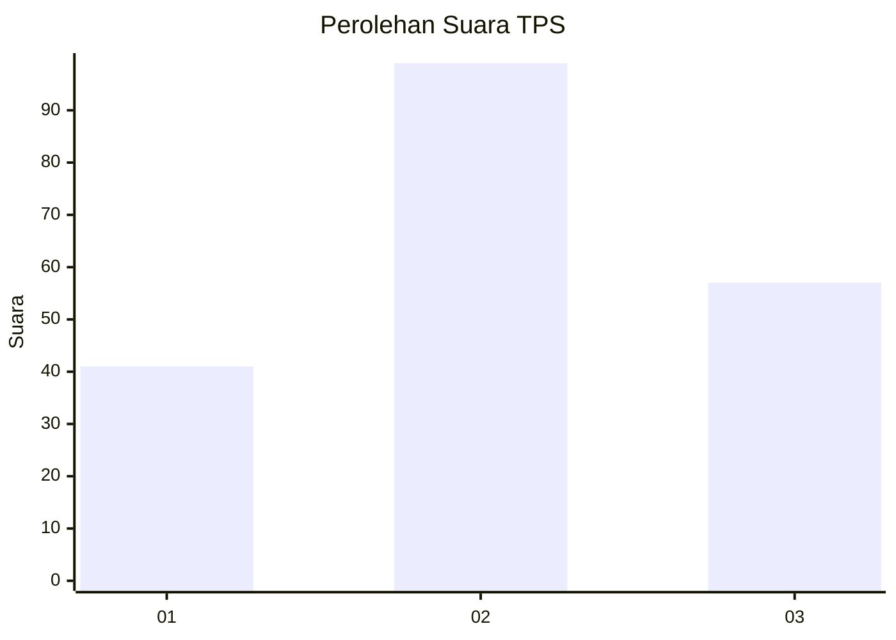
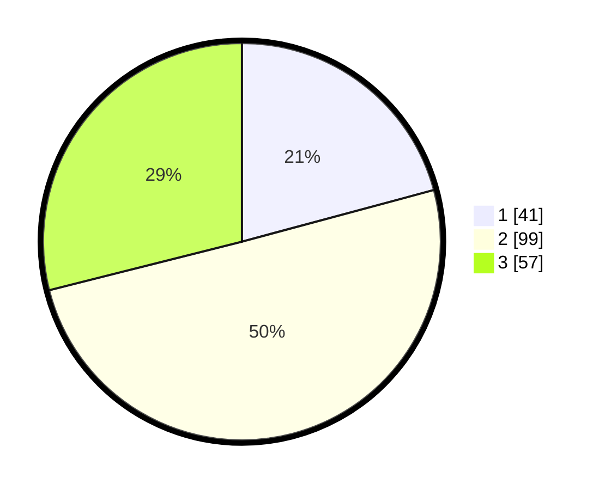

# Hasil

## Grafik

## Tabel

| No. | Nama Paslon    | Suara | Suara (raw) | Persentase |
|:--- |:-------------- | -----:| -----------:| ----------:|
| 1   | ANIES MUHAIMIN | 41    | [41][p-1]   | 20,81      |
| 2   | PRABOWO GIBRAN | 99    | [99][p-2]   | 50,25      |
| 3   | GANJAR MAHFUD  | 57    | [57][p-3]   | 28,93      |

[p-1]: https://github.com/gigit-pemilu/pemilu-2024-34-di-yogyakarta/blob/main/pilpres/hitung-suara/sub/34-di-yogyakarta/sub/04-sleman/sub/08-berbah/sub/2002-tegaltirto/sub/033-tps/sub/paslon-1.txt
[p-2]: https://github.com/gigit-pemilu/pemilu-2024-34-di-yogyakarta/blob/main/pilpres/hitung-suara/sub/34-di-yogyakarta/sub/04-sleman/sub/08-berbah/sub/2002-tegaltirto/sub/033-tps/sub/paslon-2.txt
[p-3]: https://github.com/gigit-pemilu/pemilu-2024-34-di-yogyakarta/blob/main/pilpres/hitung-suara/sub/34-di-yogyakarta/sub/04-sleman/sub/08-berbah/sub/2002-tegaltirto/sub/033-tps/sub/paslon-3.txt

## Foto C Plano

https://sirekap-obj-formc.kpu.go.id/cbb4/pemilu/ppwp/34/04/08/20/02/3404082002033-20240215-002312--1703f0aa-d67f-4533-85a4-725e92629914.jpg

https://sirekap-obj-formc.kpu.go.id/cbb4/pemilu/ppwp/34/04/08/20/02/3404082002033-20240215-002536--32f99c36-6af6-40d5-ad1e-cd86739ef208.jpg

https://sirekap-obj-formc.kpu.go.id/cbb4/pemilu/ppwp/34/04/08/20/02/3404082002033-20240215-002658--9341bd08-76a4-4db2-882e-6f32c0ab08dc.jpg

## Metadata

| Key        | Value               |
| ---------- | ------------------- |
| Time Stamp | 2024-02-15 16:30:25 |

