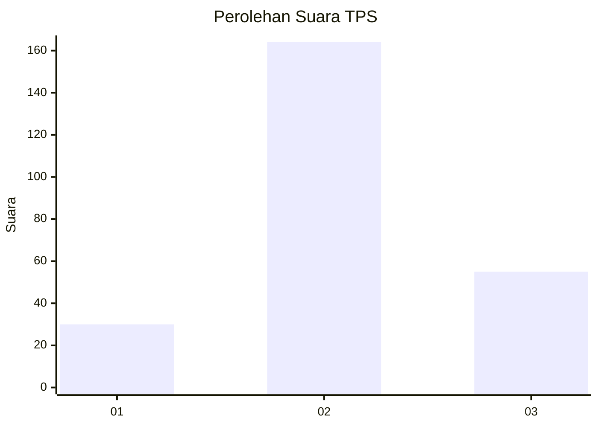
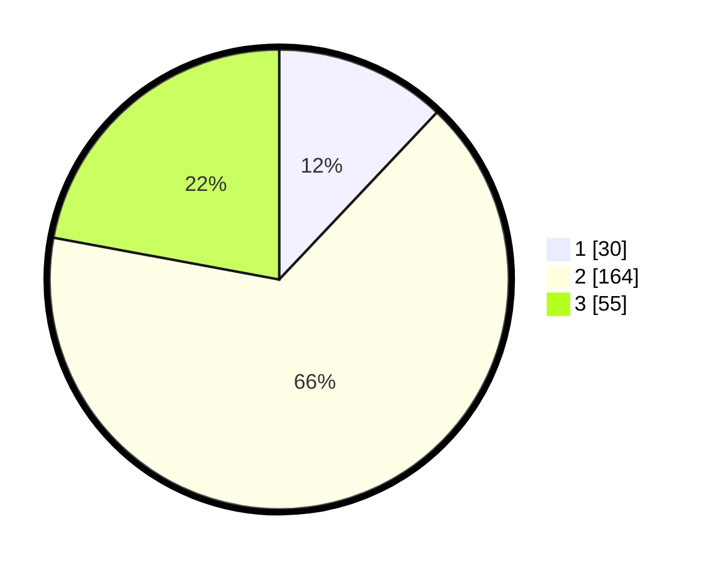

# Hasil

## Grafik

## Tabel

| No. | Nama Paslon    | Suara | Suara (raw) | Persentase |
|:--- |:-------------- | -----:| -----------:| ----------:|
| 1   | ANIES MUHAIMIN | 30    | [30][p-1]   | 12,05      |
| 2   | PRABOWO GIBRAN | 164   | [164][p-2]  | 65,86      |
| 3   | GANJAR MAHFUD  | 55    | [55][p-3]   | 22,09      |

[p-1]: https://github.com/gigit-pemilu/pemilu-2024-34-di-yogyakarta/blob/main/pilpres/hitung-suara/sub/34-di-yogyakarta/sub/04-sleman/sub/08-berbah/sub/2002-tegaltirto/sub/041-tps/sub/paslon-1.txt
[p-2]: https://github.com/gigit-pemilu/pemilu-2024-34-di-yogyakarta/blob/main/pilpres/hitung-suara/sub/34-di-yogyakarta/sub/04-sleman/sub/08-berbah/sub/2002-tegaltirto/sub/041-tps/sub/paslon-2.txt
[p-3]: https://github.com/gigit-pemilu/pemilu-2024-34-di-yogyakarta/blob/main/pilpres/hitung-suara/sub/34-di-yogyakarta/sub/04-sleman/sub/08-berbah/sub/2002-tegaltirto/sub/041-tps/sub/paslon-3.txt

## Foto C Plano

https://sirekap-obj-formc.kpu.go.id/ef1a/pemilu/ppwp/34/04/08/20/02/3404082002041-20240214-155443--65a7f545-9090-410a-bafe-a8e11d17a701.jpg

https://sirekap-obj-formc.kpu.go.id/ef1a/pemilu/ppwp/34/04/08/20/02/3404082002041-20240214-160102--f62de954-2bda-4f5a-90bd-f201e4d3e91a.jpg

https://sirekap-obj-formc.kpu.go.id/ef1a/pemilu/ppwp/34/04/08/20/02/3404082002041-20240214-160147--70259b1b-4ea5-46ae-9847-7c577290380e.jpg

## Metadata

| Key        | Value               |
| ---------- | ------------------- |
| Time Stamp | 2024-02-25 17:00:00 |

