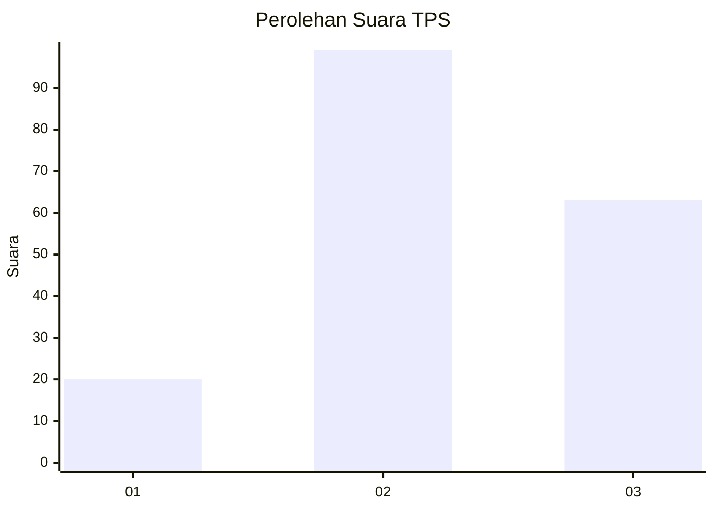
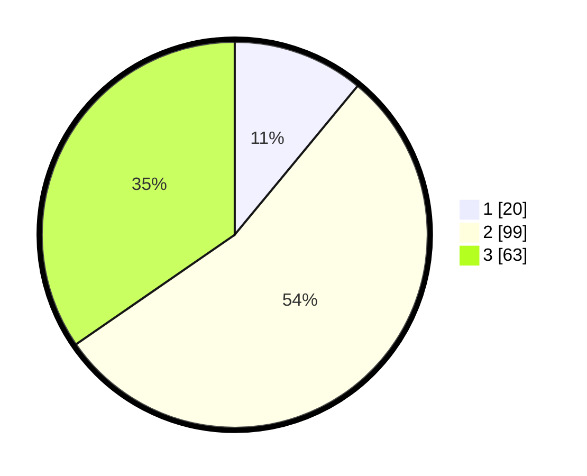

# Hasil

## Grafik

## Tabel

| No. | Nama Paslon    | Suara | Suara (raw) | Persentase |
|:--- |:-------------- | -----:| -----------:| ----------:|
| 1   | ANIES MUHAIMIN | 20    | [20][p-1]   | 10,99      |
| 2   | PRABOWO GIBRAN | 99    | [99][p-2]   | 54,40      |
| 3   | GANJAR MAHFUD  | 63    | [63][p-3]   | 34,62      |

[p-1]: https://github.com/gigit-pemilu/pemilu-2024-34-di-yogyakarta/blob/main/pilpres/hitung-suara/sub/34-di-yogyakarta/sub/04-sleman/sub/08-berbah/sub/2003-kalitirto/sub/002-tps/sub/paslon-1.txt
[p-2]: https://github.com/gigit-pemilu/pemilu-2024-34-di-yogyakarta/blob/main/pilpres/hitung-suara/sub/34-di-yogyakarta/sub/04-sleman/sub/08-berbah/sub/2003-kalitirto/sub/002-tps/sub/paslon-2.txt
[p-3]: https://github.com/gigit-pemilu/pemilu-2024-34-di-yogyakarta/blob/main/pilpres/hitung-suara/sub/34-di-yogyakarta/sub/04-sleman/sub/08-berbah/sub/2003-kalitirto/sub/002-tps/sub/paslon-3.txt

## Foto C Plano

https://sirekap-obj-formc.kpu.go.id/4f4e/pemilu/ppwp/34/04/08/20/03/3404082003002-20240214-213514--1de50918-1847-42f9-8c56-3c99eecd6726.jpg

https://sirekap-obj-formc.kpu.go.id/4f4e/pemilu/ppwp/34/04/08/20/03/3404082003002-20240214-155925--91e88466-8f69-4fba-956c-ab507e42d79d.jpg

https://sirekap-obj-formc.kpu.go.id/4f4e/pemilu/ppwp/34/04/08/20/03/3404082003002-20240214-162217--5bc74e2f-9998-46fd-89fc-3b0d17e5cb14.jpg

## Metadata

| Key        | Value               |
| ---------- | ------------------- |
| Time Stamp | 2024-02-15 16:30:25 |

