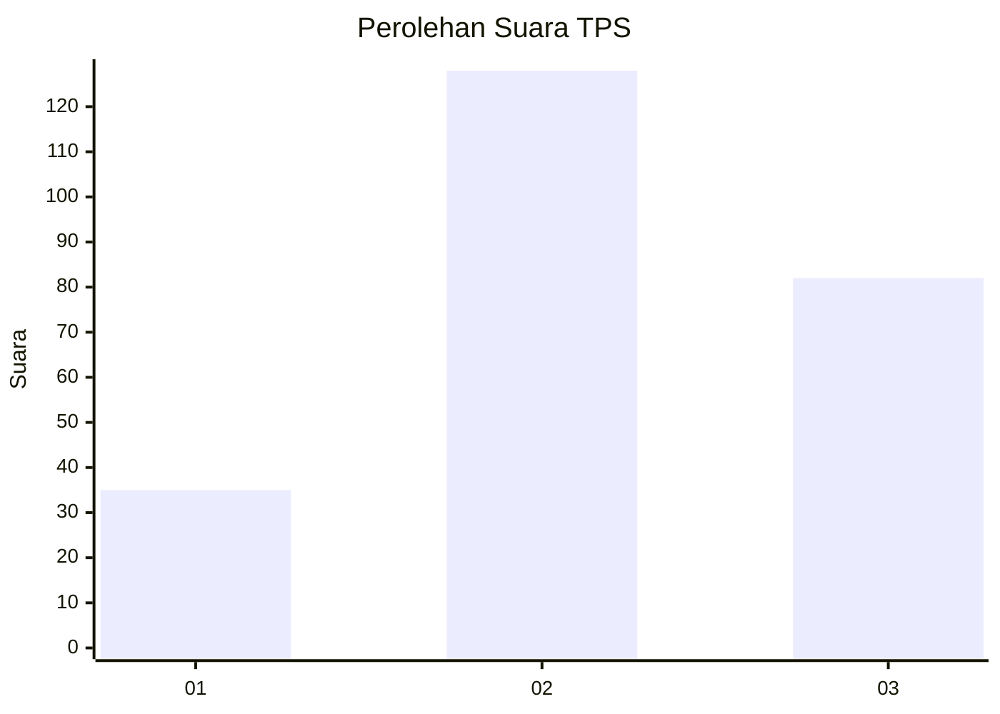
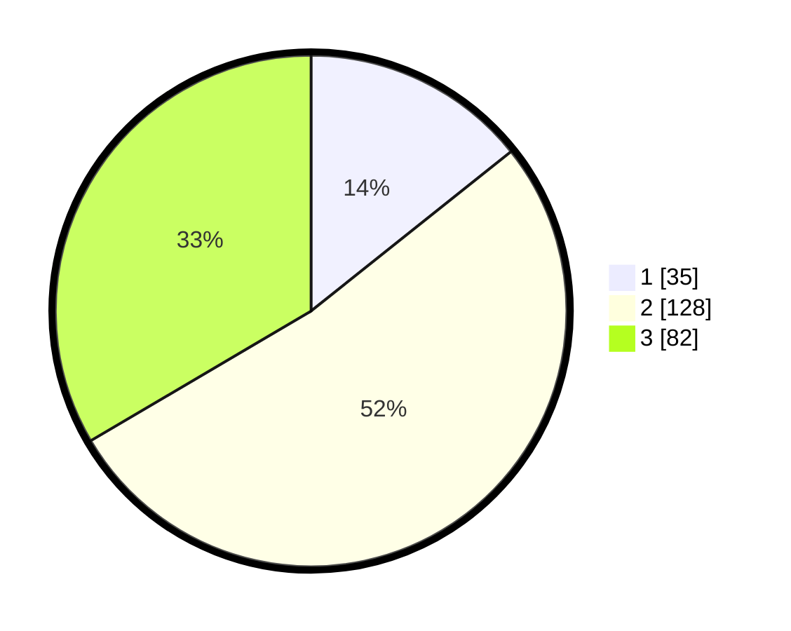

# Hasil

## Grafik

## Tabel

| No. | Nama Paslon    | Suara | Suara (raw) | Persentase |
|:--- |:-------------- | -----:| -----------:| ----------:|
| 1   | ANIES MUHAIMIN | 35    | [35][p-1]   | 14,29      |
| 2   | PRABOWO GIBRAN | 128   | [128][p-2]  | 52,24      |
| 3   | GANJAR MAHFUD  | 82    | [82][p-3]   | 33,47      |

[p-1]: https://github.com/gigit-pemilu/pemilu-2024-34-di-yogyakarta/blob/main/pilpres/hitung-suara/sub/34-di-yogyakarta/sub/04-sleman/sub/08-berbah/sub/2003-kalitirto/sub/004-tps/sub/paslon-1.txt
[p-2]: https://github.com/gigit-pemilu/pemilu-2024-34-di-yogyakarta/blob/main/pilpres/hitung-suara/sub/34-di-yogyakarta/sub/04-sleman/sub/08-berbah/sub/2003-kalitirto/sub/004-tps/sub/paslon-2.txt
[p-3]: https://github.com/gigit-pemilu/pemilu-2024-34-di-yogyakarta/blob/main/pilpres/hitung-suara/sub/34-di-yogyakarta/sub/04-sleman/sub/08-berbah/sub/2003-kalitirto/sub/004-tps/sub/paslon-3.txt

## Foto C Plano

https://sirekap-obj-formc.kpu.go.id/064c/pemilu/ppwp/34/04/08/20/03/3404082003004-20240216-143626--371df413-8d33-4ba6-9774-66f241fea978.jpg

https://sirekap-obj-formc.kpu.go.id/064c/pemilu/ppwp/34/04/08/20/03/3404082003004-20240216-143649--314e68e5-63da-4282-b729-dfd83f84722e.jpg

https://sirekap-obj-formc.kpu.go.id/064c/pemilu/ppwp/34/04/08/20/03/3404082003004-20240216-143727--4edd6176-216b-42b6-ab2a-2f06d0218ee4.jpg

## Metadata

| Key        | Value               |
| ---------- | ------------------- |
| Time Stamp | 2024-02-24 22:31:28 |

