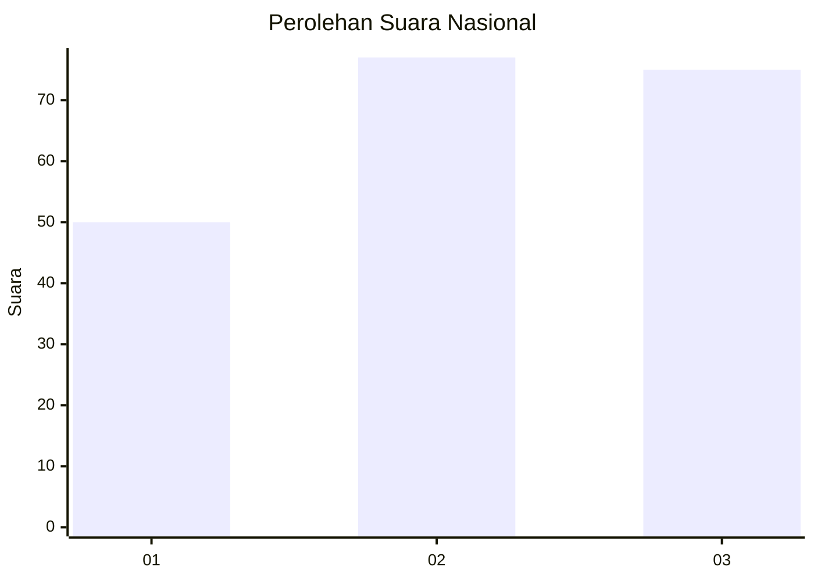
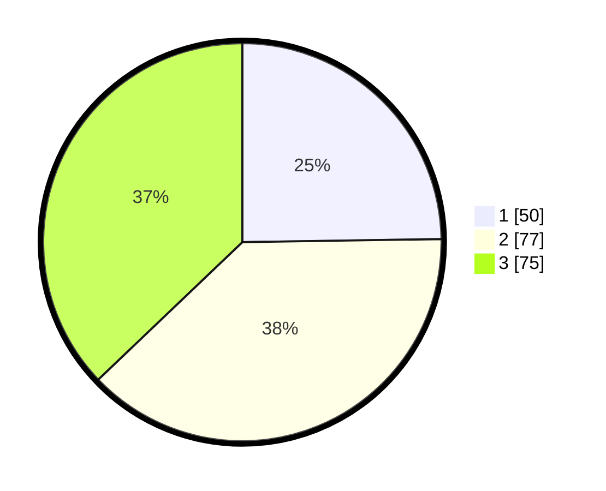

# Hasil

## Grafik

## Tabel

| No. | Nama Paslon    | Suara | Suara (raw) | Persentase |
|:--- |:-------------- | -----:| -----------:| ----------:|
| 1   | ANIES MUHAIMIN | 50    | [50][p-1]   | 24,75      |
| 2   | PRABOWO GIBRAN | 77    | [77][p-2]   | 38,12      |
| 3   | GANJAR MAHFUD  | 75    | [75][p-3]   | 37,13      |

[p-1]: https://github.com/gigit-pemilu/pemilu-2024/blob/main/pilpres/hitung-suara/sub/34-di-yogyakarta/sub/04-sleman/sub/08-berbah/sub/2003-kalitirto/sub/006-tps/sub/paslon-1.txt
[p-2]: https://github.com/gigit-pemilu/pemilu-2024/blob/main/pilpres/hitung-suara/sub/34-di-yogyakarta/sub/04-sleman/sub/08-berbah/sub/2003-kalitirto/sub/006-tps/sub/paslon-2.txt
[p-3]: https://github.com/gigit-pemilu/pemilu-2024/blob/main/pilpres/hitung-suara/sub/34-di-yogyakarta/sub/04-sleman/sub/08-berbah/sub/2003-kalitirto/sub/006-tps/sub/paslon-3.txt

## Foto C Plano

https://sirekap-obj-formc.kpu.go.id/7a19/pemilu/ppwp/34/04/08/20/03/3404082003006-20240216-151109--8fdae150-eeb0-4f44-b69e-f877770481e1.jpg

https://sirekap-obj-formc.kpu.go.id/7a19/pemilu/ppwp/34/04/08/20/03/3404082003006-20240216-151132--90a1b91c-8eed-4d04-b4dc-c14a83d88995.jpg

https://sirekap-obj-formc.kpu.go.id/7a19/pemilu/ppwp/34/04/08/20/03/3404082003006-20240216-151159--f3ad1e02-61ff-4b96-a463-64ce6236fa7b.jpg

## Metadata

| Key        | Value               |
| ---------- | ------------------- |
| Time Stamp | 2024-02-16 16:25:10 |

