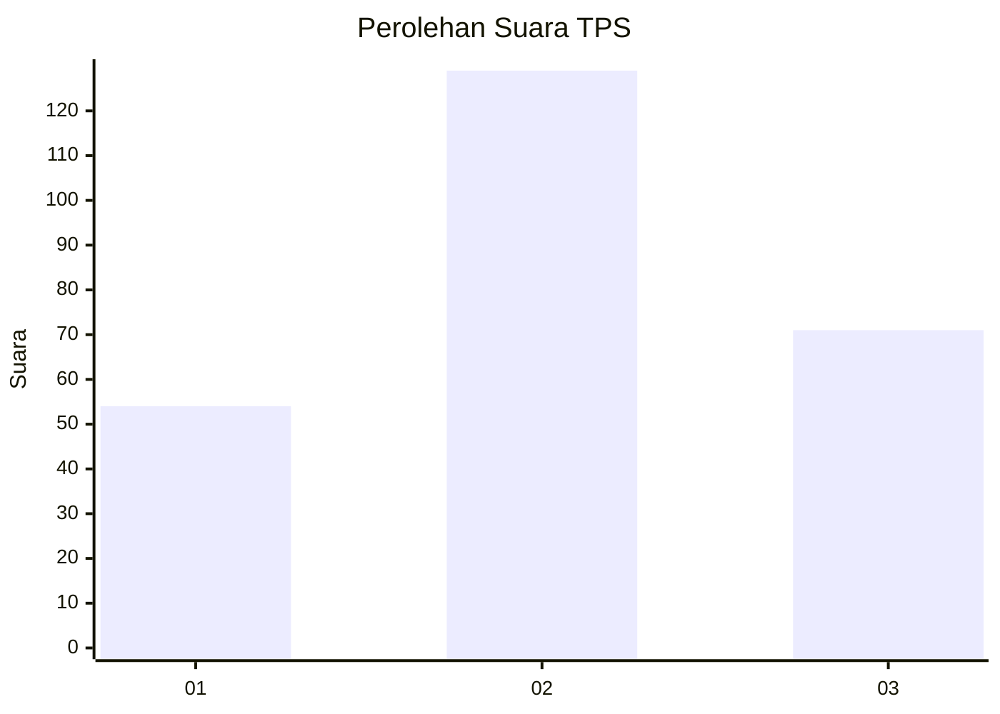
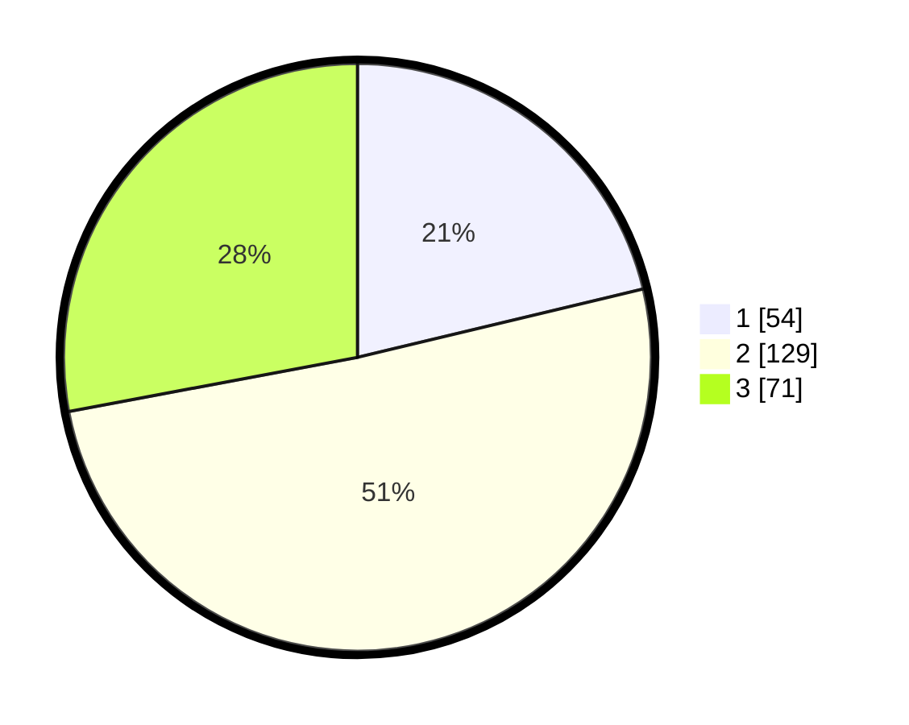

# Hasil

## Grafik

## Tabel

| No. | Nama Paslon    | Suara | Suara (raw) | Persentase |
|:--- |:-------------- | -----:| -----------:| ----------:|
| 1   | ANIES MUHAIMIN | 54    | [54][p-1]   | 21,26      |
| 2   | PRABOWO GIBRAN | 129   | [129][p-2]  | 50,79      |
| 3   | GANJAR MAHFUD  | 71    | [71][p-3]   | 27,95      |

[p-1]: https://github.com/gigit-pemilu/pemilu-2024-34-di-yogyakarta/blob/main/pilpres/hitung-suara/sub/34-di-yogyakarta/sub/04-sleman/sub/08-berbah/sub/2003-kalitirto/sub/011-tps/sub/paslon-1.txt
[p-2]: https://github.com/gigit-pemilu/pemilu-2024-34-di-yogyakarta/blob/main/pilpres/hitung-suara/sub/34-di-yogyakarta/sub/04-sleman/sub/08-berbah/sub/2003-kalitirto/sub/011-tps/sub/paslon-2.txt
[p-3]: https://github.com/gigit-pemilu/pemilu-2024-34-di-yogyakarta/blob/main/pilpres/hitung-suara/sub/34-di-yogyakarta/sub/04-sleman/sub/08-berbah/sub/2003-kalitirto/sub/011-tps/sub/paslon-3.txt

## Foto C Plano

https://sirekap-obj-formc.kpu.go.id/61b9/pemilu/ppwp/34/04/08/20/03/3404082003011-20240214-155443--2baa77dc-4e77-42bc-937a-86957bfdac7e.jpg

https://sirekap-obj-formc.kpu.go.id/61b9/pemilu/ppwp/34/04/08/20/03/3404082003011-20240214-155830--e616fdc2-11cf-4a9e-8da2-71969d6d30a1.jpg

https://sirekap-obj-formc.kpu.go.id/61b9/pemilu/ppwp/34/04/08/20/03/3404082003011-20240214-160056--7167448d-cd00-41de-9be7-1a504e75d5c6.jpg

## Metadata

| Key        | Value               |
| ---------- | ------------------- |
| Time Stamp | 2024-02-15 16:30:25 |

