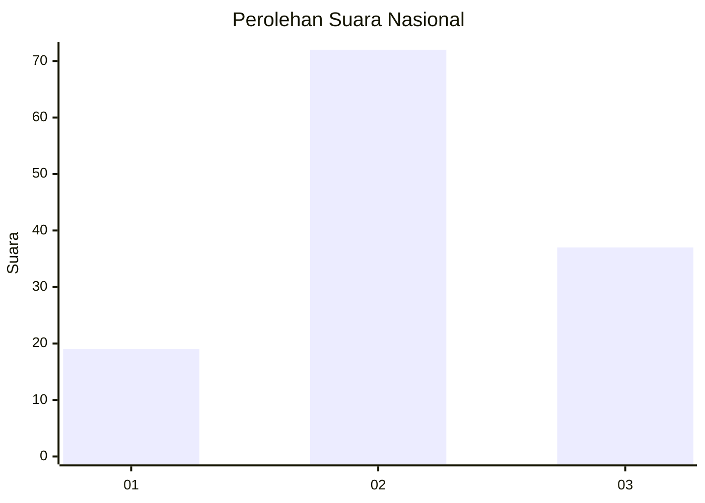
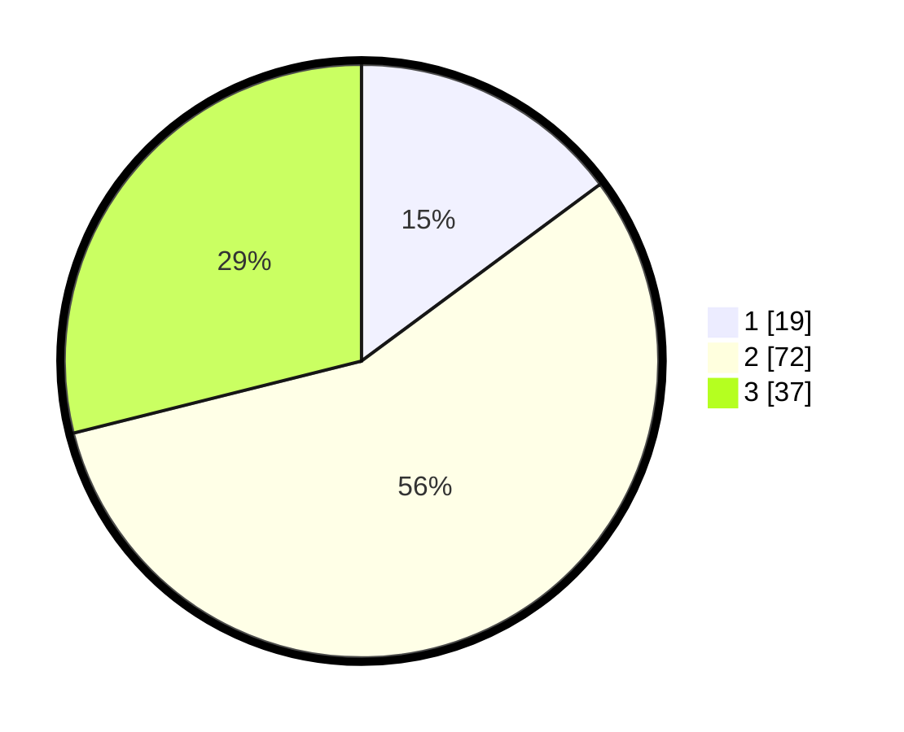

# Hasil

## Grafik

## Tabel

| No. | Nama Paslon    | Suara | Suara (raw) | Persentase |
|:--- |:-------------- | -----:| -----------:| ----------:|
| 1   | ANIES MUHAIMIN | 19    | [19][p-1]   | 14,84      |
| 2   | PRABOWO GIBRAN | 72    | [72][p-2]   | 56,25      |
| 3   | GANJAR MAHFUD  | 37    | [37][p-3]   | 28,91      |

[p-1]: https://github.com/gigit-pemilu/pemilu-2024/blob/main/pilpres/hitung-suara/sub/34-di-yogyakarta/sub/04-sleman/sub/08-berbah/sub/2003-kalitirto/sub/020-tps/sub/paslon-1.txt
[p-2]: https://github.com/gigit-pemilu/pemilu-2024/blob/main/pilpres/hitung-suara/sub/34-di-yogyakarta/sub/04-sleman/sub/08-berbah/sub/2003-kalitirto/sub/020-tps/sub/paslon-2.txt
[p-3]: https://github.com/gigit-pemilu/pemilu-2024/blob/main/pilpres/hitung-suara/sub/34-di-yogyakarta/sub/04-sleman/sub/08-berbah/sub/2003-kalitirto/sub/020-tps/sub/paslon-3.txt

## Foto C Plano

https://sirekap-obj-formc.kpu.go.id/3f28/pemilu/ppwp/34/04/08/20/03/3404082003020-20240214-224509--a0de3b3a-a399-4c5f-a59f-e5e374fe487c.jpg

https://sirekap-obj-formc.kpu.go.id/3f28/pemilu/ppwp/34/04/08/20/03/3404082003020-20240214-224718--45653c10-81db-4efc-9210-d271fdf21ff3.jpg

https://sirekap-obj-formc.kpu.go.id/3f28/pemilu/ppwp/34/04/08/20/03/3404082003020-20240214-224907--9f57af43-f730-49ca-827d-4b54e02de383.jpg

## Metadata

| Key        | Value               |
| ---------- | ------------------- |
| Time Stamp | 2024-02-15 09:00:24 |

