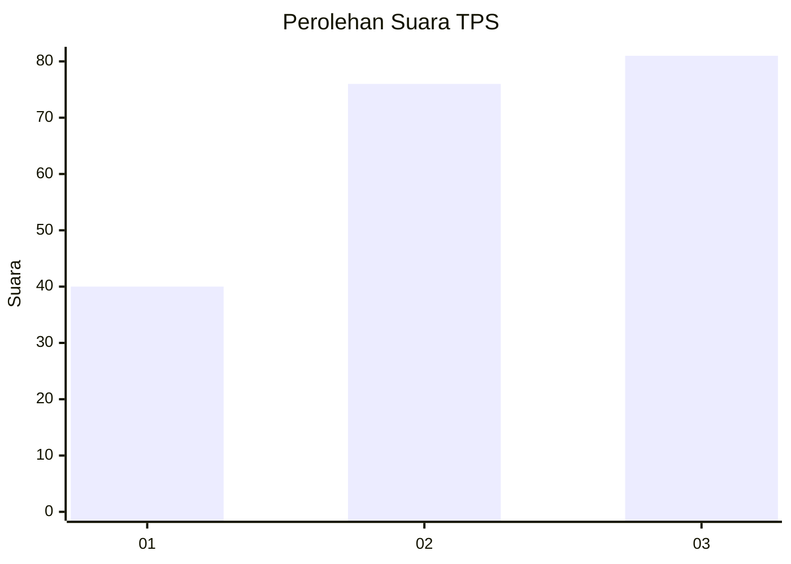
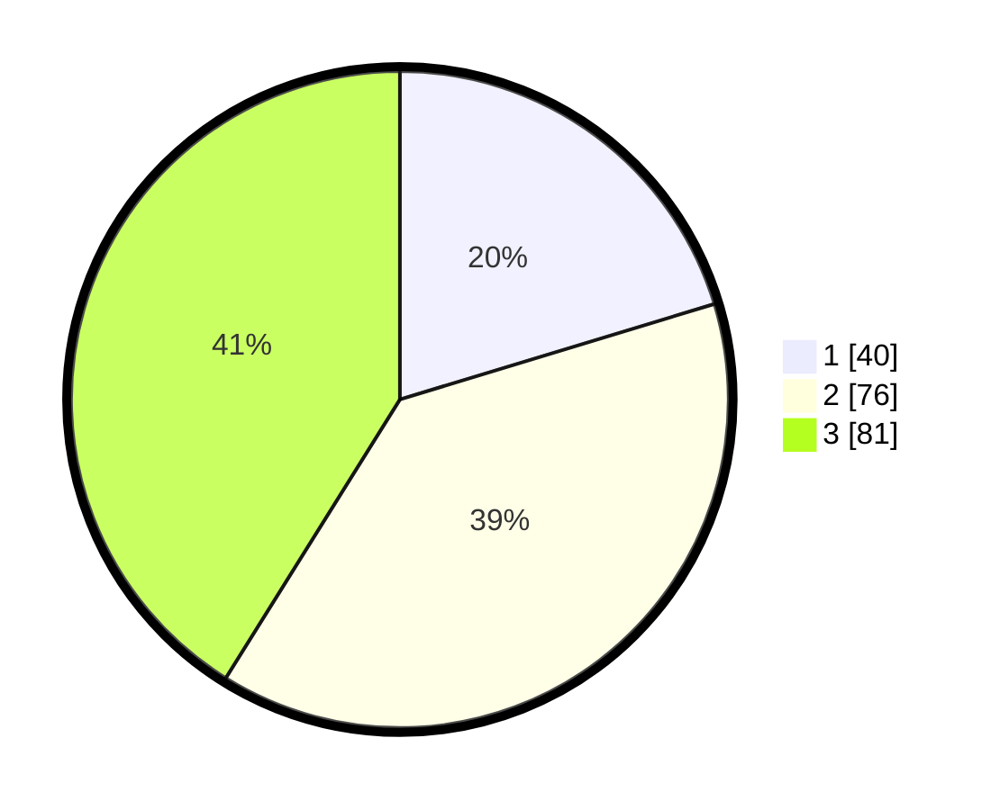

# Hasil

## Grafik

## Tabel

| No. | Nama Paslon    | Suara | Suara (raw) | Persentase |
|:--- |:-------------- | -----:| -----------:| ----------:|
| 1   | ANIES MUHAIMIN | 40    | [40][p-1]   | 20,30      |
| 2   | PRABOWO GIBRAN | 76    | [76][p-2]   | 38,58      |
| 3   | GANJAR MAHFUD  | 81    | [81][p-3]   | 41,12      |

[p-1]: https://github.com/gigit-pemilu/pemilu-2024-34-di-yogyakarta/blob/main/pilpres/hitung-suara/sub/34-di-yogyakarta/sub/04-sleman/sub/08-berbah/sub/2003-kalitirto/sub/037-tps/sub/paslon-1.txt
[p-2]: https://github.com/gigit-pemilu/pemilu-2024-34-di-yogyakarta/blob/main/pilpres/hitung-suara/sub/34-di-yogyakarta/sub/04-sleman/sub/08-berbah/sub/2003-kalitirto/sub/037-tps/sub/paslon-2.txt
[p-3]: https://github.com/gigit-pemilu/pemilu-2024-34-di-yogyakarta/blob/main/pilpres/hitung-suara/sub/34-di-yogyakarta/sub/04-sleman/sub/08-berbah/sub/2003-kalitirto/sub/037-tps/sub/paslon-3.txt

## Foto C Plano

https://sirekap-obj-formc.kpu.go.id/72bd/pemilu/ppwp/34/04/08/20/03/3404082003037-20240214-224735--5109f5af-5eeb-498f-a24d-d7001b549405.jpg

https://sirekap-obj-formc.kpu.go.id/72bd/pemilu/ppwp/34/04/08/20/03/3404082003037-20240214-225109--809702ad-338d-4da0-a913-eafc4cb03fc4.jpg

https://sirekap-obj-formc.kpu.go.id/72bd/pemilu/ppwp/34/04/08/20/03/3404082003037-20240214-225339--a44b1c40-49a7-4296-9211-73a560851883.jpg

## Metadata

| Key        | Value               |
| ---------- | ------------------- |
| Time Stamp | 2024-02-15 16:30:25 |

