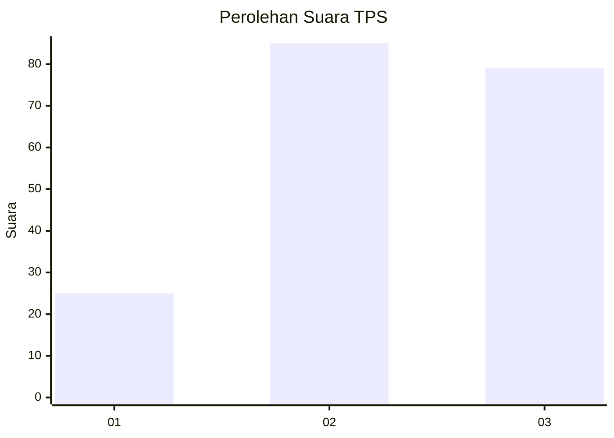
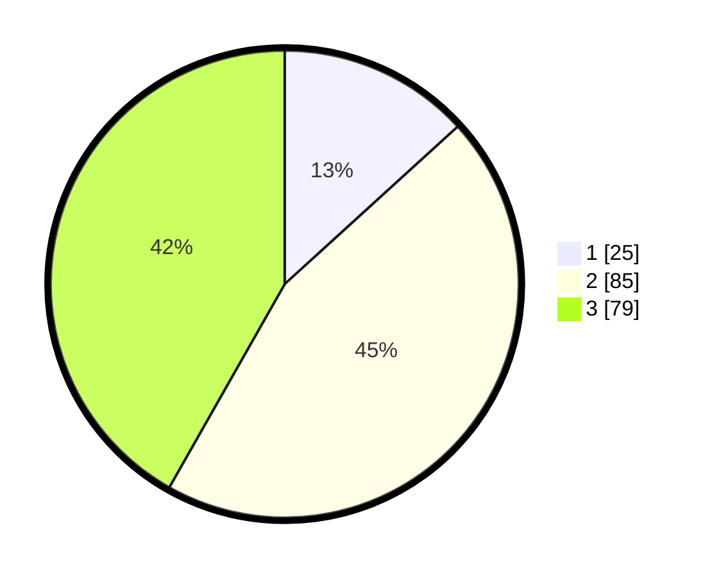

# Hasil

## Grafik

## Tabel

| No. | Nama Paslon    | Suara | Suara (raw) | Persentase |
|:--- |:-------------- | -----:| -----------:| ----------:|
| 1   | ANIES MUHAIMIN | 25    | [25][p-1]   | 13,23      |
| 2   | PRABOWO GIBRAN | 85    | [85][p-2]   | 44,97      |
| 3   | GANJAR MAHFUD  | 79    | [79][p-3]   | 41,80      |

[p-1]: https://github.com/gigit-pemilu/pemilu-2024-34-di-yogyakarta/blob/main/pilpres/hitung-suara/sub/34-di-yogyakarta/sub/04-sleman/sub/08-berbah/sub/2003-kalitirto/sub/038-tps/sub/paslon-1.txt
[p-2]: https://github.com/gigit-pemilu/pemilu-2024-34-di-yogyakarta/blob/main/pilpres/hitung-suara/sub/34-di-yogyakarta/sub/04-sleman/sub/08-berbah/sub/2003-kalitirto/sub/038-tps/sub/paslon-2.txt
[p-3]: https://github.com/gigit-pemilu/pemilu-2024-34-di-yogyakarta/blob/main/pilpres/hitung-suara/sub/34-di-yogyakarta/sub/04-sleman/sub/08-berbah/sub/2003-kalitirto/sub/038-tps/sub/paslon-3.txt

## Foto C Plano

https://sirekap-obj-formc.kpu.go.id/9114/pemilu/ppwp/34/04/08/20/03/3404082003038-20240214-235856--ac137dc6-740c-4cfa-baa2-ddec9682e5d3.jpg

https://sirekap-obj-formc.kpu.go.id/9114/pemilu/ppwp/34/04/08/20/03/3404082003038-20240215-000010--287e757a-9e22-4111-956f-1705c25e3279.jpg

https://sirekap-obj-formc.kpu.go.id/9114/pemilu/ppwp/34/04/08/20/03/3404082003038-20240214-235949--29392e36-1a1a-47bd-98bb-b600519ddb85.jpg

## Metadata

| Key        | Value               |
| ---------- | ------------------- |
| Time Stamp | 2024-02-15 16:30:25 |

