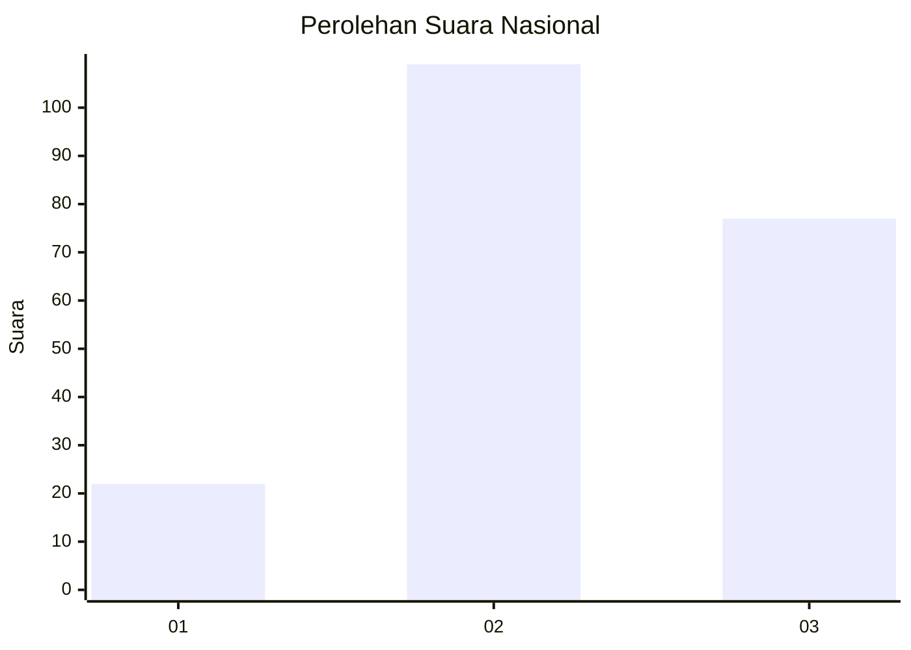
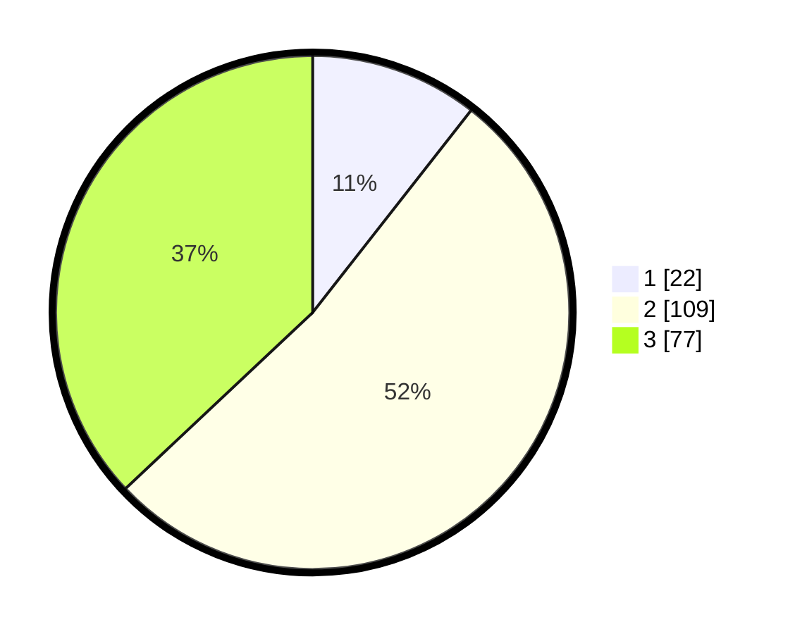

# Hasil

## Grafik

## Tabel

| No. | Nama Paslon    | Suara | Suara (raw) | Persentase |
|:--- |:-------------- | -----:| -----------:| ----------:|
| 1   | ANIES MUHAIMIN | 22    | [22][p-1]   | 10,58      |
| 2   | PRABOWO GIBRAN | 109   | [109][p-2]  | 52,40      |
| 3   | GANJAR MAHFUD  | 77    | [77][p-3]   | 37,02      |

[p-1]: https://github.com/gigit-pemilu/pemilu-2024/blob/main/pilpres/hitung-suara/sub/34-di-yogyakarta/sub/04-sleman/sub/08-berbah/sub/2004-jogotirto/sub/002-tps/sub/paslon-1.txt
[p-2]: https://github.com/gigit-pemilu/pemilu-2024/blob/main/pilpres/hitung-suara/sub/34-di-yogyakarta/sub/04-sleman/sub/08-berbah/sub/2004-jogotirto/sub/002-tps/sub/paslon-2.txt
[p-3]: https://github.com/gigit-pemilu/pemilu-2024/blob/main/pilpres/hitung-suara/sub/34-di-yogyakarta/sub/04-sleman/sub/08-berbah/sub/2004-jogotirto/sub/002-tps/sub/paslon-3.txt

## Foto C Plano

https://sirekap-obj-formc.kpu.go.id/1434/pemilu/ppwp/34/04/08/20/04/3404082004002-20240217-092255--678d1354-ed36-4597-a7b8-4001899cd016.jpg

https://sirekap-obj-formc.kpu.go.id/1434/pemilu/ppwp/34/04/08/20/04/3404082004002-20240214-195442--cdbdaa9e-45cb-4aa3-a166-1aef4f2ad482.jpg

https://sirekap-obj-formc.kpu.go.id/1434/pemilu/ppwp/34/04/08/20/04/3404082004002-20240217-091926--b522a5f5-c883-426b-aa1b-dd121c86db15.jpg

## Metadata

| Key        | Value               |
| ---------- | ------------------- |
| Time Stamp | 2024-02-21 12:00:00 |

