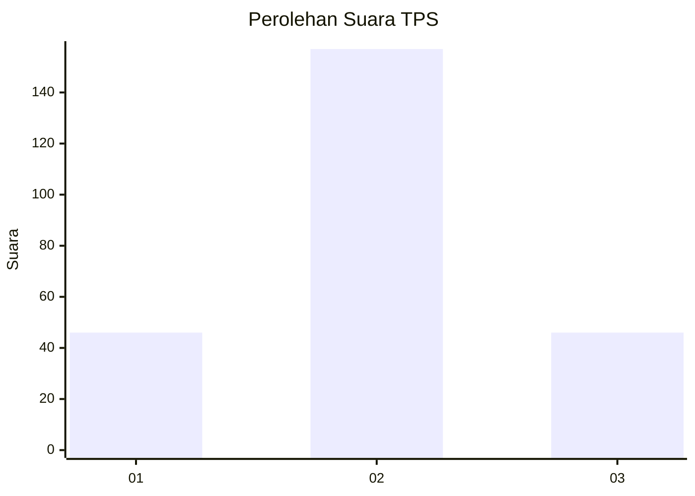
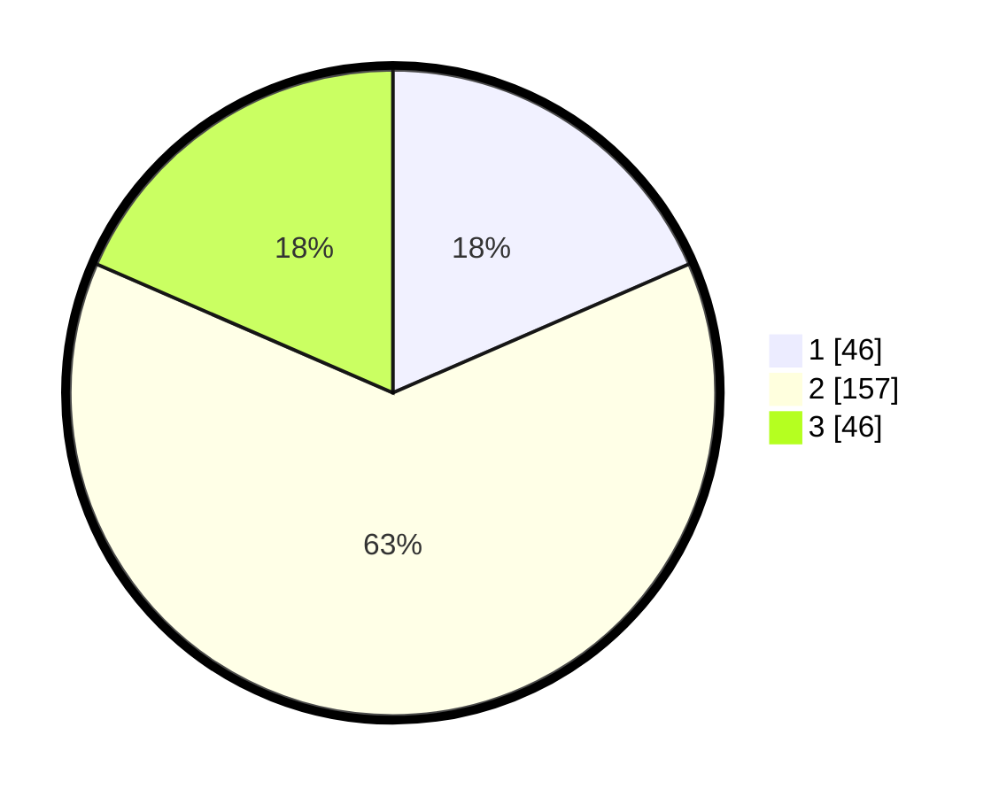

# Hasil

## Grafik

## Tabel

| No. | Nama Paslon    | Suara | Suara (raw) | Persentase |
|:--- |:-------------- | -----:| -----------:| ----------:|
| 1   | ANIES MUHAIMIN | 46    | [46][p-1]   | 18,47      |
| 2   | PRABOWO GIBRAN | 157   | [157][p-2]  | 63,05      |
| 3   | GANJAR MAHFUD  | 46    | [46][p-3]   | 18,47      |

[p-1]: https://github.com/gigit-pemilu/pemilu-2024-34-di-yogyakarta/blob/main/pilpres/hitung-suara/sub/34-di-yogyakarta/sub/04-sleman/sub/08-berbah/sub/2004-jogotirto/sub/006-tps/sub/paslon-1.txt
[p-2]: https://github.com/gigit-pemilu/pemilu-2024-34-di-yogyakarta/blob/main/pilpres/hitung-suara/sub/34-di-yogyakarta/sub/04-sleman/sub/08-berbah/sub/2004-jogotirto/sub/006-tps/sub/paslon-2.txt
[p-3]: https://github.com/gigit-pemilu/pemilu-2024-34-di-yogyakarta/blob/main/pilpres/hitung-suara/sub/34-di-yogyakarta/sub/04-sleman/sub/08-berbah/sub/2004-jogotirto/sub/006-tps/sub/paslon-3.txt

## Foto C Plano

https://sirekap-obj-formc.kpu.go.id/e53d/pemilu/ppwp/34/04/08/20/04/3404082004006-20240216-164722--0a941d65-1845-4ee2-9b40-e6ddaf0a843d.jpg

https://sirekap-obj-formc.kpu.go.id/e53d/pemilu/ppwp/34/04/08/20/04/3404082004006-20240216-164010--185dad0f-c91a-4139-a889-8afe50fc6913.jpg

https://sirekap-obj-formc.kpu.go.id/e53d/pemilu/ppwp/34/04/08/20/04/3404082004006-20240216-164723--e9fa421e-dd8e-487e-a36a-8dfa24f67dde.jpg

## Metadata

| Key        | Value               |
| ---------- | ------------------- |
| Time Stamp | 2024-02-17 18:00:00 |

## DATA PEMILIH TETAP

Jumlah pemilih dalam DPT: **265**.
 * L: **130**.
 * P: **135**.

## DATA PENGGUNA HAK PILIH

Jumlah pengguna hak pilih dalam DPT: **233**.
 * L: **117**.
 * P: **116**.

Jumlah pengguna hak pilih dalam DPTb: **12**.
 * L: **8**.
 * P: **4**.

Jumlah pengguna hak pilih dalam DPK: **10**.
 * L: **6**.
 * P: **4**.

Jumlah pengguna hak pilih: **0**.
 * L: **0**.
 * P: **0**.

## JUMLAH SUARA SAH DAN TIDAK SAH

JUMLAH SELURUH SUARA SAH: **249**.

JUMLAH SUARA TIDAK SAH: **6**.

JUMLAH SELURUH SUARA SAH DAN SUARA TIDAK SAH: **255**.

