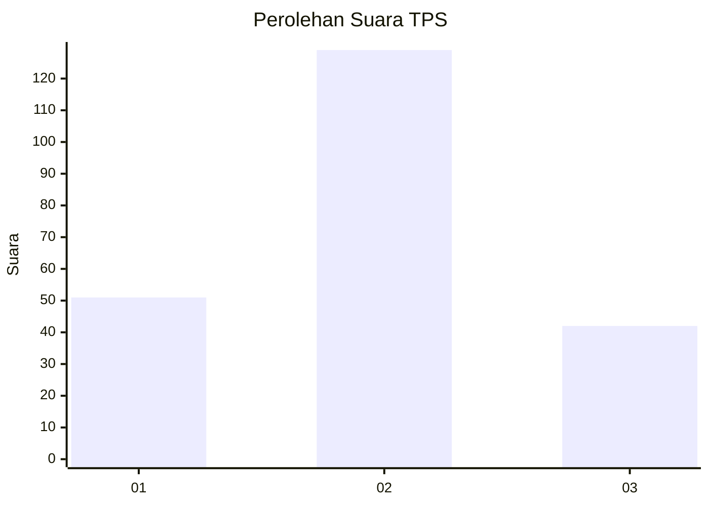
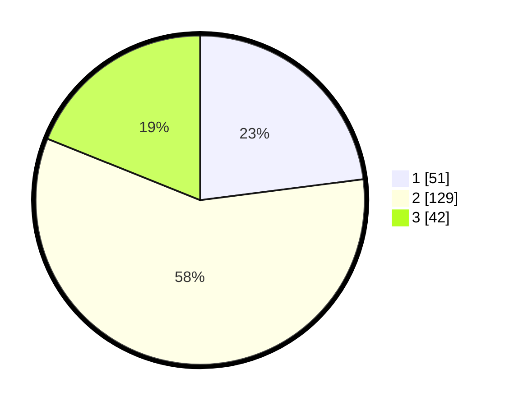

# Hasil

## Grafik

## Tabel

| No. | Nama Paslon    | Suara | Suara (raw) | Persentase |
|:--- |:-------------- | -----:| -----------:| ----------:|
| 1   | ANIES MUHAIMIN | 51    | [51][p-1]   | 22,97      |
| 2   | PRABOWO GIBRAN | 129   | [129][p-2]  | 58,11      |
| 3   | GANJAR MAHFUD  | 42    | [42][p-3]   | 18,92      |

[p-1]: https://github.com/gigit-pemilu/pemilu-2024-34-di-yogyakarta/blob/main/pilpres/hitung-suara/sub/34-di-yogyakarta/sub/04-sleman/sub/08-berbah/sub/2004-jogotirto/sub/012-tps/sub/paslon-1.txt
[p-2]: https://github.com/gigit-pemilu/pemilu-2024-34-di-yogyakarta/blob/main/pilpres/hitung-suara/sub/34-di-yogyakarta/sub/04-sleman/sub/08-berbah/sub/2004-jogotirto/sub/012-tps/sub/paslon-2.txt
[p-3]: https://github.com/gigit-pemilu/pemilu-2024-34-di-yogyakarta/blob/main/pilpres/hitung-suara/sub/34-di-yogyakarta/sub/04-sleman/sub/08-berbah/sub/2004-jogotirto/sub/012-tps/sub/paslon-3.txt

## Foto C Plano

https://sirekap-obj-formc.kpu.go.id/9fd0/pemilu/ppwp/34/04/08/20/04/3404082004012-20240215-011000--5782606c-bf10-4500-8e37-2702e1fa9c0d.jpg

https://sirekap-obj-formc.kpu.go.id/9fd0/pemilu/ppwp/34/04/08/20/04/3404082004012-20240215-011058--c2637fbe-e3b6-40cd-8ddd-5c8bb4ac8805.jpg

https://sirekap-obj-formc.kpu.go.id/9fd0/pemilu/ppwp/34/04/08/20/04/3404082004012-20240215-011223--fa4161ae-4fe1-49a7-933a-c69c8e1923cd.jpg

## Metadata

| Key        | Value               |
| ---------- | ------------------- |
| Time Stamp | 2024-02-15 16:30:25 |

