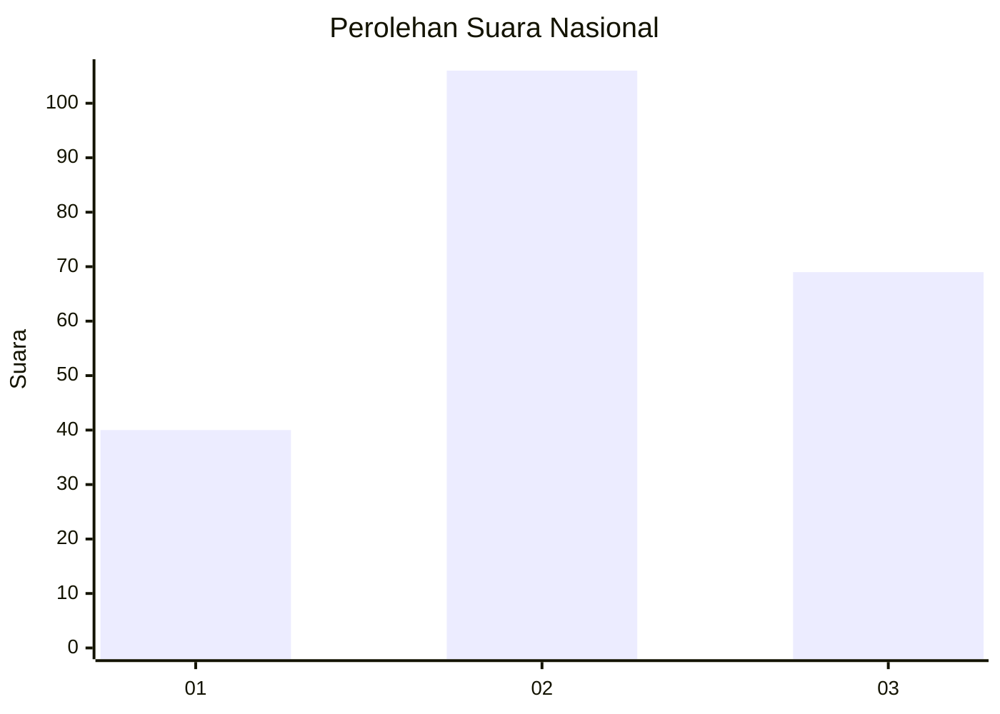
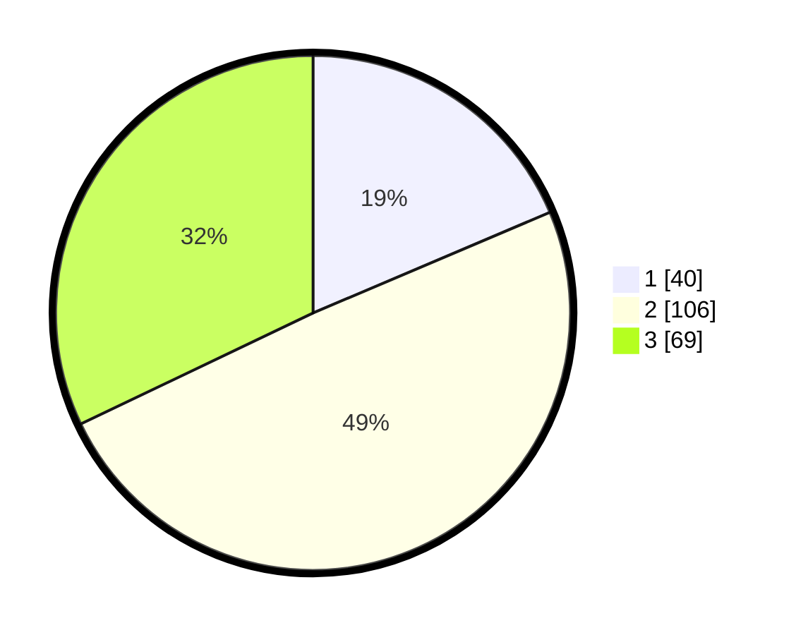

# Hasil

## Grafik

## Tabel

| No. | Nama Paslon    | Suara | Suara (raw) | Persentase |
|:--- |:-------------- | -----:| -----------:| ----------:|
| 1   | ANIES MUHAIMIN | 40    | [40][p-1]   | 18,60      |
| 2   | PRABOWO GIBRAN | 106   | [106][p-2]  | 49,30      |
| 3   | GANJAR MAHFUD  | 69    | [69][p-3]   | 32,09      |

[p-1]: https://github.com/gigit-pemilu/pemilu-2024/blob/main/pilpres/hitung-suara/sub/34-di-yogyakarta/sub/04-sleman/sub/08-berbah/sub/2004-jogotirto/sub/013-tps/sub/paslon-1.txt
[p-2]: https://github.com/gigit-pemilu/pemilu-2024/blob/main/pilpres/hitung-suara/sub/34-di-yogyakarta/sub/04-sleman/sub/08-berbah/sub/2004-jogotirto/sub/013-tps/sub/paslon-2.txt
[p-3]: https://github.com/gigit-pemilu/pemilu-2024/blob/main/pilpres/hitung-suara/sub/34-di-yogyakarta/sub/04-sleman/sub/08-berbah/sub/2004-jogotirto/sub/013-tps/sub/paslon-3.txt

## Foto C Plano

https://sirekap-obj-formc.kpu.go.id/c8dc/pemilu/ppwp/34/04/08/20/04/3404082004013-20240214-214243--d313f207-c4b7-4ec8-a781-b14d6b519ab0.jpg

https://sirekap-obj-formc.kpu.go.id/c8dc/pemilu/ppwp/34/04/08/20/04/3404082004013-20240214-214319--67d0146a-f311-42d0-a0ea-f683f426e561.jpg

https://sirekap-obj-formc.kpu.go.id/c8dc/pemilu/ppwp/34/04/08/20/04/3404082004013-20240214-210617--68a1cf9d-2768-4697-a210-e8d64ea01e5b.jpg

## Metadata

| Key        | Value               |
| ---------- | ------------------- |
| Time Stamp | 2024-02-15 16:30:25 |

