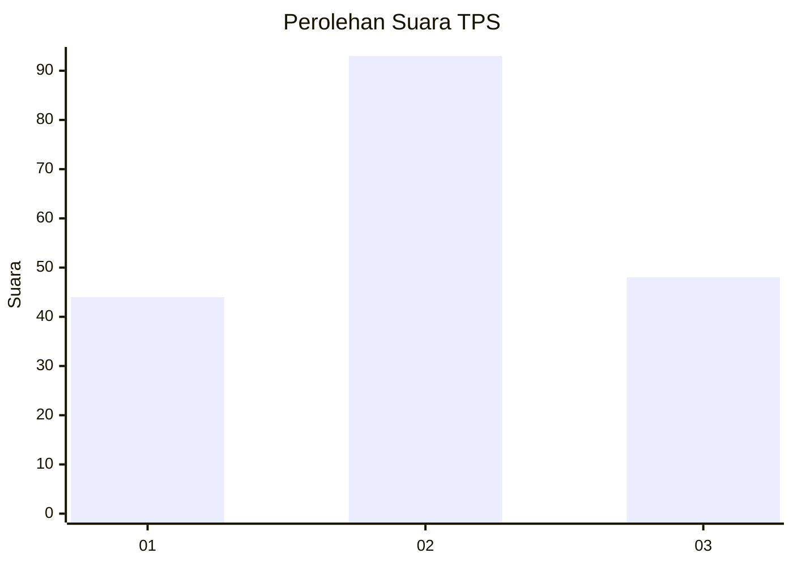
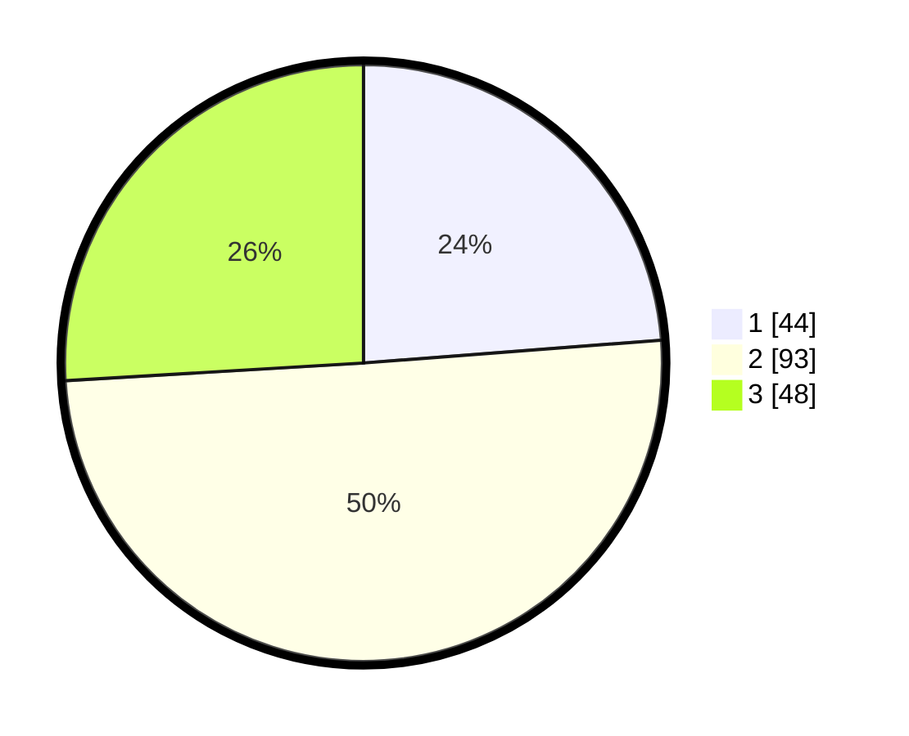

# Hasil

## Grafik

## Tabel

| No. | Nama Paslon    | Suara | Suara (raw) | Persentase |
|:--- |:-------------- | -----:| -----------:| ----------:|
| 1   | ANIES MUHAIMIN | 44    | [44][p-1]   | 23,78      |
| 2   | PRABOWO GIBRAN | 93    | [93][p-2]   | 50,27      |
| 3   | GANJAR MAHFUD  | 48    | [48][p-3]   | 25,95      |

[p-1]: https://github.com/gigit-pemilu/pemilu-2024-34-di-yogyakarta/blob/main/pilpres/hitung-suara/sub/34-di-yogyakarta/sub/04-sleman/sub/08-berbah/sub/2004-jogotirto/sub/016-tps/sub/paslon-1.txt
[p-2]: https://github.com/gigit-pemilu/pemilu-2024-34-di-yogyakarta/blob/main/pilpres/hitung-suara/sub/34-di-yogyakarta/sub/04-sleman/sub/08-berbah/sub/2004-jogotirto/sub/016-tps/sub/paslon-2.txt
[p-3]: https://github.com/gigit-pemilu/pemilu-2024-34-di-yogyakarta/blob/main/pilpres/hitung-suara/sub/34-di-yogyakarta/sub/04-sleman/sub/08-berbah/sub/2004-jogotirto/sub/016-tps/sub/paslon-3.txt

## Foto C Plano

https://sirekap-obj-formc.kpu.go.id/4f0d/pemilu/ppwp/34/04/08/20/04/3404082004016-20240214-232805--29592e52-e58f-4336-9d9c-288cf5d4a0ad.jpg

https://sirekap-obj-formc.kpu.go.id/4f0d/pemilu/ppwp/34/04/08/20/04/3404082004016-20240214-233026--c7e6b44a-ae90-4b4a-832f-3660991a950d.jpg

https://sirekap-obj-formc.kpu.go.id/4f0d/pemilu/ppwp/34/04/08/20/04/3404082004016-20240214-233456--67c1d939-5b92-43a7-8cd8-3654235145bc.jpg

## Metadata

| Key        | Value               |
| ---------- | ------------------- |
| Time Stamp | 2024-02-15 16:30:25 |

