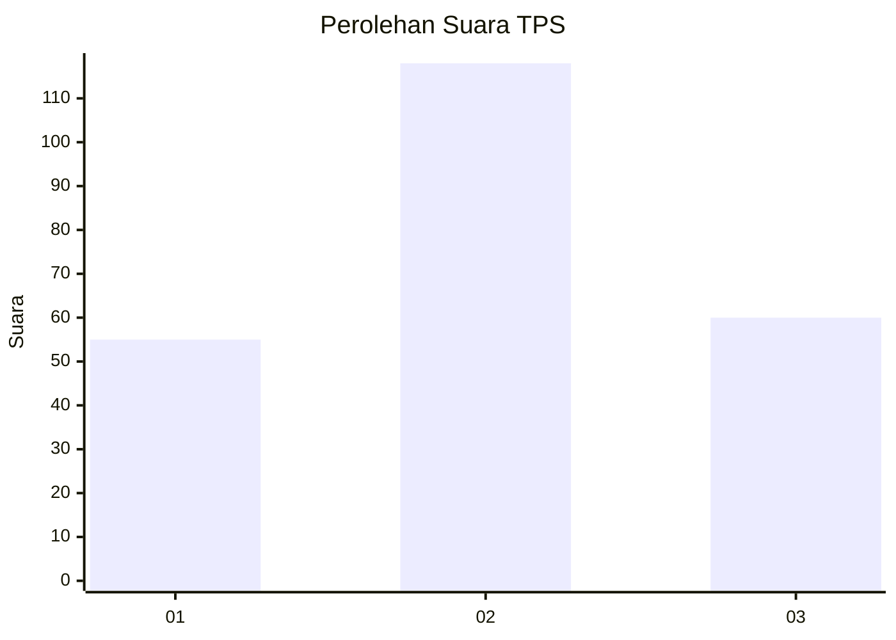
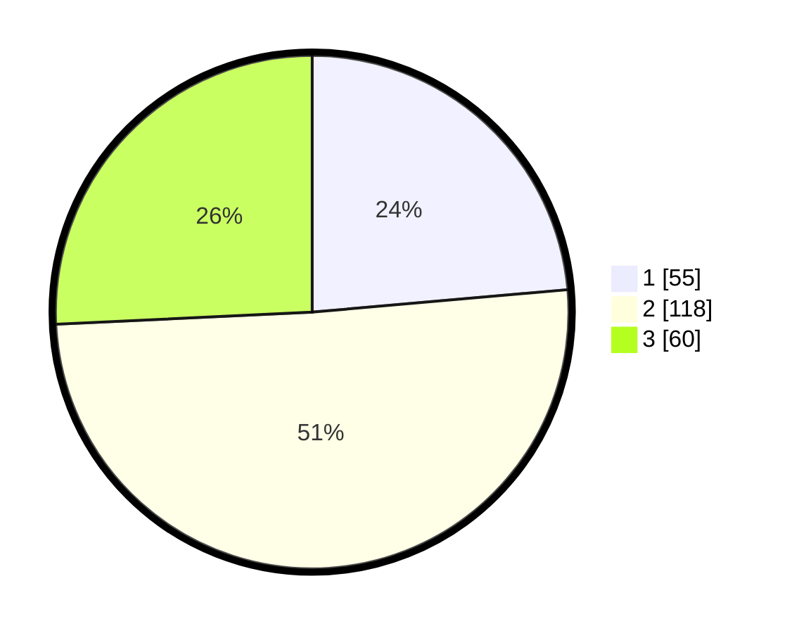

# Hasil

## Grafik

## Tabel

| No. | Nama Paslon    | Suara | Suara (raw) | Persentase |
|:--- |:-------------- | -----:| -----------:| ----------:|
| 1   | ANIES MUHAIMIN | 55    | [55][p-1]   | 23,61      |
| 2   | PRABOWO GIBRAN | 118   | [118][p-2]  | 50,64      |
| 3   | GANJAR MAHFUD  | 60    | [60][p-3]   | 25,75      |

[p-1]: https://github.com/gigit-pemilu/pemilu-2024-34-di-yogyakarta/blob/main/pilpres/hitung-suara/sub/34-di-yogyakarta/sub/04-sleman/sub/08-berbah/sub/2004-jogotirto/sub/020-tps/sub/paslon-1.txt
[p-2]: https://github.com/gigit-pemilu/pemilu-2024-34-di-yogyakarta/blob/main/pilpres/hitung-suara/sub/34-di-yogyakarta/sub/04-sleman/sub/08-berbah/sub/2004-jogotirto/sub/020-tps/sub/paslon-2.txt
[p-3]: https://github.com/gigit-pemilu/pemilu-2024-34-di-yogyakarta/blob/main/pilpres/hitung-suara/sub/34-di-yogyakarta/sub/04-sleman/sub/08-berbah/sub/2004-jogotirto/sub/020-tps/sub/paslon-3.txt

## Foto C Plano

https://sirekap-obj-formc.kpu.go.id/a5f0/pemilu/ppwp/34/04/08/20/04/3404082004020-20240214-223855--a804a1ab-a4a9-4e8b-96fd-63a22b4096c3.jpg

https://sirekap-obj-formc.kpu.go.id/a5f0/pemilu/ppwp/34/04/08/20/04/3404082004020-20240214-223902--e4cd7dc8-0141-499e-b4d6-5d82c66ae692.jpg

https://sirekap-obj-formc.kpu.go.id/a5f0/pemilu/ppwp/34/04/08/20/04/3404082004020-20240214-223906--cadade81-6bad-4ca6-8c07-e73b7c30b332.jpg

## Metadata

| Key        | Value               |
| ---------- | ------------------- |
| Time Stamp | 2024-02-15 17:00:25 |

