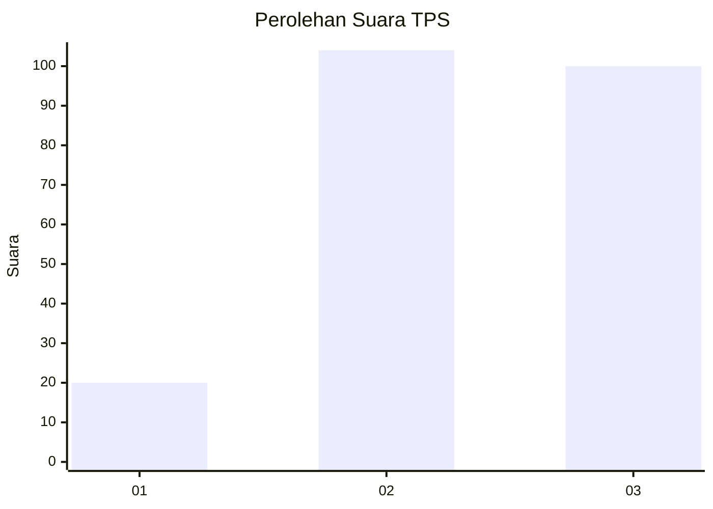
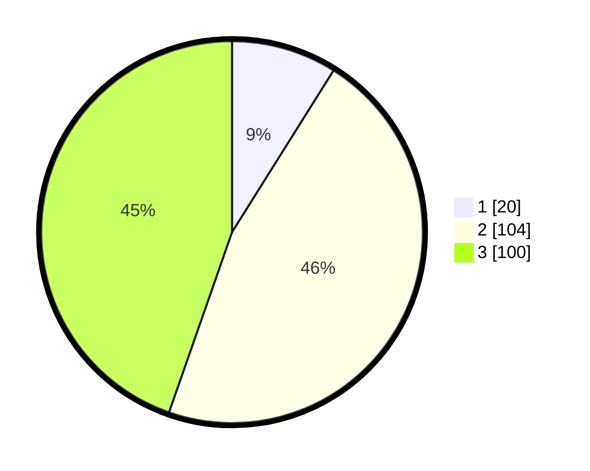

# Hasil

## Grafik

## Tabel

| No. | Nama Paslon    | Suara | Suara (raw) | Persentase |
|:--- |:-------------- | -----:| -----------:| ----------:|
| 1   | ANIES MUHAIMIN | 20    | [20][p-1]   | 8,93       |
| 2   | PRABOWO GIBRAN | 104   | [104][p-2]  | 46,43      |
| 3   | GANJAR MAHFUD  | 100   | [100][p-3]  | 44,64      |

[p-1]: https://github.com/gigit-pemilu/pemilu-2024-34-di-yogyakarta/blob/main/pilpres/hitung-suara/sub/34-di-yogyakarta/sub/04-sleman/sub/08-berbah/sub/2004-jogotirto/sub/021-tps/sub/paslon-1.txt
[p-2]: https://github.com/gigit-pemilu/pemilu-2024-34-di-yogyakarta/blob/main/pilpres/hitung-suara/sub/34-di-yogyakarta/sub/04-sleman/sub/08-berbah/sub/2004-jogotirto/sub/021-tps/sub/paslon-2.txt
[p-3]: https://github.com/gigit-pemilu/pemilu-2024-34-di-yogyakarta/blob/main/pilpres/hitung-suara/sub/34-di-yogyakarta/sub/04-sleman/sub/08-berbah/sub/2004-jogotirto/sub/021-tps/sub/paslon-3.txt

## Foto C Plano

https://sirekap-obj-formc.kpu.go.id/0817/pemilu/ppwp/34/04/08/20/04/3404082004021-20240214-231711--f6d1b0d7-ad44-4fab-ad1b-5877b97eb48b.jpg

https://sirekap-obj-formc.kpu.go.id/0817/pemilu/ppwp/34/04/08/20/04/3404082004021-20240214-232720--963b77fb-944e-4859-9b2e-28ea0eb652bc.jpg

https://sirekap-obj-formc.kpu.go.id/0817/pemilu/ppwp/34/04/08/20/04/3404082004021-20240214-232920--3a2feecf-b386-405f-8e1d-309dd5d08ce6.jpg

## Metadata

| Key        | Value               |
| ---------- | ------------------- |
| Time Stamp | 2024-02-25 18:00:00 |

