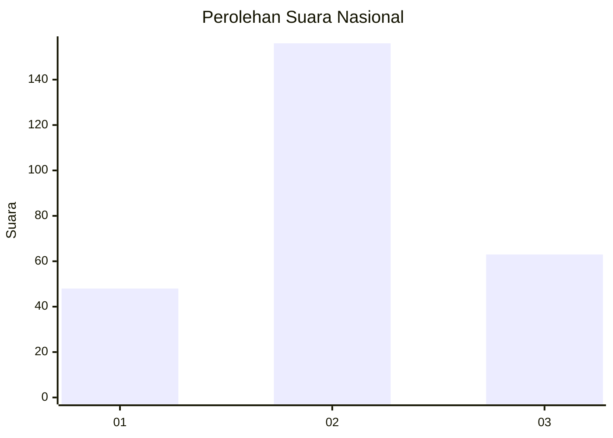
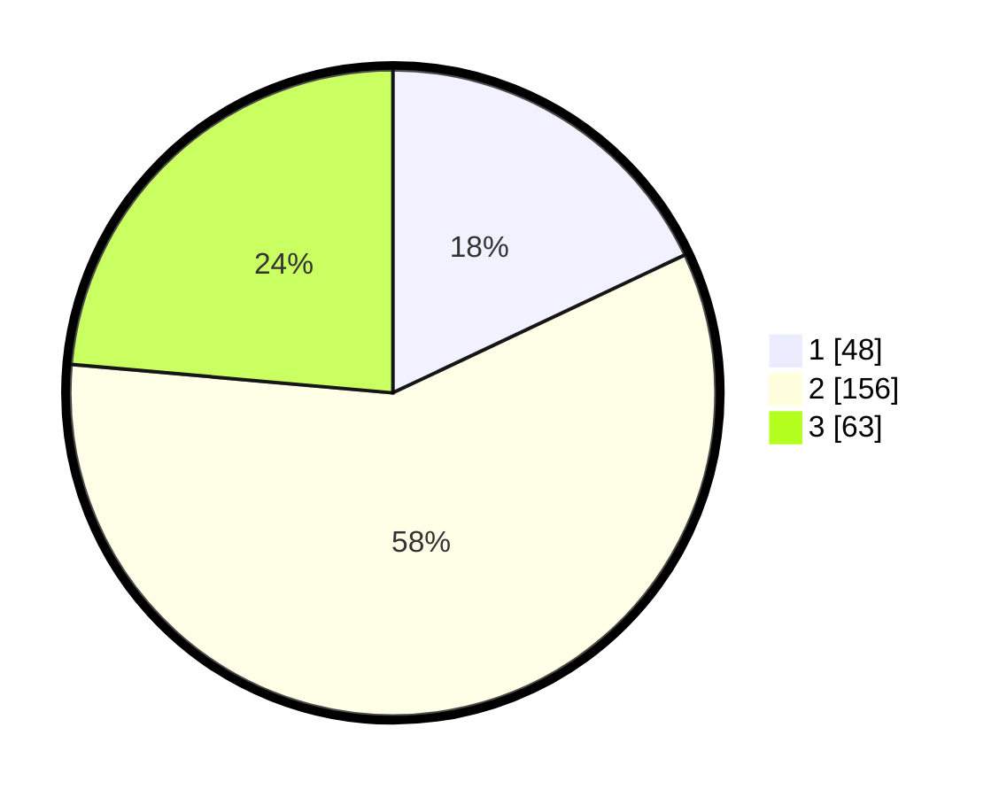

# Hasil

## Grafik

## Tabel

| No. | Nama Paslon    | Suara | Suara (raw) | Persentase |
|:--- |:-------------- | -----:| -----------:| ----------:|
| 1   | ANIES MUHAIMIN | 48    | [48][p-1]   | 17,98      |
| 2   | PRABOWO GIBRAN | 156   | [156][p-2]  | 58,43      |
| 3   | GANJAR MAHFUD  | 63    | [63][p-3]   | 23,60      |

[p-1]: https://github.com/gigit-pemilu/pemilu-2024/blob/main/pilpres/hitung-suara/sub/34-di-yogyakarta/sub/04-sleman/sub/08-berbah/sub/2004-jogotirto/sub/025-tps/sub/paslon-1.txt
[p-2]: https://github.com/gigit-pemilu/pemilu-2024/blob/main/pilpres/hitung-suara/sub/34-di-yogyakarta/sub/04-sleman/sub/08-berbah/sub/2004-jogotirto/sub/025-tps/sub/paslon-2.txt
[p-3]: https://github.com/gigit-pemilu/pemilu-2024/blob/main/pilpres/hitung-suara/sub/34-di-yogyakarta/sub/04-sleman/sub/08-berbah/sub/2004-jogotirto/sub/025-tps/sub/paslon-3.txt

## Foto C Plano

https://sirekap-obj-formc.kpu.go.id/40d7/pemilu/ppwp/34/04/08/20/04/3404082004025-20240214-225543--2f10b1dd-134e-44a6-a236-d50dc53552bf.jpg

https://sirekap-obj-formc.kpu.go.id/40d7/pemilu/ppwp/34/04/08/20/04/3404082004025-20240214-225648--e52ad39e-96e7-4c29-8beb-d3e1f961e62e.jpg

https://sirekap-obj-formc.kpu.go.id/40d7/pemilu/ppwp/34/04/08/20/04/3404082004025-20240214-192454--e663948a-441c-472a-a7f1-f3b5318d397f.jpg

## Metadata

| Key        | Value               |
| ---------- | ------------------- |
| Time Stamp | 2024-02-15 17:00:25 |

