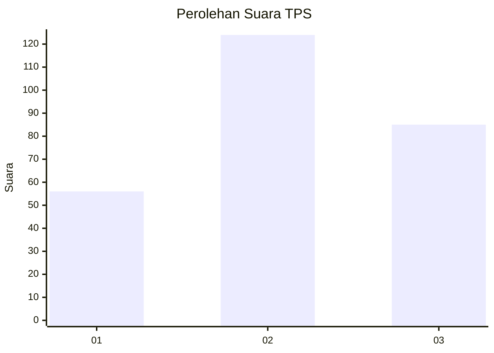
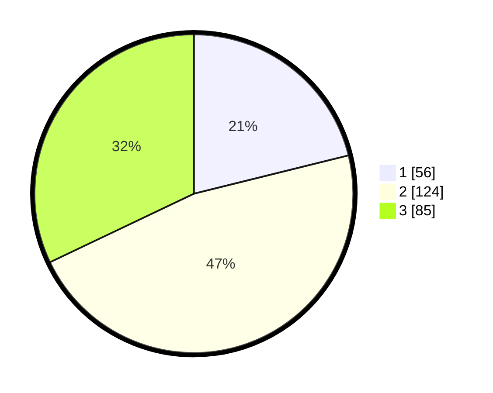

# Hasil

## Grafik

## Tabel

| No. | Nama Paslon    | Suara | Suara (raw) | Persentase |
|:--- |:-------------- | -----:| -----------:| ----------:|
| 1   | ANIES MUHAIMIN | 56    | [56][p-1]   | 21,13      |
| 2   | PRABOWO GIBRAN | 124   | [124][p-2]  | 46,79      |
| 3   | GANJAR MAHFUD  | 85    | [85][p-3]   | 32,08      |

[p-1]: https://github.com/gigit-pemilu/pemilu-2024-34-di-yogyakarta/blob/main/pilpres/hitung-suara/sub/34-di-yogyakarta/sub/04-sleman/sub/08-berbah/sub/2004-jogotirto/sub/026-tps/sub/paslon-1.txt
[p-2]: https://github.com/gigit-pemilu/pemilu-2024-34-di-yogyakarta/blob/main/pilpres/hitung-suara/sub/34-di-yogyakarta/sub/04-sleman/sub/08-berbah/sub/2004-jogotirto/sub/026-tps/sub/paslon-2.txt
[p-3]: https://github.com/gigit-pemilu/pemilu-2024-34-di-yogyakarta/blob/main/pilpres/hitung-suara/sub/34-di-yogyakarta/sub/04-sleman/sub/08-berbah/sub/2004-jogotirto/sub/026-tps/sub/paslon-3.txt

## Foto C Plano

https://sirekap-obj-formc.kpu.go.id/344c/pemilu/ppwp/34/04/08/20/04/3404082004026-20240215-002822--dd4c3c3b-4341-4de5-9205-e574acce8669.jpg

https://sirekap-obj-formc.kpu.go.id/344c/pemilu/ppwp/34/04/08/20/04/3404082004026-20240215-002913--8a7d0c00-687b-47a5-a165-df346b8e88c3.jpg

https://sirekap-obj-formc.kpu.go.id/344c/pemilu/ppwp/34/04/08/20/04/3404082004026-20240215-003126--7a83840d-ca2f-4d0c-8079-53ad836c0855.jpg

## Metadata

| Key        | Value               |
| ---------- | ------------------- |
| Time Stamp | 2024-02-24 23:00:00 |

