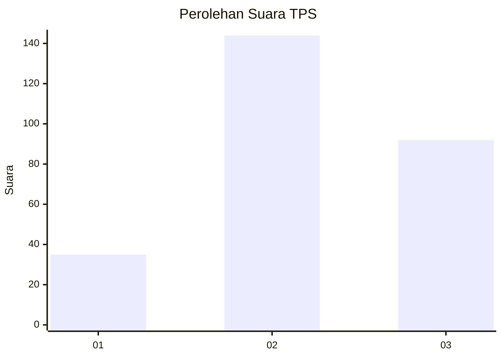
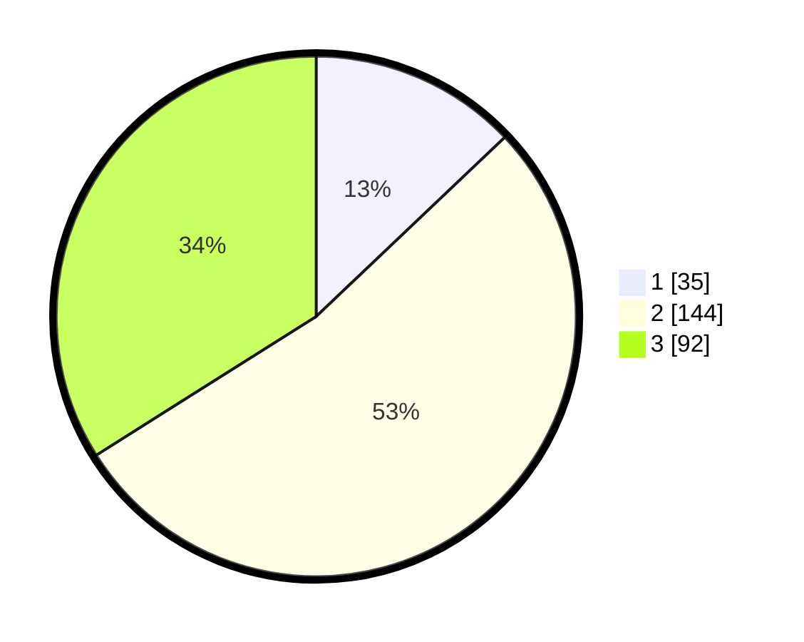

# Hasil

## Grafik

## Tabel

| No. | Nama Paslon    | Suara | Suara (raw) | Persentase |
|:--- |:-------------- | -----:| -----------:| ----------:|
| 1   | ANIES MUHAIMIN | 35    | [35][p-1]   | 12,92      |
| 2   | PRABOWO GIBRAN | 144   | [144][p-2]  | 53,14      |
| 3   | GANJAR MAHFUD  | 92    | [92][p-3]   | 33,95      |

[p-1]: https://github.com/gigit-pemilu/pemilu-2024-34-di-yogyakarta/blob/main/pilpres/hitung-suara/sub/34-di-yogyakarta/sub/04-sleman/sub/08-berbah/sub/2004-jogotirto/sub/029-tps/sub/paslon-1.txt
[p-2]: https://github.com/gigit-pemilu/pemilu-2024-34-di-yogyakarta/blob/main/pilpres/hitung-suara/sub/34-di-yogyakarta/sub/04-sleman/sub/08-berbah/sub/2004-jogotirto/sub/029-tps/sub/paslon-2.txt
[p-3]: https://github.com/gigit-pemilu/pemilu-2024-34-di-yogyakarta/blob/main/pilpres/hitung-suara/sub/34-di-yogyakarta/sub/04-sleman/sub/08-berbah/sub/2004-jogotirto/sub/029-tps/sub/paslon-3.txt

## Foto C Plano

https://sirekap-obj-formc.kpu.go.id/39cf/pemilu/ppwp/34/04/08/20/04/3404082004029-20240214-221029--c6c2e038-d6a6-4d40-b5d0-f2c40a7ee85d.jpg

https://sirekap-obj-formc.kpu.go.id/39cf/pemilu/ppwp/34/04/08/20/04/3404082004029-20240214-221152--ec2be79f-2d86-40bf-a4e3-5e20358b1b44.jpg

https://sirekap-obj-formc.kpu.go.id/39cf/pemilu/ppwp/34/04/08/20/04/3404082004029-20240214-221259--34b5dbab-cea0-43e9-b6ef-4150054ce1dd.jpg

## Metadata

| Key        | Value               |
| ---------- | ------------------- |
| Time Stamp | 2024-02-15 17:00:25 |

