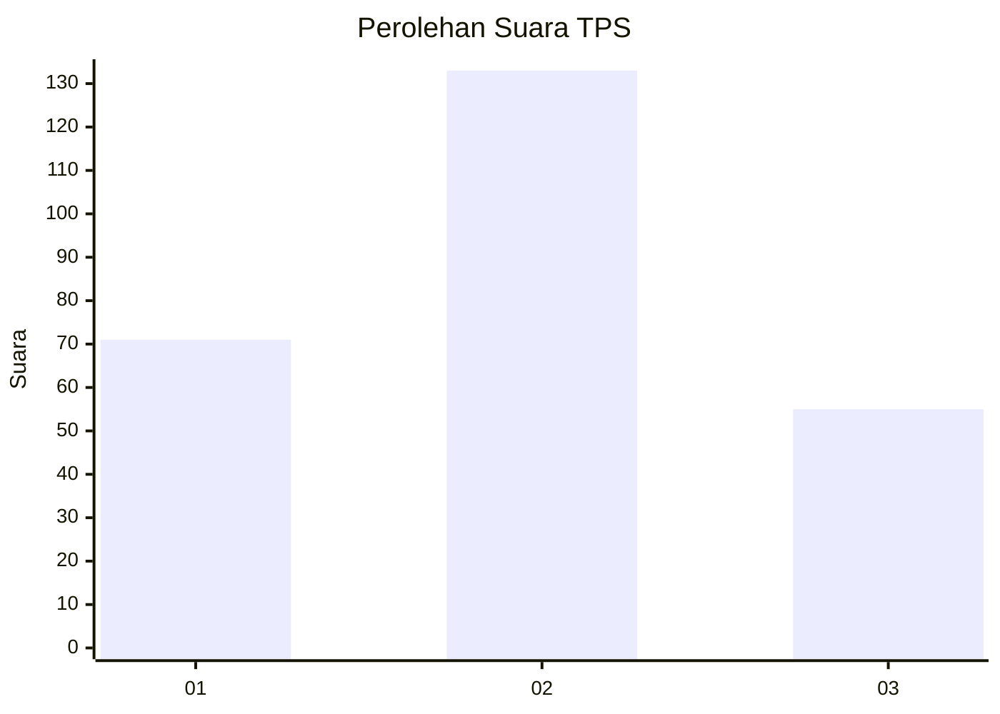
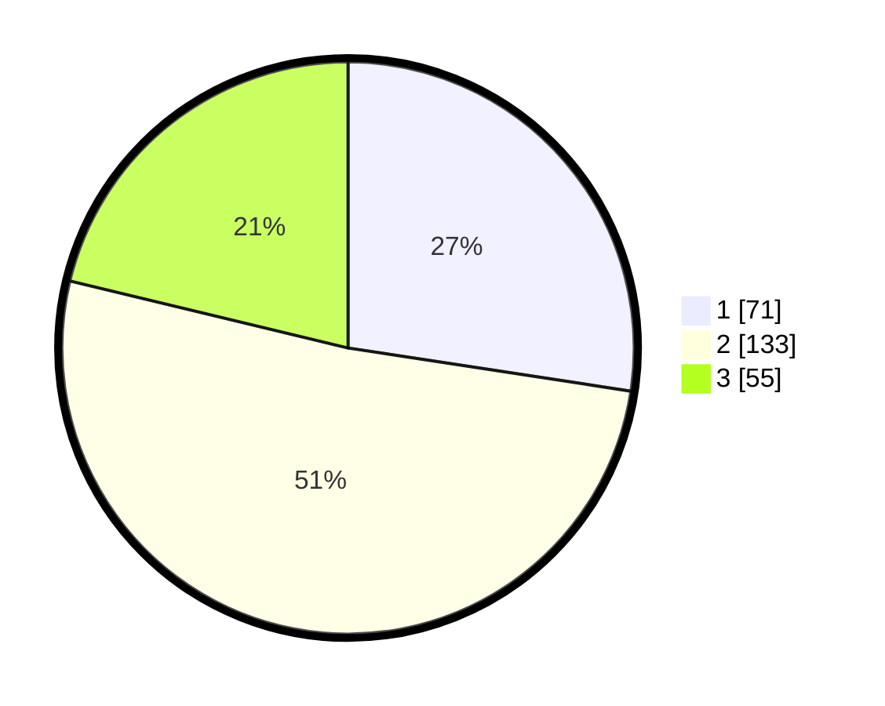

# Hasil

## Grafik

## Tabel

| No. | Nama Paslon    | Suara | Suara (raw) | Persentase |
|:--- |:-------------- | -----:| -----------:| ----------:|
| 1   | ANIES MUHAIMIN | 71    | [71][p-1]   | 27,41      |
| 2   | PRABOWO GIBRAN | 133   | [133][p-2]  | 51,35      |
| 3   | GANJAR MAHFUD  | 55    | [55][p-3]   | 21,24      |

[p-1]: https://github.com/gigit-pemilu/pemilu-2024-34-di-yogyakarta/blob/main/pilpres/hitung-suara/sub/34-di-yogyakarta/sub/04-sleman/sub/09-prambanan/sub/2001-sumberharjo/sub/002-tps/sub/paslon-1.txt
[p-2]: https://github.com/gigit-pemilu/pemilu-2024-34-di-yogyakarta/blob/main/pilpres/hitung-suara/sub/34-di-yogyakarta/sub/04-sleman/sub/09-prambanan/sub/2001-sumberharjo/sub/002-tps/sub/paslon-2.txt
[p-3]: https://github.com/gigit-pemilu/pemilu-2024-34-di-yogyakarta/blob/main/pilpres/hitung-suara/sub/34-di-yogyakarta/sub/04-sleman/sub/09-prambanan/sub/2001-sumberharjo/sub/002-tps/sub/paslon-3.txt

## Foto C Plano

https://sirekap-obj-formc.kpu.go.id/c279/pemilu/ppwp/34/04/09/20/01/3404092001002-20240216-055212--376fc797-61cc-47df-95bf-e6a7d94e1cb6.jpg

https://sirekap-obj-formc.kpu.go.id/c279/pemilu/ppwp/34/04/09/20/01/3404092001002-20240214-193808--4e102fdb-d5c2-406a-b79b-eb309534d7b3.jpg

https://sirekap-obj-formc.kpu.go.id/c279/pemilu/ppwp/34/04/09/20/01/3404092001002-20240216-055213--0e181df0-51ad-432e-af9a-2c7d6ad788de.jpg

## Metadata

| Key        | Value               |
| ---------- | ------------------- |
| Time Stamp | 2024-02-16 11:00:29 |

## DATA PEMILIH TETAP

Jumlah pemilih dalam DPT: **288**.
 * L: **143**.
 * P: **145**.

## DATA PENGGUNA HAK PILIH

Jumlah pengguna hak pilih dalam DPT: **257**.
 * L: **125**.
 * P: **132**.

Jumlah pengguna hak pilih dalam DPTb: **6**.
 * L: **4**.
 * P: **2**.

Jumlah pengguna hak pilih dalam DPK: **1**.
 * L: **1**.
 * P: **0**.

Jumlah pengguna hak pilih: **264**.
 * L: **130**.
 * P: **134**.

## JUMLAH SUARA SAH DAN TIDAK SAH

JUMLAH SELURUH SUARA SAH: **259**.

JUMLAH SUARA TIDAK SAH: **5**.

JUMLAH SELURUH SUARA SAH DAN SUARA TIDAK SAH: **264**.

