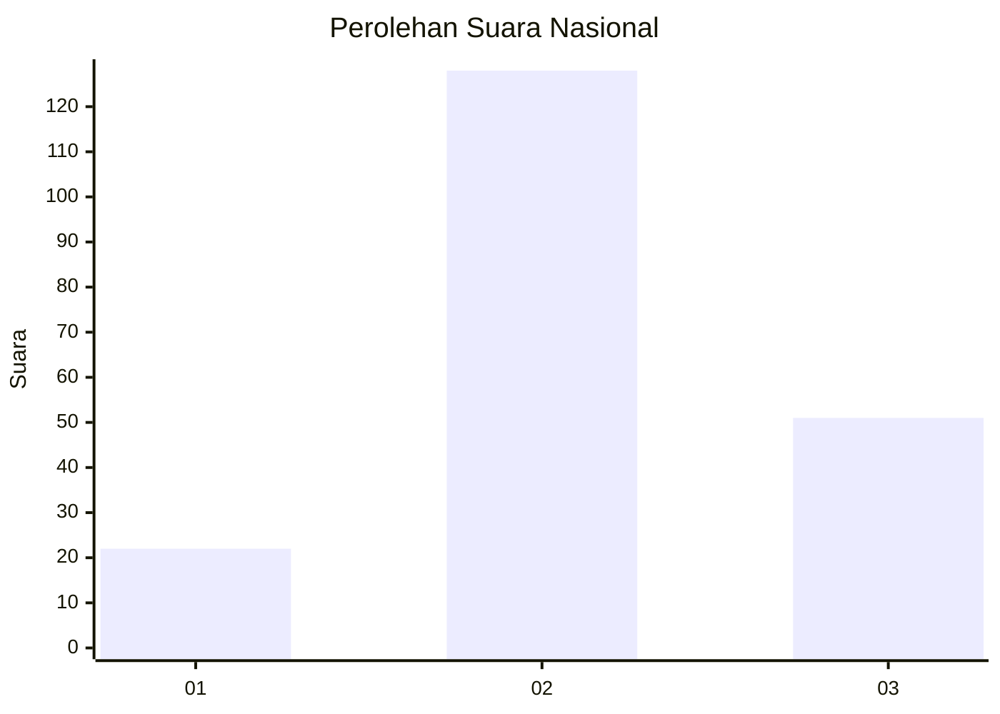
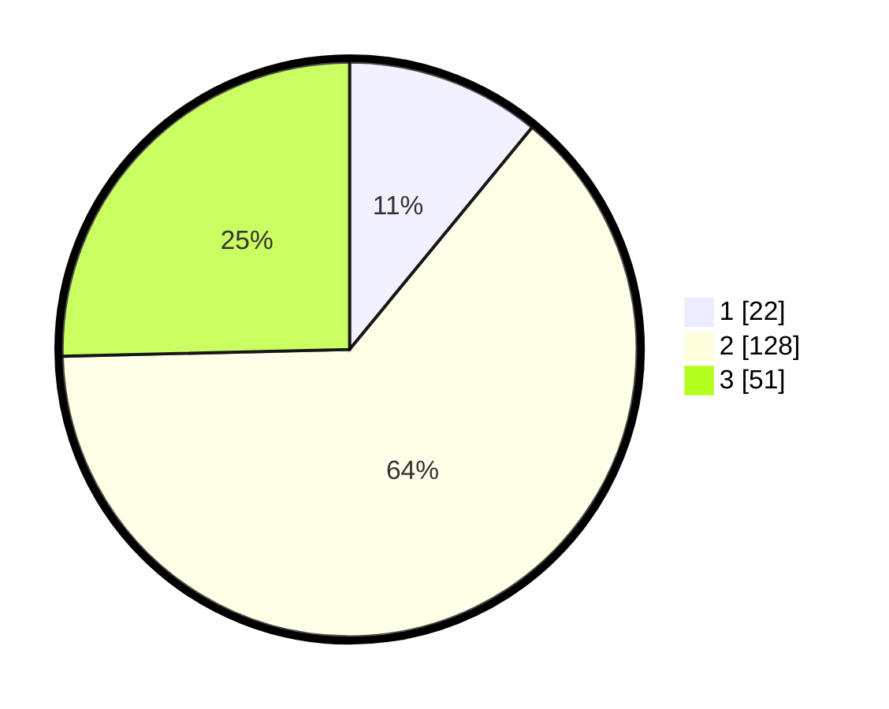

# Hasil

## Grafik

## Tabel

| No. | Nama Paslon    | Suara | Suara (raw) | Persentase |
|:--- |:-------------- | -----:| -----------:| ----------:|
| 1   | ANIES MUHAIMIN | 22    | [22][p-1]   | 10,95      |
| 2   | PRABOWO GIBRAN | 128   | [128][p-2]  | 63,68      |
| 3   | GANJAR MAHFUD  | 51    | [51][p-3]   | 25,37      |

[p-1]: https://github.com/gigit-pemilu/pemilu-2024/blob/main/pilpres/hitung-suara/sub/34-di-yogyakarta/sub/04-sleman/sub/09-prambanan/sub/2001-sumberharjo/sub/003-tps/sub/paslon-1.txt
[p-2]: https://github.com/gigit-pemilu/pemilu-2024/blob/main/pilpres/hitung-suara/sub/34-di-yogyakarta/sub/04-sleman/sub/09-prambanan/sub/2001-sumberharjo/sub/003-tps/sub/paslon-2.txt
[p-3]: https://github.com/gigit-pemilu/pemilu-2024/blob/main/pilpres/hitung-suara/sub/34-di-yogyakarta/sub/04-sleman/sub/09-prambanan/sub/2001-sumberharjo/sub/003-tps/sub/paslon-3.txt

## Foto C Plano

https://sirekap-obj-formc.kpu.go.id/5579/pemilu/ppwp/34/04/09/20/01/3404092001003-20240215-233302--1f3dd6d7-18e8-4d1e-89e9-fb0a885f5052.jpg

https://sirekap-obj-formc.kpu.go.id/5579/pemilu/ppwp/34/04/09/20/01/3404092001003-20240215-233304--26b84f1f-a6a0-4f6d-9d38-1d1fcff45f17.jpg

https://sirekap-obj-formc.kpu.go.id/5579/pemilu/ppwp/34/04/09/20/01/3404092001003-20240215-233303--7baee5f9-3123-47fd-9c17-bcd2653ac585.jpg

## Metadata

| Key        | Value               |
| ---------- | ------------------- |
| Time Stamp | 2024-02-16 12:51:22 |

## DATA PEMILIH TETAP

Jumlah pemilih dalam DPT: **233**.
 * L: **120**.
 * P: **113**.

## DATA PENGGUNA HAK PILIH

Jumlah pengguna hak pilih dalam DPT: **198**.
 * L: **101**.
 * P: **97**.

Jumlah pengguna hak pilih dalam DPTb: **5**.
 * L: **2**.
 * P: **3**.

Jumlah pengguna hak pilih dalam DPK: **0**.
 * L: **0**.
 * P: **0**.

Jumlah pengguna hak pilih: **203**.
 * L: **103**.
 * P: **100**.

## JUMLAH SUARA SAH DAN TIDAK SAH

JUMLAH SELURUH SUARA SAH: **201**.

JUMLAH SUARA TIDAK SAH: **2**.

JUMLAH SELURUH SUARA SAH DAN SUARA TIDAK SAH: **203**.

