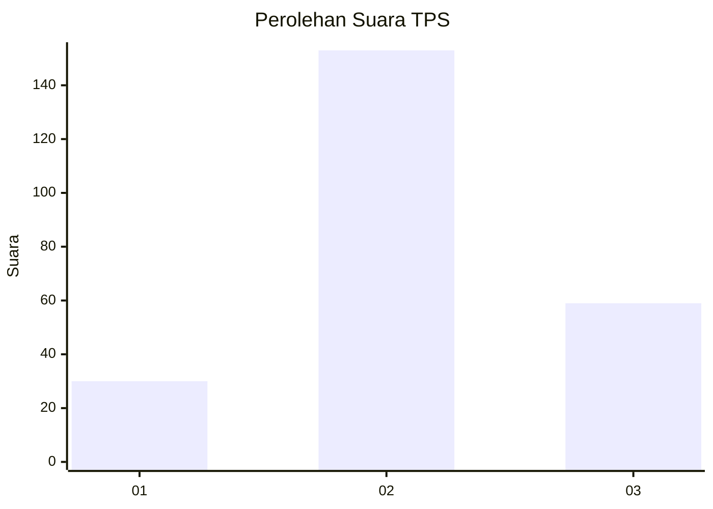
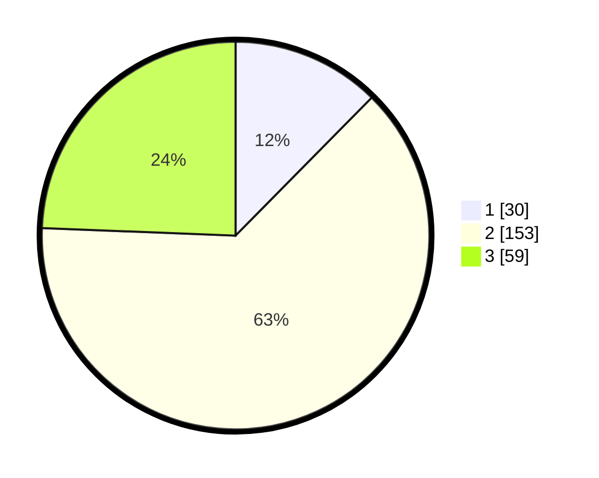

# Hasil

## Grafik

## Tabel

| No. | Nama Paslon    | Suara | Suara (raw) | Persentase |
|:--- |:-------------- | -----:| -----------:| ----------:|
| 1   | ANIES MUHAIMIN | 30    | [30][p-1]   | 12,40      |
| 2   | PRABOWO GIBRAN | 153   | [153][p-2]  | 63,22      |
| 3   | GANJAR MAHFUD  | 59    | [59][p-3]   | 24,38      |

[p-1]: https://github.com/gigit-pemilu/pemilu-2024-34-di-yogyakarta/blob/main/pilpres/hitung-suara/sub/34-di-yogyakarta/sub/04-sleman/sub/09-prambanan/sub/2001-sumberharjo/sub/004-tps/sub/paslon-1.txt
[p-2]: https://github.com/gigit-pemilu/pemilu-2024-34-di-yogyakarta/blob/main/pilpres/hitung-suara/sub/34-di-yogyakarta/sub/04-sleman/sub/09-prambanan/sub/2001-sumberharjo/sub/004-tps/sub/paslon-2.txt
[p-3]: https://github.com/gigit-pemilu/pemilu-2024-34-di-yogyakarta/blob/main/pilpres/hitung-suara/sub/34-di-yogyakarta/sub/04-sleman/sub/09-prambanan/sub/2001-sumberharjo/sub/004-tps/sub/paslon-3.txt

## Foto C Plano

https://sirekap-obj-formc.kpu.go.id/6831/pemilu/ppwp/34/04/09/20/01/3404092001004-20240216-062404--10950231-5a42-47b4-902b-3700c25e9300.jpg

https://sirekap-obj-formc.kpu.go.id/6831/pemilu/ppwp/34/04/09/20/01/3404092001004-20240216-062406--3843ad81-b851-480f-92be-6e9e57e5c561.jpg

https://sirekap-obj-formc.kpu.go.id/6831/pemilu/ppwp/34/04/09/20/01/3404092001004-20240216-062405--1ef535e9-ada6-49d5-a549-4311535aea23.jpg

## Metadata

| Key        | Value               |
| ---------- | ------------------- |
| Time Stamp | 2024-02-16 12:51:22 |

## DATA PEMILIH TETAP

Jumlah pemilih dalam DPT: **269**.
 * L: **128**.
 * P: **141**.

## DATA PENGGUNA HAK PILIH

Jumlah pengguna hak pilih dalam DPT: **238**.
 * L: **109**.
 * P: **129**.

Jumlah pengguna hak pilih dalam DPTb: **7**.
 * L: **3**.
 * P: **4**.

Jumlah pengguna hak pilih dalam DPK: **3**.
 * L: **1**.
 * P: **2**.

Jumlah pengguna hak pilih: **248**.
 * L: **113**.
 * P: **135**.

## JUMLAH SUARA SAH DAN TIDAK SAH

JUMLAH SELURUH SUARA SAH: **242**.

JUMLAH SUARA TIDAK SAH: **6**.

JUMLAH SELURUH SUARA SAH DAN SUARA TIDAK SAH: **248**.

