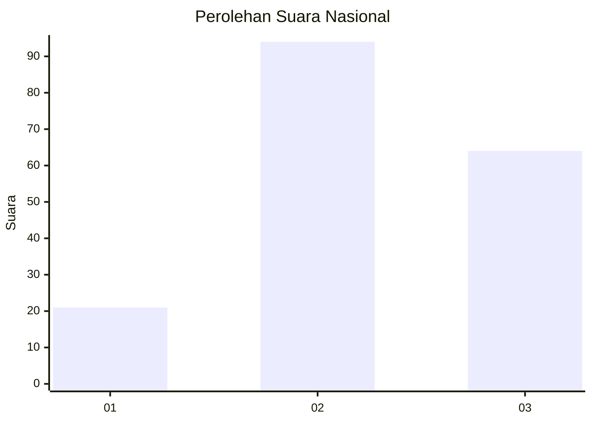
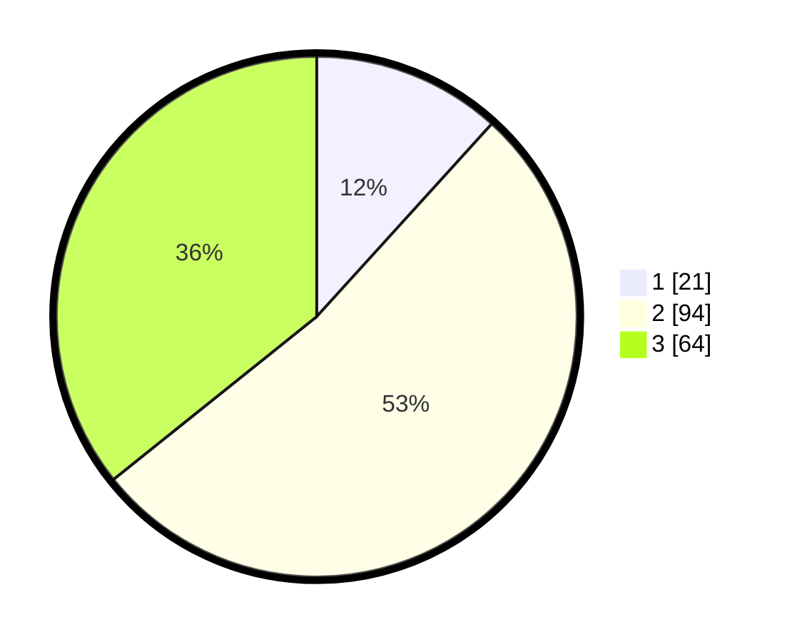

# Hasil

## Grafik

## Tabel

| No. | Nama Paslon    | Suara | Suara (raw) | Persentase |
|:--- |:-------------- | -----:| -----------:| ----------:|
| 1   | ANIES MUHAIMIN | 21    | [21][p-1]   | 11,73      |
| 2   | PRABOWO GIBRAN | 94    | [94][p-2]   | 52,51      |
| 3   | GANJAR MAHFUD  | 64    | [64][p-3]   | 35,75      |

[p-1]: https://github.com/gigit-pemilu/pemilu-2024/blob/main/pilpres/hitung-suara/sub/34-di-yogyakarta/sub/04-sleman/sub/09-prambanan/sub/2001-sumberharjo/sub/005-tps/sub/paslon-1.txt
[p-2]: https://github.com/gigit-pemilu/pemilu-2024/blob/main/pilpres/hitung-suara/sub/34-di-yogyakarta/sub/04-sleman/sub/09-prambanan/sub/2001-sumberharjo/sub/005-tps/sub/paslon-2.txt
[p-3]: https://github.com/gigit-pemilu/pemilu-2024/blob/main/pilpres/hitung-suara/sub/34-di-yogyakarta/sub/04-sleman/sub/09-prambanan/sub/2001-sumberharjo/sub/005-tps/sub/paslon-3.txt

## Foto C Plano

https://sirekap-obj-formc.kpu.go.id/048a/pemilu/ppwp/34/04/09/20/01/3404092001005-20240216-003920--c378ae3b-73c7-42bf-98a3-f5e1684a633b.jpg

https://sirekap-obj-formc.kpu.go.id/048a/pemilu/ppwp/34/04/09/20/01/3404092001005-20240216-003920--3c6f9be1-65fa-4c9a-9aba-3d95d30ce1d9.jpg

https://sirekap-obj-formc.kpu.go.id/048a/pemilu/ppwp/34/04/09/20/01/3404092001005-20240214-220218--1174598c-e7f2-4bd2-aa0e-727d1138bc07.jpg

## Metadata

| Key        | Value               |
| ---------- | ------------------- |
| Time Stamp | 2024-02-16 12:51:22 |

## DATA PEMILIH TETAP

Jumlah pemilih dalam DPT: **186**.
 * L: **85**.
 * P: **101**.

## DATA PENGGUNA HAK PILIH

Jumlah pengguna hak pilih dalam DPT: **175**.
 * L: **80**.
 * P: **95**.

Jumlah pengguna hak pilih dalam DPTb: **5**.
 * L: **1**.
 * P: **4**.

Jumlah pengguna hak pilih dalam DPK: **1**.
 * L: **1**.
 * P: **0**.

Jumlah pengguna hak pilih: **181**.
 * L: **82**.
 * P: **99**.

## JUMLAH SUARA SAH DAN TIDAK SAH

JUMLAH SELURUH SUARA SAH: **179**.

JUMLAH SUARA TIDAK SAH: **2**.

JUMLAH SELURUH SUARA SAH DAN SUARA TIDAK SAH: **181**.

