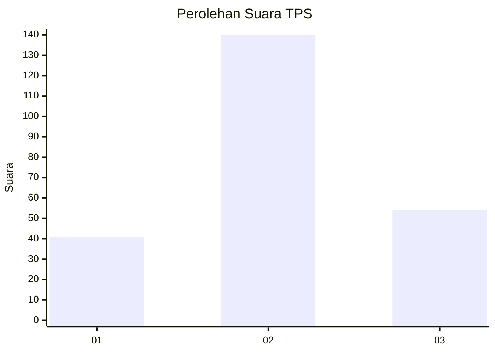
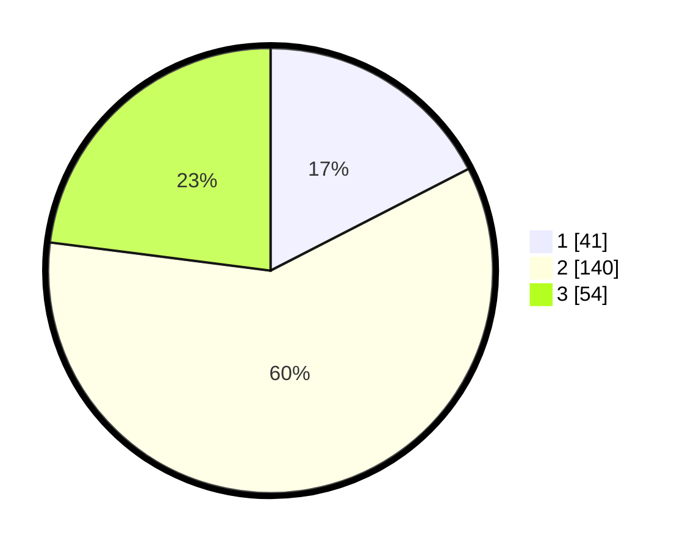

# Hasil

## Grafik

## Tabel

| No. | Nama Paslon    | Suara | Suara (raw) | Persentase |
|:--- |:-------------- | -----:| -----------:| ----------:|
| 1   | ANIES MUHAIMIN | 41    | [41][p-1]   | 17,45      |
| 2   | PRABOWO GIBRAN | 140   | [140][p-2]  | 59,57      |
| 3   | GANJAR MAHFUD  | 54    | [54][p-3]   | 22,98      |

[p-1]: https://github.com/gigit-pemilu/pemilu-2024-34-di-yogyakarta/blob/main/pilpres/hitung-suara/sub/34-di-yogyakarta/sub/04-sleman/sub/09-prambanan/sub/2001-sumberharjo/sub/016-tps/sub/paslon-1.txt
[p-2]: https://github.com/gigit-pemilu/pemilu-2024-34-di-yogyakarta/blob/main/pilpres/hitung-suara/sub/34-di-yogyakarta/sub/04-sleman/sub/09-prambanan/sub/2001-sumberharjo/sub/016-tps/sub/paslon-2.txt
[p-3]: https://github.com/gigit-pemilu/pemilu-2024-34-di-yogyakarta/blob/main/pilpres/hitung-suara/sub/34-di-yogyakarta/sub/04-sleman/sub/09-prambanan/sub/2001-sumberharjo/sub/016-tps/sub/paslon-3.txt

## Foto C Plano

https://sirekap-obj-formc.kpu.go.id/0706/pemilu/ppwp/34/04/09/20/01/3404092001016-20240215-030659--052f51d1-3de8-4345-8ba4-9efbac3972bf.jpg

https://sirekap-obj-formc.kpu.go.id/0706/pemilu/ppwp/34/04/09/20/01/3404092001016-20240215-030721--68a39300-e1ad-47e2-a7e1-e18873385242.jpg

https://sirekap-obj-formc.kpu.go.id/0706/pemilu/ppwp/34/04/09/20/01/3404092001016-20240215-030709--bd185be4-57e2-4d27-9ec8-896b48779b03.jpg

## Metadata

| Key        | Value               |
| ---------- | ------------------- |
| Time Stamp | 2024-02-15 18:30:25 |

## DATA PEMILIH TETAP

Jumlah pemilih dalam DPT: **246**.
 * L: **113**.
 * P: **133**.

## DATA PENGGUNA HAK PILIH

Jumlah pengguna hak pilih dalam DPT: **220**.
 * L: **96**.
 * P: **124**.

Jumlah pengguna hak pilih dalam DPTb: **5**.
 * L: **2**.
 * P: **3**.

Jumlah pengguna hak pilih dalam DPK: **14**.
 * L: **7**.
 * P: **7**.

Jumlah pengguna hak pilih: **239**.
 * L: **105**.
 * P: **134**.

## JUMLAH SUARA SAH DAN TIDAK SAH

JUMLAH SELURUH SUARA SAH: **235**.

JUMLAH SUARA TIDAK SAH: **4**.

JUMLAH SELURUH SUARA SAH DAN SUARA TIDAK SAH: **239**.

